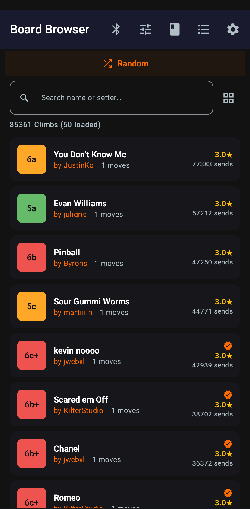
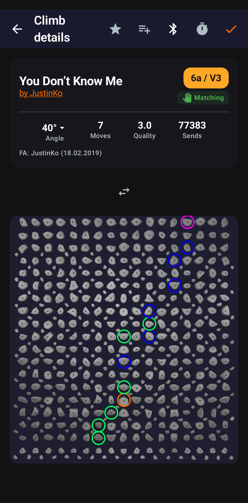
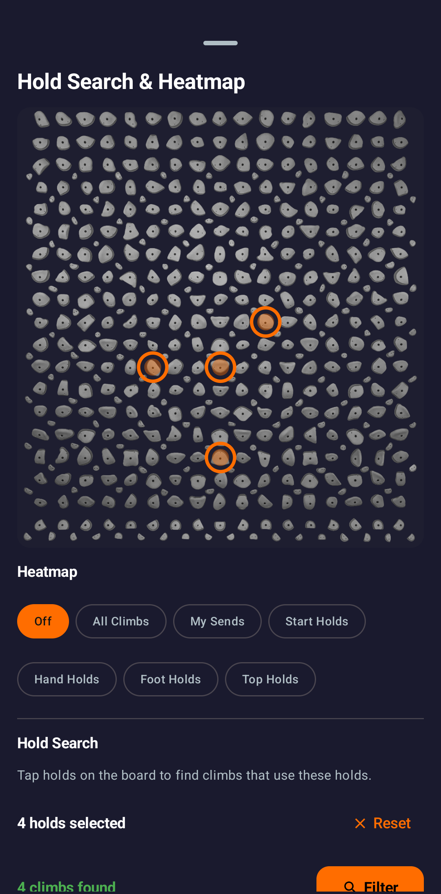
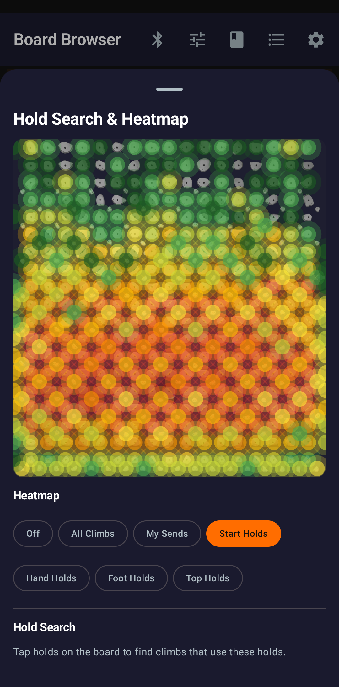

# CruxCoach

Open-source Kilter Board climbing app for Android.

Browse climbs, control your Kilter Board via Bluetooth, log ascents, import your Kilter logbook, and track your progress — no third-party cloud services, full control over your data.

[](https://zapstore.dev/apps/com.cruxcoach.android)

<p align="center">
  &nbsp;&nbsp;
  &nbsp;&nbsp;
  &nbsp;&nbsp;
  
</p>

---

## What makes it different

**Custom LED Colors** — Choose your own hold colors on the Kilter Board. Different colors for start, hand, foot, and top holds. Visible to everyone around you.

**Nearby Sharing** — Share your current climb with nearby CruxCoach users over Bluetooth. No internet needed, works instantly at the Kilter Board.

**Your Data, Your Device** — All personal data encrypted locally. Decentralized identity via [Nostr](https://nostr.com) — no email, no password, no central server. No cloud accounts, no telemetry, no ads.

---

## All Features

- **85,000+ climbs** with filters for grade, angle, quality, moves, and setter
- **BLE board control** — light up holds on your Kilter Board
- **Climb lists** — favorites, projects, custom lists
- **Log ascents** with grade opinions, attempts, and notes
- **Hold Search** — tap holds on the Kilter Board to find climbs that use them
- **Heatmap** — visualize hold popularity by type, sends, or all climbs
- **Kilter logbook import** from your Kilter account
- **Statistics** — grade progression, difficulty trends, favorite angles
- **Data export/import** as JSON backup
- **App-share QR code** — share CruxCoach with nearby climbers by QR
- **Reliable notifications** — guided setup for Android battery and autostart restrictions so dev-DMs and sync updates always arrive
- **In-app auto-updater** — verifiable APK updates with TOFU certificate pinning (auto-disabled on Zapstore installs)
- **In-app developer contact** via encrypted Nostr DMs

---

## Download

**[Zapstore](https://zapstore.dev/apps/com.cruxcoach.android)** (recommended) — Nostr-native app store with verifiable builds.

Or [build from source](#building-from-source).

---

## Building from Source

```bash
git clone https://codeberg.org/CruxCoach/CruxCoach.git
cd CruxCoach
bash scripts/setup_dev_env.sh   # installs JDK 17, Android SDK, NDK, CMake (Debian/Ubuntu)
source ~/.bashrc                # or ~/.zshrc
./gradlew :androidApp:assembleDebug
```

The APK is at `androidApp/build/outputs/apk/debug/androidApp-debug.apk`.

For signing, testing, and full setup details see [CONTRIBUTING.md](CONTRIBUTING.md#development-setup).

---

## Architecture

| Layer | Technology |
|-------|-----------|
| Language | Kotlin (shared + Android) |
| UI | Jetpack Compose + Material 3 |
| Database | SQLDelight (board data) + SQLCipher (personal data) |
| DI | Hilt |
| Async | kotlinx-coroutines |
| Serialization | kotlinx-serialization |
| Navigation | Jetpack Navigation Compose |
| BLE | Android BLE API (Nordic UART Service) |
| Nostr | Quartz (Vitor Pamplona) |
| Background | WorkManager |

Domain logic lives in a shared Kotlin Multiplatform module (~60–70% of code). See [CONTRIBUTING.md](CONTRIBUTING.md#project-structure) for the full project structure.

---

## Board Compatibility

Currently supported: **Kilter Board** (all sizes and angles).

> Primarily tested on the 12x12 Original layout. Other sizes should work but are less tested — feedback welcome!

See [LEGAL.md](LEGAL.md) for our position on interoperability and data usage.

---

## Data & Privacy

**Board database** — community-created content distributed via Nostr Blossom. Content-addressed and verifiable by any client. See [LEGAL.md](LEGAL.md).

**Personal data** — stored locally in an encrypted SQLCipher database. Encryption keys live in the Android Keystore and never leave the device.

**Your identity** — a Nostr key pair. No central server can lock you out.

---

## Contributing

We welcome contributions! See [CONTRIBUTING.md](CONTRIBUTING.md) for bug reporting, dev setup, coding standards, and PR guidelines.

For the active feature roadmap and per-release specifications, see [`docs/specs/`](docs/specs/).

## Security

Found a vulnerability? See [SECURITY.md](SECURITY.md) for responsible disclosure.

## Legal

CruxCoach is not affiliated with Kilter, LLC or Aurora Climbing. See [LEGAL.md](LEGAL.md).

---

## Support

- **Bug Reports**: [Codeberg Issues](https://codeberg.org/CruxCoach/CruxCoach/issues) or in-app via Settings
- **Donate** (upstream maintainer): Lightning `cruxcoach@npub.cash`

  

  > Forks: this address routes to the upstream maintainer. Replace it via
  > `local.properties` before publishing your build — see
  > [CONTRIBUTING.md → Customizing for forks](CONTRIBUTING.md#customizing-for-forks).

---

## License & Trademark

- **Code**: [GNU General Public License v3.0](LICENSE) — Copyright (C) 2025-2026 CruxCoach Contributors.
- **Name + logo**: Reserved — see [TRADEMARK.md](TRADEMARK.md). Forks distributing modified binaries to a wide audience must rename and replace the launcher icon.
- **Bundled & vendored third-party components**: see [THIRD_PARTY_LICENSES.md](THIRD_PARTY_LICENSES.md) and [NOTICE](NOTICE).
