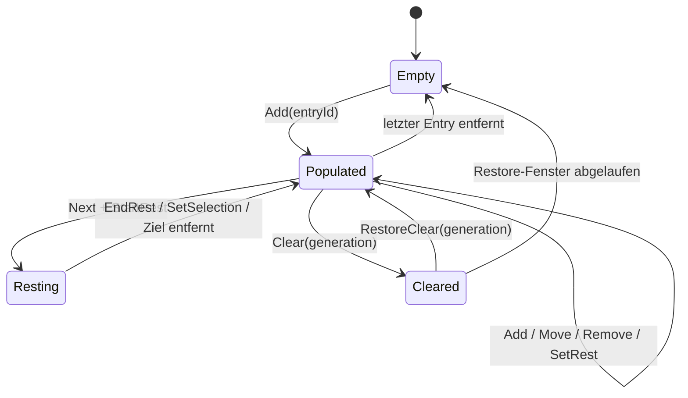
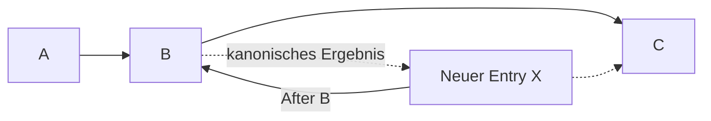
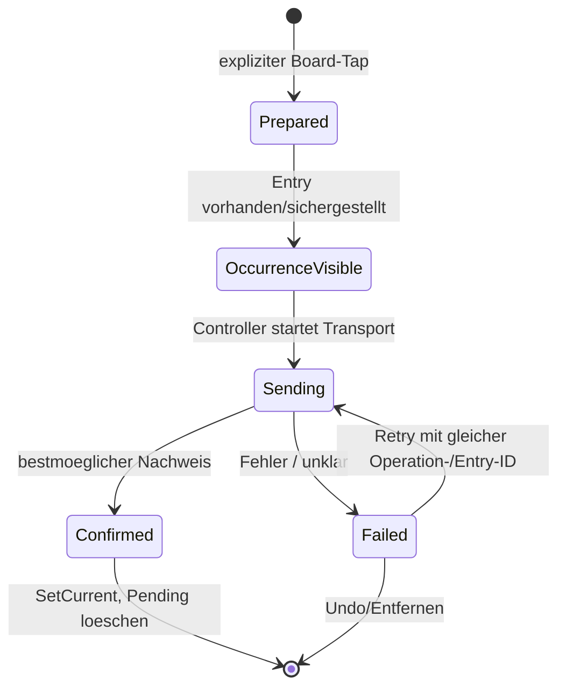

# Architektur der gemeinsamen Board-Playlist

> **Normativer Satz:** Die Board-Playlist ist der gemeinsame, occurrence-adressierte
> Ablaufplan einer physischen BoardCell. Der technische Controller serialisiert ihn und
> ist der einzige physische Writer; er besitzt dadurch keine produktseitigen Sonderrechte
> an der Reihenfolge.

## 1. Problem und Ziel

Mehrere Menschen stehen vor derselben Wand. Sie muessen dieselbe Reihenfolge sehen und
bearbeiten koennen, waehrend Nachrichten verzoegert, wiederholt oder nach einem Handover
neu gesendet werden. Gleichzeitig darf lokales Browsing weder die Navigation anderer
Geraete noch die LEDs veraendern.

Die Architektur optimiert daher nicht auf „eine Liste in mehreren UIs“, sondern auf:

- eindeutige Nutzerabsicht trotz doppelter Climbs,
- idempotente Befehle trotz Retry,
- deterministische Reduktion trotz konkurrierender Edits,
- einen einzigen physischen Writer,
- nachvollziehbare Trennung von Selection, Current und realer Wand,
- ehrliche Degradation bei Protokollen ohne Readback,
- reparierbaren Zustand nach Gap, Reconnect, Restart und Handover.

## 2. Begriffe

| Begriff | Bedeutung |
|---|---|
| Climb | fachliches Problem, identifiziert durch Climb-UUID plus konkrete Variante/Winkel |
| Occurrence | genau ein Vorkommen dieses Climbs in der Playlist |
| Entry-ID | stabile Identitaet einer Occurrence |
| Selection / „Du siehst“ | lokal betrachteter Eintrag, ohne Aussage ueber LEDs |
| Current | kanonische Occurrence, deren Projektion zuletzt belastbar gelang |
| Projection | Climb/Winkel, den CruxCoach als physischen Board-Zustand fuehrt |
| Pending | eine konkrete Occurrence sollte projiziert werden, Ergebnis ist noch offen oder negativ |
| Controller | technischer BoardCell-Sequencer und einziger physischer Writer |
| Replica | Mitglied, das denselben kanonischen Snapshot validiert und darstellt |

Die entscheidende Relation ist:

```text
Climb 1 --- n Occurrences 1 --- 1 Entry-ID
Occurrence 0 --- 1 Current-Markierung
Current 1 --- 1 kanonische Projection
Projection 1 --- 1 Konfidenzstufe
```

## 3. Warum Occurrences die atomare Identitaet sind

Ein Training wie 4x4 enthaelt denselben Climb absichtlich mehrfach. Diese Eintraege sind
nicht austauschbar: Sie koennen unterschiedliche Positionen, Pausen und Nutzerabsichten
haben. Folglich darf kein Algorithmus „den gleichen Climb weiter unten“ finden und
verschieben oder wiederverwenden.

### 3.1 Eigenschaften einer Entry-ID

Eine Entry-ID:

- wird vom erzeugenden Geraet genau einmal gemintet,
- identifiziert eine Nutzerhandlung, nicht nur fachlichen Inhalt,
- bleibt bei Move, Current-Wechsel, Retry und Restore stabil,
- macht ein wiederholtes Add auf jedem Controller zum No-op,
- reist beim Oeffnen aus der Playlist bis in den Detail-State,
- ist der Bezug fuer Pending, Failure, Retry und Undo.

### 3.2 Warum Alternativen scheitern

| Alternative | Fehler |
|---|---|
| Climb-UUID | mehrere legitime Vorkommen sind nicht unterscheidbar |
| Climb-UUID + Winkel | auch dieselbe Variante darf mehrfach vorkommen |
| Listenindex | verliert bei jedem konkurrierenden Insert/Move seine Bedeutung |
| „erstes passendes Element“ | trifft nicht zwingend die angetippte Occurrence |
| zeitliches Dedupe-Fenster | vergisst nach Restart/Handover und kann legitime Wiederholung blockieren |

## 4. Kanonisches Zustandsmodell

`BoardPlaylistState` ist Bestandteil des hash-gebundenen `BoardCellSnapshot`. Der Zustand
enthaelt:

- `entries`: geordnete, occurrence-adressierte Eintraege,
- `selectedEntryId`: gemeinsamer Auswahlcursor — wohin die Gruppe schaut; von Add, Remove,
  Next, Previous, Rest und Restore bewegt und ohne jede physische Bedeutung,
- `currentEntryId`: bestaetigter gemeinsamer Current — ausschliesslich nach terminal
  erfolgreichem Transport gesetzt, und zwar nur vom Controller,
- `activeRest`: kanonisches Zeitfenster mit stabiler Ziel-Occurrence,
- `pendingProjection`: fehlgeschlagene oder nicht aufloesbare Projektion fuer eine Entry-ID,
- `clearGeneration`: Fence gegen alte Edits nach einem Clear,
- `lastClear`: kurzlebiger, kanonischer Restore-Puffer.



### 4.1 Normalisierung ist Teil der Sicherheitsgrenze

Nach jedem Operationsbatch normalisiert `BoardPlaylistPolicy` den Zustand. Das ist kein
UI-Cleanup, sondern erzwingt, dass jede Replica dieselben Bytes ableitet:

- maximal 512 Entries,
- maximal 256 Operationen pro Command,
- begrenzte ID-Laengen,
- eindeutige, nichtleere Entry-IDs,
- begrenzte Pausendauer,
- gueltiger Auswahlcursor oder deterministischer Fallback (der Cursor zeigt immer auf
  etwas, solange es etwas gibt),
- **kein** Fallback fuer den bestaetigten Current: er benennt die Occurrence, deren
  Transport gelang, also waere ein erfundener Current die Behauptung eines Board-Writes,
  den es nie gab. Verschwindet seine Occurrence, wird er geloescht — die Wand selbst steht
  unveraendert in `BoardCellSnapshot.projection`,
- Pending nur fuer eine existierende Occurrence, gebunden an deren eigenen Climb und
  Winkel (nicht an den Current: ein fehlgeschlagener Send laesst den bestaetigten Current
  unveraendert, die Markierung gehoert also der Occurrence dahinter),
- plausible, controllergestempelte Zeitfenster,
- gueltiger Restore-Puffer innerhalb desselben Snapshot-Budgets.

Ein Peer darf keinen inkonsistenten Zustand durch eine kreative Operation einschleusen.
Pure Reduktion und identische Normalisierung sind Voraussetzung fuer Hash-Vergleich und
Snapshot-Reparatur.

## 5. Operationsmodell statt Full-State-Overwrite

Normale Edits werden als kleine, typisierte Operationen versendet:

| Operation | Fachliche Bedeutung | Idempotenzregel |
|---|---|---|
| `Add(entryId, ..., anchor)` | eine Occurrence einfuegen | existierende Entry-ID = No-op |
| `Remove(entryId)` | genau eine Occurrence entfernen | bereits entfernt = No-op |
| `Move(entryId, anchor)` | dieselbe Occurrence repositionieren | verschwundener Anchor mutiert nichts |
| `SetSelection(entryId)` | gemeinsamen Auswahlcursor setzen | fehlende Entry-ID mutiert nichts |
| `SetCurrent(entryId)` | bestaetigten Board-Zustand festhalten | nur Controller; fehlende Entry-ID mutiert nichts |
| `RecordRelayOperation(op)` | Ingress-Intention eines Gastes replizieren | nur Controller; idempotent je `(Fingerprint, Gast)` |
| `SetRest(entryId, seconds)` | Pausenplan an Occurrence aendern | begrenzt und occurrence-adressiert |
| `StartRest(nextEntryId, ...)` | Cursorwechsel und Pause koppeln (nie den bestaetigten Current) | Controller stempelt Generation/Zeit |
| `Clear(generation)` | Liste atomar leeren | Generation verhindert Wiederholung |
| `RestoreClear(generation)` | letzten Clear zuruecknehmen | gleiche IDs verhindern Duplikate |
| `SetPendingProjection(...)` | physisches Problem sichtbar machen | nur Controller darf es kanonisieren |

Vollstaendige Snapshots bleiben der Reparaturpfad fuer Join, Restart, erkannte Gaps,
Anti-Entropy, Controller-Recovery und Handover. Delta-Operationen optimieren den Normalfall;
Snapshots definieren die letzte Autoritaet.

### 5.1 Relative Anchors statt Indizes

Ein Insert oder Move sagt `Head`, `Tail` oder `After(entryId)`. Damit bleibt die Absicht
bei konkurrierenden Edits verstaendlich. Verschwindet ein Move-Anchor, wird nicht geraten:
der Move bleibt wirkungslos. Bei einem Add ist Tail ein sicherer Fallback, weil die neue
Occurrence sonst verloren ginge.



## 6. Controller und Single-Writer-Semantik

Jedes Mitglied darf Edits vorschlagen. Nur der aktive, epoch-/term-gebundene Controller:

- ordnet Commands in eine kanonische Sequenz,
- stempelt Zeitfenster und Generationen,
- validiert Operationsgrenzen,
- schreibt auf das physische Board,
- kanonisiert physisches Pending/Failure,
- repliziert den naechsten hash-gebundenen Snapshot.

Der Controller ist technischer Sequencer, kein Playlist-Host. Er darf nicht aufgrund
seiner Rolle produktseitig alleine sortieren, entfernen oder auswaehlen.

### 6.1 Warum UI-Gates nicht genuegen

Eine ausgeblendete Lampe verhindert keinen programmatischen oder verzoegerten Send. Der
Ownership-Check muss am finalen Dispatch erneut stattfinden. Zwischen „darf ich?“ und dem
physischen Write kann eine BoardCell entstehen, ein Handover passieren oder ein anderes
Board verbunden werden.

> **Policy vorab fuer ehrliche Affordance; Fence am Dispatch fuer Korrektheit.**

## 7. `lightNow` als logische Transaktion

„Jetzt aufs Board“ verbindet eine gemeinsame Occurrence mit einem physischen Effekt. Die
Transaktion hat zwei Einstiege.

### 7.1 Einstieg aus einer vorhandenen Playlist-Occurrence

1. Die Navigation liefert `fromEntryId` zusammen mit Climb und Winkel.
2. Existiert die Entry-ID weiterhin, wird keine neue Occurrence erzeugt.
3. Der Controller projiziert genau deren Climb/Winkel.
4. Erst nach belastbarem Erfolg wird genau diese Entry-ID Current.
5. Wiederholtes Light aendert weder Laenge noch Reihenfolge.

### 7.2 Einstieg von ausserhalb der Playlist

1. Der Client mintet eine stabile Operation-/Entry-ID.
2. Eine neue Occurrence wird direkt nach dem bisherigen Current eingefuegt; ohne Current
   ans Ende.
3. Die Projektion kann latenzarm beginnen, waehrend der kanonische Teil sequenziert wird.
4. Erfolg setzt diese neue Entry-ID als Current.
5. Fehler laesst die Occurrence an ihrer Stelle, markiert sie als nicht uebertragen und
   behaelt den alten Current.

### 7.3 Remote geloeschter Detailkontext

Wird eine lokal geoeffnete Occurrence remote entfernt, bleibt der Detail-Screen offen.
Die UI zeigt `Aus Playlist entfernt`. Ein spaeterer Board-Tap darf die geloeschte Entry-ID
nicht heimlich wiederbeleben; er erzeugt bewusst eine neue Occurrence nach dem Current.

### 7.4 Erfolgs- und Fehlerpfad



Das wesentliche Invariant lautet:

```text
neuer Current => physischer Transport fuer genau diese Occurrence war erfolgreich
```

Die Umkehrung ist absichtlich protokollabhaengig. Bei einem write-only Board bedeutet
„erfolgreich“ vollstaendig transportiert, nicht optisch verifiziert.

## 8. Projektionskonfidenz

`BoardProjectionConfidencePolicy` leitet aus kanonischem Snapshot, lokalem In-flight und
optionalem Controller-Readback eine explizite Evidenzstufe ab.

| Zustand | Bedeutung | UI darf behaupten |
|---|---|---|
| `PENDING` | diese Projektion ist unterwegs | „Wird gesendet“ |
| `TRANSPORTED` | Transport wurde abgeschlossen | „An Board uebertragen“ |
| `CONTROLLER_CONFIRMED` | Controller meldet genau diese Route | „Vom Board bestaetigt“ |
| `UNKNOWN` | Wandzustand nicht belastbar bekannt | „Board-Zustand unbekannt“ |
| `FAILED` | Versuch ist nicht gelungen | „Nicht uebertragen“, Retry anbieten |

Quantum kann durch `REQUEST_USER_ROUTE_LIST` Controller-Bestaetigung liefern. Andere
Boards erreichen im aktuellen Modell maximal `TRANSPORTED`. Das ist keine schlechtere UX,
sondern praezise Sprache ueber unterschiedliche Hardwarefaehigkeiten.

Konfidenz wird abgeleitet und nicht repliziert: Die kanonischen Eingaben existieren
bereits. Ein lokales In-flight darf nicht als vermeintlicher Fortschritt auf andere
Geraete uebertragen werden.

## 9. Lokale Ansicht, Current und Projection

Lokale Ansicht, bestaetigter Current und eine neue In-flight-Operation duerfen verschieden
sein:

```text
Du siehst:          Occurrence B
Bestaetigter Current: Occurrence A (TRANSPORTED)
In-flight:          Occurrence C (PENDING)
```

Die UI muss diese Differenz sichtbar halten. Eine Progressionsaktion darf einen naechsten
Kandidaten bestimmen oder — bei bewusst aktivierter Progressionsautomatik — dessen
Transaktion starten. Sie darf `Current` jedoch nicht vor dem erforderlichen
Transportnachweis als vollzogen darstellen. Die Lampe bleibt die explizite manuelle
Bruecke.

## 10. Pausen

Eine Pause ist gemeinsamer Zustand, kein lokaler Countdown:

- Sie adressiert `nextEntryId`, nicht einen Index.
- Start- und Endzeit werden vom Controller als UTC-Fenster gestempelt.
- `endsAt - startedAt` muss exakt der geplanten Dauer entsprechen.
- Eine Replica zeigt Restzeit aus demselben Fenster, nicht „volle Dauer seit Empfang“.
- Entfernen des Ziel-Entries beendet die Pause.
- `Next` und `StartRest` gehoeren in denselben Operationsbatch.

Damit ueberlebt die Pause Reconnect, Restart und Controller-Handover, ohne auf jedem
Geraet neu zu beginnen.

## 11. Clear und Restore

Clear ist besonders riskant: Viele Eintraege verschwinden durch einen Tap, und oft merkt
ein anderes Mitglied den Fehler zuerst. Deshalb ist Restore kanonisch statt nur eine
lokale Snackbar.

1. Der Controller erhoeht `clearGeneration`.
2. Der bisherige Inhalt wird fuer ein begrenztes, pruefbares Zeitfenster in `lastClear`
   gehalten.
3. Jeder Peer zeigt denselben Restore-Countdown und darf Restore anfordern.
4. Originale Entry-IDs bleiben erhalten.
5. Nach dem Clear hinzugefuegte Entries bleiben bestehen und folgen der restaurierten
   Liste.
6. Veraltete Edits aus einer frueheren Generation werden verworfen, damit sie den Clear
   nicht teilweise rueckgaengig machen.

## 12. Lokales Undo versus kanonisches Restore

Nicht jede Ruecknahme hat dieselbe Reichweite:

| Mechanismus | Reichweite | Zweck |
|---|---|---|
| lokales Undo-Angebot | Geraet, das den Edit ausloeste | inverse Operation fuer Add/Move/Remove/etc. |
| kanonisches Clear-Restore | alle BoardCell-Mitglieder | grossen destruktiven Gruppen-Edit gemeinsam retten |
| Retry | alle berechtigten Oberflaechen | dieselbe physische Operation mit stabiler Identitaet wiederholen |

Undo-Texte benennen die zurueckgenommene Handlung. Ein nacktes „Rueckgaengig“ ist bei
gleichzeitigen Edits anderer Menschen nicht sicher interpretierbar.

## 13. Relay und externe Eingaben

Ein Relay-Guest ist eine weitere Quelle fuer Nutzerabsicht, aber kein alternativer Writer.
Nach Aufloesung und Validierung gilt dieselbe Semantik:

- `Direkt aufs Board`: neue stabile Occurrence nach Current, controller-sequenzierter
  Transport, Current erst nach Erfolg.
- `Ans Ende`: nur Add am Tail, kein Board-Overwrite.

Operation-ID und Entry-ID muessen Retry, Relay-Restart und Controller-Handover ueberleben —
und gleichzeitig **eine neue Benutzerintention von einer Wiederholung unterscheiden**. Die
Identitaet ist daher weder lokal gemintet noch dauerhaft aus dem Inhalt abgeleitet: der
Nonce entsteht einmal pro Intention, und der Datensatz darueber liegt in
`relayOperations` im kanonischen Zustand, wo ihn jeder Controller lesen kann. Zwei Gaeste
mit identischem Payload sind zwei Intentionen; ein spaeterer bewusster Zweitversuch
ebenfalls.
Board, Modell/Layout und Winkel sind gegen das reale Ziel zu pruefen. Dedupe wird erst
terminal nach Erfolg, damit ein legitimer Retry nach Fehler moeglich bleibt.

## 14. Grenzen und Nicht-Ziele

- Die BoardCell repliziert derzeit genau eine kanonische Projektion, keine vier Quantum-
  Layer.
- Lokale Navigation wird nicht zwischen Mitgliedern synchronisiert.
- Die App behauptet auf write-only Boards keinen LED-Readback.
- Ein verschwundener Move-Anchor wird nicht durch heuristisches Umordnen ersetzt.
- Ein geloeschter, lokal geoeffneter Entry wird nicht unsichtbar wiederhergestellt.
- Doppelte Climbs werden nicht automatisch konsolidiert.

## 15. Testbare Architekturvertraege

Mindestens folgende Eigenschaften muessen als Tests existieren:

### Identitaet und Reihenfolge

- zwei identische Climbs mit verschiedenen Entry-IDs bleiben getrennt,
- Light aus Liste trifft exakt die angetippte Occurrence,
- wiederholtes Light veraendert Laenge/Reihenfolge nicht,
- Retry desselben Adds erzeugt kein Duplikat,
- Move bleibt bei konkurrierendem Insert occurrence-korrekt,
- fehlender Move-Anchor verursacht kein geratenes Reordering.

### Transaktion und Fehler

- fehlgeschlagener Write behaelt bisherigen Current,
- neue Occurrence bleibt sichtbar und retry-faehig,
- Retry verwendet dieselbe Operation-/Entry-ID,
- Erfolg setzt Current genau einmal,
- Controller-Handover waehrend In-flight erzeugt keine zweite Occurrence,
- fremder Writer oder verlorener Zustand ergibt `UNKNOWN`, nicht Erfolg.

### Replikation und Zeit

- Rest zeigt nach spaetem Join nur verbleibende Zeit,
- Restart startet eine Pause nicht neu,
- absurde oder inkonsistente Zeitfenster werden verworfen,
- Clear blockiert alte In-flight-Edits,
- Restore ist idempotent und bewahrt post-Clear Adds,
- Snapshot-Reparatur konvergiert auf denselben Hash.

### UI-Vertrag

- Row-Tap mutiert weder Current noch Projection,
- Row-Lampe tut dies explizit,
- Detail-Navigation traegt Entry-ID,
- remote geloeschter Entry bleibt als lokaler Kontext sichtbar,
- alle fuenf Konfidenzstufen haben unterscheidbare Texte und Semantik.

## 16. Review-Checkliste fuer neue Features

Bei jeder neuen Playlist-Funktion:

1. Adressiert sie eine Occurrence oder nur zufaellig einen Climb/Index?
2. Ist die Operation wiederholbar, ohne den Effekt zu verdoppeln?
3. Wer stempelt Zeit, Generation und physisches Ergebnis?
4. Was passiert bei gleichzeitigem Clear, Move oder Remove?
5. Bleibt die letzte bestaetigte Wandwahrheit bei Fehler sichtbar?
6. Ist der Dispatch gegen einen zwischenzeitlichen Ownership-Wechsel gefenced?
7. Kann eine alte Wire-Version die Operation lesen?
8. Ist der lokale optimistische Zustand zeitlich begrenzt und reparierbar?
9. Sind UI-Aktion, Accessibility-Name und fachliche Operation deckungsgleich?
