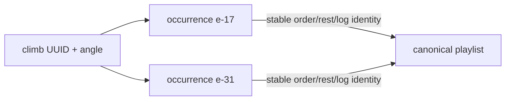
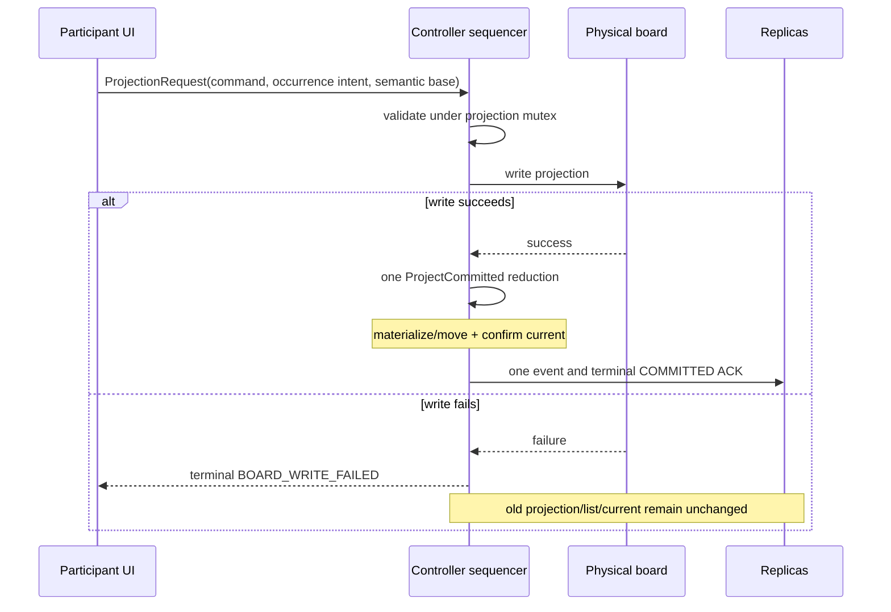

# Playlist occurrence focus and atomic projection

This note is the normative bridge between the BoardCell protocol and the
playlist/detail UI. It complements the broader architecture documents by
recording why one board write, one occurrence, and one user-visible success
must share an authority boundary.

## Authority and identity

The Board Playlist belongs to the `BoardCell`; it has no host owner. Every
authenticated member may edit it or request a projection. The technical
controller serializes commands and writes the physical board, but this role is
an implementation responsibility rather than a product privilege.

An entry is an *occurrence* identified by stable `entryId`. Climb UUID plus
angle describes its content, not its identity: a training block may contain the
same climb several times, with independent order, rest and logging meaning.
Operations therefore address occurrence IDs and use occurrence anchors instead
of mutable array indices.

Generic climb detail is duplicate-safe. It reuses a matching occurrence that
is current, then one immediately after current. A matching occurrence elsewhere
requires confirmation before it is moved after the old current. Only an absent
climb-and-angle pair mints an occurrence. Explicit **Repeat** remains the way to
request deliberate duplication.

## Layered or quantum state

Several facts coexist and must not be flattened into one `current` flag.

| Layer | Authority | Example |
|---|---|---|
| Physical | board write/readback | LEDs show climb X |
| Canonical | hashed BoardCell event | occurrence `e-17` is current-on-board |
| Canonical failure | playlist state | `e-31` could not be projected |
| Local navigation | player ViewModel | this phone is viewing `e-31` |
| Transport | local retry/ACK state | command is queued or accepted |
| Personal | personal repository | ascent mark for the climb |

“Quantum” means uncertainty remains layered until authoritative evidence
collapses it. Transport enqueue is not projection success. Local focus is not
group current. A write-only board's terminal transport completion is weaker
than controller readback, and the UI describes that distinction honestly.

## One projection transaction

The former participant path sent playlist `Add` and then `ProjectionRequest`.
The Add advanced `playlistRevision`, correctly making the second message's
semantic base stale. The result was a leaked occurrence, an unchanged board,
and a failed send.

The projection request now carries occurrence intent with conservative defaults:

- `entryId`: selected or requester-minted stable occurrence;
- `materializeEntry`: permission to create it when absent;
- `placeAfterCurrent`: move/place it relative to pre-write current.

Defaults are projection-only, preserving decode and behavior for request shapes
that do not understand occurrence materialization.

The successful event changes projection and playlist in one canonical sequence
and advances playlist revision once. A failed physical write emits no commit,
so it cannot materialize an unwanted entry. Request `commandId` and `entryId`
survive retry, reconnect, controller handover and durable replay.

Semantic stale checking compares projection and playlist revision while
allowing heartbeat-only sequence changes to rebase. A concurrent visible edit
refuses the request rather than changing the meaning of an old tap.

## Transport is not canonical commit

`send()` only proves local enqueue. Participant detail waits for the terminal
command ACK and reports success only for `COMMITTED`; rejection, physical write
failure and timeout are failures. The controller persists write intent before
touching the board and persists snapshot plus ACK after success, making retries
idempotent through process death.

The UI must derive long-lived success from canonical state: matching projection
and `currentEntryId`, plus readback confidence where the board supports it.
Pending transport may drive a spinner, never a success checkmark.

## Current-on-board and local player focus

`currentEntryId` is the only canonical occurrence confirmed on the wall and is
by far the strongest list highlight. The list does not expose a second selected
highlight that could compete with it.

A row opens `playlist_player?entryId=…`. `PlaylistOccurrenceFocus` stores that
ID locally and emits no playlist operation. Back returns to the list. Player
swipes and previous/next change local focus only; they do not send or move group
current. The lamp is the explicit boundary that sends the focused occurrence,
and only its terminal controller commit may make it current-on-board.

If an entry disappears, focus resolves to canonical current and then the first
remaining occurrence. It never adopts a different repeat merely because the
climb UUID matches.

## Repository-backed information and responsive UI

The player obtains names, grades, setter identity, move/frame counts and board
geometry from `ClimbRenderLoader` and `BoardRepository`; it fabricates no
metadata. Name is primary, grade/angle secondary, and setter plus move/frame
count tertiary. An established CruxCoach setter profile remains interactive;
native/foreign setter text remains plain.

The Nokia-class viewport is a baseline constraint. Important order is compact
identity, complete board image and holds, player/detail controls, then optional
hints. Visualization width is capped by both available width and height using
the real board/image aspect ratio. A queued climb replaces the large split Add
surface with a compact non-actionable status. Banners use single-line
truncation, and names yield space before counts or controls.

Join/leave presentation follows the membership transition until canonical
membership settles. Collapsed Nearby status is derived from the same visible
discovery rows as expanded Nearby; an expired occupied counter cannot leave a
“Board occupied” banner when no board or joinable playlist exists.

## Failure decisions

- **Stale base:** no board write; refresh before a new action.
- **Write failure:** old projection/current/list remain; show terminal failure.
- **Handover/interruption:** retry the same command and occurrence IDs.
- **Unknown projection:** display unknown; never infer from local focus/order.
- **Removed focused entry:** resolve local focus without resurrection.
- **Move of existing occurrence:** require explicit confirmation.

## CI and publication rationale

Targeted local checks cover reducers, semantic request ordering, occurrence
focus and affected UI compilation; CI owns the redundant full matrix. The
`feat/*` identity maps deterministically to one APKTrack track and package.
Feature CI handles only unsigned/debug transport artifacts and never receives
Android signing keys or publication tokens. The trusted main-side publisher
downloads but does not execute the artifact, applies the central development
signature, and verifies package, certificate, branch, track, version and hash
against Root policy.

A queued or leased APKTrack job is progress, not success. Publication completes
only at terminal `status="published"` with `receipt_delivered=true`. The stable
track remains manual/production-only.
