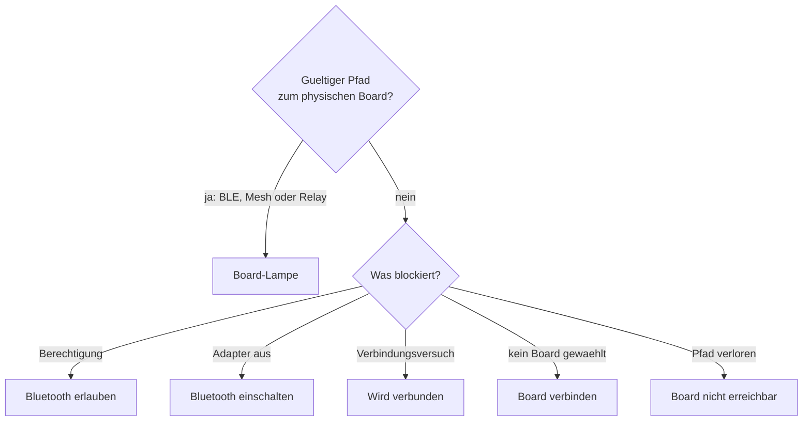

# UI/UX-Prinzipien fuer Playlist, Board und Quantum-Layer

> **Normativer Satz:** Die Oberflaeche muss lokale Aufmerksamkeit, gemeinsame Absicht und
> physische Board-Wahrheit unterscheidbar machen. Jede Aktion soll genau eine Bedeutung
> haben; jede Statusaussage darf nur so stark sein wie ihre technische Evidenz.

## 1. UX-Zielbild

Menschen benutzen CruxCoach nicht in einer ruhigen Desktop-Situation. Sie stehen vor einer
Wand, sprechen miteinander, halten ein Telefon mit einer Hand und muessen schnell erkennen:

- Welchen Climb sehe *ich*?
- Welchen Eintrag meint die Gruppe?
- Was leuchtet wirklich auf der Wand?
- Ist etwas unterwegs, fehlgeschlagen oder nur nicht beweisbar?
- Veraendert mein naechster Tap nur meine Ansicht oder die gemeinsame Session?

Das Design priorisiert deshalb semantische Eindeutigkeit vor maximaler Aktionsdichte.

## 2. Die sieben Leitprinzipien

### 2.1 Lesen ist kein Schreiben

Oeffnen, Swipen, Vor/Zurueck im Detail, Winkelansicht und Info-Sheet sind lokale
Navigation. Keine dieser Gesten mutiert Current, Playlist oder Wand.

### 2.2 Eine Geste, eine Bedeutung

Ein normaler Row-Tap oeffnet. Eine Lampe projiziert. Ein Plus fuegt ans Ende. Der Pfeil
oeffnet weitere Einfuegeoptionen. Keine Geste entscheidet kontextabhaengig zwischen zwei
gemeinsamen Mutationen, ohne dies sichtbar zu machen.

### 2.3 Gemeinsame Seiteneffekte sind explizit

Board- und Playlist-Aktionen haben sichtbare Controls, klare Verben, Haptik und direktes
Feedback. Long-Press ist ein Accelerator, nie der einzige auffindbare Weg.

### 2.4 Status ist keine Aktion

Eine leuchtende oder bestaetigte Wand macht die Lampe nicht zu einem deaktivierten
Statusicon. Resend ist eine legitime explizite Handlung. Status steht als Text/Badge neben
der weiterhin bedienbaren Aktion.

### 2.5 Fehler benennen den naechsten sinnvollen Schritt

„Nicht verbunden“ ist zu grob. Die UI unterscheidet Berechtigung, Bluetooth, fehlende
Boardauswahl, Verbindungsaufbau, Nichterreichbarkeit, Sendefehler und unbekannte
Controllerwahrheit.

### 2.6 Farbe wird immer redundant codiert

Layerfarbe wird durch Slotnummer, Textname, Position und Semantik ergaenzt. Ein Zustand
darf fuer farbfehlsichtige oder blinde Menschen nicht verschwinden.

### 2.7 Layout folgt Aufgabenhierarchie

Die Wandvisualisierung bleibt die groesste Flaeche. Sekundaere Detailinformation und das
volle Layer-Rack leben in Sheets. Dauerhaft sichtbare Controls sind kurz, stabil und nach
fachlicher Rolle gruppiert.

## 3. Informationsarchitektur des Detail-Screens

```text
TopAppBar   Favorit · persoenliche Liste · BLE · Resttimer · Mehr
banners     Resttimer · Sync/Fehler · Playlist-Kontext (+ ans Ende)
--------------------------------------------------------------
content     kompakte Climb-Info-Caption       -> Info-Sheet
            Quantum Layer Strip              -> Layer-Sheet
            Board-Visualisierung (maximaler Raum)
            Route-Playback (nur wenn fachlich passend)
            Sendestatus
--------------------------------------------------------------
bottomBar   Versuch · Board · Top
```

### 3.1 Warum kein grosser alter Detail-Block

Name, Setter, Grade, Winkel, Board und Provenienz muessen sofort erfassbar sein. Eine grosse
Karte mit allen Metadaten verdraengt jedoch die Wand, die fuer die Kletterentscheidung
zentral ist. Die kompakte Caption zeigt die Hierarchie; das Info-Sheet bietet Tiefe bei
Bedarf.

### 3.2 Warum das Layer-Rack in ein Sheet gehoert

Vier Slots mit Farben, Fremdbelegung, Fehlern, Entfernen und Send-all sind zu hoch fuer die
primaere Flaeche. Ein einzeiliger Strip beantwortet „Was ist vorbereitet/aktiv?“. Das Sheet
beantwortet „Wie aendere ich es?“.

Diese Progressive Disclosure darf keine Funktion verstecken: Alle Layeraktionen bleiben
im Sheet erreichbar, der Strip zeigt Belegung und Gruppen-Sperre sichtbar an.

## 4. Das Aktionsdock

Die drei dauerhaften Aktionen sind:

| Deutsch | Englisch | Bedeutung | Reichweite |
|---|---|---|---|
| `Versuch` | `Try` | persoenlichen Versuch protokollieren | lokal/persoenlich |
| `Board` | `Board` | diesen Climb explizit projizieren | physisch/gemeinsam |
| `Top` | `Top` | persoenlichen Durchstieg protokollieren | lokal/persoenlich |

Icons: X · Lampe/Board-Zustand · Haken. Die sichtbaren Labels bleiben kurz; die
Accessibility-Texte sind vollstaendig, etwa „Climb jetzt auf dem Board anzeigen“.

### 4.1 Warum Logging und Board getrennt bleiben

Try/Top sind persoenliche Logbook-Ereignisse. Board/Playlist veraendern einen gemeinsam
genutzten physischen Kontext. Sie stehen im selben ergonomischen Dock, duerfen aber weder
farblich noch semantisch so verschmelzen, dass Logging wie Gruppensteuerung wirkt.

### 4.2 Detailliertes Logging

Der schnelle Try-/Top-Tap darf Qualitaet, Kommentar oder Benchmark nicht unauffindbar
machen. „Mit Details protokollieren …“ bleibt im Overflow erreichbar. Quick Log und
detailliertes Log sind zwei Tiefen derselben persoenlichen Aufgabe.

## 5. Mittlere Dock-Aktion und Erreichbarkeit

Die mittlere Aktion wird aus einem Board-Pfad abgeleitet, nicht nur aus lokaler BLE-
Verbindung.

Waehrend eine klassische Session verbindet, bleibt die Position besetzt: sichtbar,
benannt (`Wird verbunden`), nicht sendbar, und der Tap oeffnet das Status-/Recovery-Sheet.
Die Aktion zu verstecken verliert nicht nur den Status — es aendert mitten im Beitritt die
Breite der beiden Aktionen daneben, unter dem Daumen der Person, die gerade tippt.



Prioritaeten sind nutzerorientiert. Eine fehlende Berechtigung wird vor „Bluetooth aus“
gezeigt, weil sie sonst unsichtbar bleibt. `NO_BOARD` ist eine Einladung; `UNREACHABLE`
ist ein Fehler. Beides mit „Board verbinden“ gleich zu benennen waere unehrlich.

## 6. Playlist-Eintrag: Oeffnen versus Beleuchten

Eine Row hat zwei getrennte Intentionen:

- Tap auf Inhalt: Climb lokal oeffnen und Entry-ID in Navigation bewahren.
- Tap auf Lampe: genau diese Occurrence physisch projizieren.

```text
+----------------------------------------------------------------+
| Drag | Name · Grade · Winkel | Status / Pause | Lampe | Mehr   |
+----------------------------------------------------------------+
       ^ lokales Oeffnen                       ^ gemeinsame Aktion
```

Der fruehere Row-Tap auf `SetSelection` war konzeptionell falsch: Information lesen wurde zu
einer Gruppenmutation. Die explizite Lampe macht den Seiteneffekt auffindbar und pruefbar.

### 6.1 Lokal geoeffneter, remote geloeschter Entry

Der Detail-Screen bleibt offen und zeigt `Aus Playlist entfernt`. Der Nutzer verliert
nicht abrupt Kontext, aber die UI behauptet auch nicht, die Occurrence existiere noch.
`Board` erzeugt anschliessend eine neue Occurrence; es restauriert die alte nicht heimlich.

## 7. Hinzufuegen aus dem Climb-Detail

```text
[ Board · Current 3/6                         + ]
```

### 7.1 Default

Das Plus sitzt im sichtbaren Playlist-Banner und fuegt ausschliesslich ans Ende hinzu.
Das ist der haeufige, konfliktarme Fall: Nichts springt vor den aktuellen Ablauf. Ein
zweiter breiter Add-Block unter dem Boardbild ist redundant, vergroessert den Action-Dock
und trennt die Aktion optisch von ihrem Ziel; deshalb existiert er nicht.

### 7.2 Alternative

Weitere Einfuegepositionen sind vorerst nicht Teil dieses Banners. Falls sie spaeter
hinzukommen, duerfen sie die klare Plain-Tap-Semantik des Plus nicht veraendern.

### 7.3 Warum zwei gleichwertige Buttons verworfen wurden

Ein einzelnes Plus nutzt den durch das Entfernen redundanter Bannertexte gewonnenen Raum.
Es ist schneller erfassbar als ein beschrifteter Split Button und behaelt trotzdem eine
eindeutige Mutation: append-only.

### 7.4 Discoverability

Das Plus ist ein eigenes semantisch benanntes Tap-Ziel. Der Rest des Banners oeffnet die
Playlist; beide Ziele duerfen ihre Gesten nicht gegenseitig ausloesen.

### 7.5 Ladezustand

Beim Swipen kann fuer einen Moment noch der vorherige Climb im State stehen. Deshalb wird
das Banner-Plus waehrend der gemeinsamen Aufloesung von UUID und Winkel deaktiviert, aber
nicht ausgeblendet. Ein Tap darf niemals noch den vorherigen Pager-Eintrag einreihen.

## 8. Playlist-Transportsteuerung

```text
[ Zufall ]       [ Zurueck ] [  Lampe  ] [ Weiter ]       [ Hinzufuegen ]
```

Zurueck und Weiter bewegen ausschliesslich den lokalen, orange markierten Kandidaten. Sie
erzeugen weder einen Playlist-Command noch einen Board-Write. Die Lampe in der Mitte ist
die einzige explizite manuelle Bruecke zur Wand.
Sie bleibt aktiv, wenn derselbe Climb schon am Board ist, weil Resend nach externer
Aenderung oder verpasstem Write legitim ist.

Der bestaetigte Board-Current bleibt gruen umrandet. Weicht der lokale Kandidat ab, erhaelt
er eine orange Umrandung; stimmen beide ueberein, wird ausschliesslich Gruen gezeigt.

Zufall und Hinzufuegen stehen ausserhalb der zentrierten Dreiergruppe, weil sie andere
Aufgaben sind. Die Lampe darf nicht durch Zusatzaktionen optisch aus der Mitte gezogen
werden.

## 9. Reorder-UX

Drag-and-drop verwendet eine lokale Preview fuer fluessiges Feedback. Die kanonische
Operation adressiert danach Entry-ID plus relativen Anchor.

Regeln:

- Compose-Key ist `entryId`, niemals Position.
- Neue Remote-Entries duerfen die lokale Drag-Preview nicht sofort zerreissen.
- Nach kanonischer Bestaetigung verschwindet die Preview.
- Nach Timeout oder Ablehnung faellt die UI auf kanonische Ordnung zurueck.
- Move-up/down bleibt als alternative Bedienung fuer Accessibility verfuegbar.
- Haptik markiert Beginn und Abschluss, ersetzt aber kein sichtbares Feedback.

## 10. Statussprache

### 10.1 „Du siehst“ und „Am Board“

Wenn lokale Ansicht, Current oder Projection voneinander abweichen, nennt die UI beide
Fakten. Sie darf die Differenz nicht durch Hervorhebung nur einer Row verstecken.

Beispiele:

```text
Du siehst: Moon Rider, 30°
Am Board:  Black Pearl, 30° — uebertragen
```

```text
Du siehst: Moon Rider, 30°
Wird ans Board gesendet …
```

```text
Moon Rider wurde nicht uebertragen. [Erneut] [Entfernen]
Am Board bleibt: Black Pearl
```

### 10.2 Fuenf Konfidenzstufen

| Domain | Nutzertextprinzip | Farbe allein? | Aktion |
|---|---|---|---|
| `PENDING` | Prozessform: „Wird gesendet“ | nein | Abwarten/Cancel nur falls real |
| `TRANSPORTED` | Transportfakt: „An Board uebertragen“ | nein | Resend moeglich |
| `CONTROLLER_CONFIRMED` | Evidenz nennen: „Vom Board bestaetigt“ | nein | Resend moeglich |
| `UNKNOWN` | Wissensgrenze: „Board-Zustand unbekannt“ | nein | pruefen/resenden |
| `FAILED` | Ergebnis + Recovery: „Nicht uebertragen“ | nein | `Erneut`, Undo/Entfernen |

„Auf dem Board“ ohne Qualifikation ist nur zulaessig, wenn der Kontext die Evidenzstufe
anderweitig klar und zugaenglich macht. Technische Worte wie GATT oder Readback gehoeren
nicht zwingend in den Haupttext; die semantische Staerke muss trotzdem stimmen.

## 11. Undo und Recovery

### 11.1 Lokales Edit-Undo

Die Snackbar benennt die Operation, etwa „Eintrag entfernt“ oder „Reihenfolge geaendert“.
Bei mehreren gleichzeitig editierenden Menschen ist ein kontextloses „Rueckgaengig“ nicht
sicher.

### 11.2 Clear-Restore

Nach einem Clear erscheint fuer alle Mitglieder eine Karte mit Entry-Anzahl, gemeinsamer
Restzeit und Restore-Aktion. Der Countdown stammt aus der controllergestempelten Deadline,
nicht aus dem Zeitpunkt, zu dem diese UI den Clear bemerkt hat.

### 11.3 Fehlgeschlagenes `lightNow`

Die neue Occurrence bleibt direkt nach dem alten Current sichtbar:

- Status `Nicht uebertragen`,
- `Erneut` mit gleicher Identitaet,
- Entfernen/Undo,
- bisheriger Current weiterhin als Wandwahrheit.

Ein Fehler darf nicht durch automatisches Entfernen „sauber“ aussehen. Sichtbarkeit ist
hier die Grundlage fuer Recovery.

## 12. Quantum-Layer-UX

### 12.1 Strip

Der kompakte Strip zeigt:

- vier stabile Positionen,
- Slotnummer,
- Farbe,
- Preview/aktiv/fehlgeschlagen,
- Zahl aktiver Controllerplaetze,
- Marker, wenn eine BoardCell die Wand besitzt.

Er ist Navigation zum Sheet und Statuszusammenfassung, nicht der Ort fuer jede Aktion.

### 12.2 Rack im Sheet

Jeder Slot zeigt mindestens:

- Climbname und Winkel,
- geplante und gegebenenfalls bestaetigte Route,
- Farbe mit Textlabel,
- `PREVIEW`, `SENDING`, `CONFIRMED` oder `FAILED`,
- Zuweisen/Ersetzen,
- eigene Lampe,
- Entfernen,
- erklaerendes Fehlerfeedback.

Zusaetzlich: Send-all, externe Spieler, freie Kapazitaet und bekannte Overlaps.

### 12.3 Gruppenmodus

Bei aktiver BoardCell bleiben lokale Previews editierbar. Physische Layer-Lampen,
Send-all und Entfernen bestaetigter Layer sind deaktiviert. Ein kurzer Text erklaert, dass
die Gruppen-Playlist die Wand steuert. Disabled ohne Grund waere eine tote UI; komplettes
Verstecken wuerde den vorbereiteten lokalen Plan unsichtbar machen.

### 12.4 Ueberlappende Holds

Auf dem Boardbild werden mehrere Layer durch benachbarte Ringsegmente gezeigt. Blendfarben
sind ungeeignet, weil die Ursprungsidentitaeten nicht mehr ablesbar waeren. Slotnummern und
Legende stellen die Verbindung zum Rack her.

### 12.5 Lanes in der geteilten Liste

Die Playlist bleibt eine Liste in der Zeit. Auf einem Vier-Lane-Board bekommt jede Zeile
zusaetzlich vier schmale Chips und der Screen einen Rack-Streifen ueber der Liste. Auf
jedem anderen Board existiert beides nicht — nicht „leer“, sondern gar nicht, damit die
Zeilenhoehe unveraendert bleibt.

```text
◉  Zombie Hands              2/4        L1 ●  L2 ·1  L3 ✓  L4 ?     💡  ⟳  🗑
   6B · 40°
```

Ein Chip ist **Nummer plus Symbol**. Farbe ist redundant und niemals allein tragend:

| Symbol | Zustand |
|---|---|
| `●` | diese Occurrence leuchtet in dieser Lane |
| `◐` | fuer diese Lane geplant, nichts geschrieben |
| `…` | Write laeuft |
| `✓` | konfliktfrei, sendbar |
| `·N` | N Holds im Weg; `·1` ist „ein Hold entfernt“, nicht sendbar |
| `?` | eine Ebene an der Wand ist unbekannt |
| `✕` | Kapazitaet, Farbe oder fremder Claim |

Ein Tap auf einen Chip **plant** eine Lane. Ein zweiter Tap auf dieselbe Lane nimmt die
Vormerkung zurueck — sonst gaebe es keinen Weg zurueck zu „die Lampe legt es dorthin, wo
der Gruppen-Current hingehoert“. Er sendet nicht. Die Lampe der Zeile bleibt die
einzige Aktion des Screens, die eine Diode veraendert; sie schreibt in die vorgemerkte oder
vorgeschlagene Lane. Ohne konfliktfreie Lane bleibt der Eintrag unveraendert in der Liste
und die Absage nennt ihren Grund.

Geraete, die keine Lane schreiben koennen — jedes Mesh-Mitglied, das nicht am Controller
haengt —, sehen dieselbe Kompatibilitaet, aber deaktivierte Chips und eine Zeile, die
erklaert warum. Eine Schaltflaeche, die nichts tut, ist eine Behauptung.

Eine Lane, deren Occurrence die Liste verlassen hat, bleibt an und wird im Streifen
markiert. Die vollstaendige Semantik steht in
[QUANTUM_PLAYLIST_LAYERS.md](QUANTUM_PLAYLIST_LAYERS.md).

### 12.6 Browser-Filter „Passt an die Wand“

Drei Zustaende: `Aus`, `Ohne Ueberlappung`, `Hoechstens 1`. Nur auf Quantum sichtbar, beim
Boardwechsel auf `Aus` zurueckgesetzt, und deaktiviert solange nichts leuchtet — mit einem
Satz, der das sagt, statt eines Chips, der wirkungslos klickt. Unter den Chips steht die
exakte Trefferzahl; kann eine Ebene nicht aufgeloest werden, steht dort stattdessen, dass
ein freier Send nicht garantiert ist.

## 13. Automatic versus explizites Senden

Der Default ist `Per Taste`. Bestehende Installationen werden genau einmal auf diesen
Default migriert; ein spaeter bewusst gewaehltes `Automatic` darf nicht bei jedem Start
zurueckgesetzt werden.

Unabhaengig von der Praeferenz gilt:

- Detail-Oeffnen sendet nie,
- Swipe sendet nie,
- Winkel-/Mirror-Wechsel sendet nie implizit,
- Reconnect sendet nie den sichtbaren Climb,
- Layer-Zuweisung ist Preview,
- explizite Playlist-/Playback-Progression darf Automatic konsumieren, wenn der jeweilige
  Flow dies eindeutig definiert.

„Automatic“ ist eine Progressionspraeferenz, keine Erlaubnis fuer Navigations-
Seiteneffekte.

## 14. Race-resistente UX

Die UI muss auch waehrend schneller Zustandswechsel ehrlich bleiben:

- Ein Variant-Wechsel (Climb, Winkel, Mirror, Holds) fenced einen laufenden Send.
- Ein alter Send darf keinen Erfolg, Fehler oder History-Eintrag auf die neue Ansicht
  schreiben.
- Der globale Spinner gehoert zum neuesten Send-Controllerzustand; ein veraltetes Resultat
  darf ihn nicht dauerhaft haengen lassen.
- Ein Ownership-Wechsel zwischen Affordance und Dispatch wird im Controller abgefangen.
- Ein Boardwechsel zwischen Layer-Tap und Write wird durch Boardidentitaet abgefangen.
- Eine optimistische Drag-Reihenfolge laeuft nach Timeout aus.

> **UX-Prinzip:** Schnelle Oberflaeche durch lokale Vorschau; korrekte Oberflaeche durch
> autoritative Reconciliation und generation-/identitaetsgebundene Resultate.

## 15. Accessibility

### 15.1 Mindestvertrag

- Jeder icon-only Control hat eine inhaltliche `contentDescription`.
- Sichtbare Einwortlabels und Accessibility-Texte duerfen unterschiedlich lang sein.
- Split-Button-Haelften besitzen getrennte Rollen und Namen.
- Long-Press ist nie der einzige Weg.
- Drag besitzt Move-up/down-Alternativen.
- Farbwahl nennt Farbe, Auswahl und Verfuegbarkeit.
- Status wird textlich und semantisch, nicht nur farblich vermittelt.
- Touch Targets bleiben ausreichend gross und stabil.
- Disabled-Zustaende sind erklaert; wenn Recovery moeglich ist, wird eine Aktion angeboten.

### 15.2 Beispielsemantik

| Sichtbar | Accessibility |
|---|---|
| `Board` | „Climb jetzt auf dem Board anzeigen“ |
| Lampenicon in Playlistrow | „Diesen Playlist-Eintrag auf dem Board anzeigen“ |
| Plus im Playlist-Banner | „Ans Ende der Board-Playlist hinzufügen“ |
| Lane-Chip `L2 ·1` | „Lane 2: ein Hold im Weg — das Board lehnt das weiterhin ab“ |
| Lane-Chip `L3 ?` | „Lane 3: unbekannt — eine Ebene an der Wand konnte nicht aufgeloest werden“ |
| Cyan-Swatch | „Cyan, Layerfarbe, verfuegbar/ausgewaehlt“ |

## 16. Internationalisierung und Textprinzipien

Neue Nutzertexte werden immer gemeinsam fuer Englisch und Deutsch eingefuehrt. Texte
sollen:

- Handlung oder Fakt nennen,
- keine technische Evidenz erfinden,
- im Deutschen und Englischen idiomatisch statt wortwoertlich sein,
- keine Richtung nur ueber Iconform vermitteln,
- Pluralformen fuer Entry-Anzahlen verwenden,
- Recovery-Verben konsistent halten (`Erneut`, `Verbinden`, `Erlauben`, `Wiederherstellen`).

Kurze sichtbare Labels werden nicht dadurch „barrierefrei“, dass sie verlaengert werden;
dafuer existieren separate Accessibility-Beschreibungen.

## 17. Anti-Patterns

Folgende Muster sind explizit zu vermeiden:

1. **Navigation als Command:** Row-Tap oder Swipe setzt Current oder schreibt LEDs.
2. **Boolean Truth:** `isOnBoard` verschluckt Pending, Readback und Unknown.
3. **Disabled-as-status:** Die Lampe wird nach Erfolg grau und verhindert Resend.
4. **Bluetooth-Tunnelblick:** Ein Mesh-Mitglied wird zum Einschalten lokalen BLEs geschickt.
5. **Versteckte starke Mutation:** Long-Press fuegt sofort „als naechstes“ ein.
6. **Farbe ohne Label:** Layer sind nur an Swatches unterscheidbar.
7. **Inline-Ueberladung:** Das volle Rack verdraengt das Boardbild.
8. **UI-only Ownership:** Button ist weg, aber ViewModel/Controller kann weiter senden.
9. **Optimismus ohne Ablauf:** Drag-Preview bleibt nach Ablehnung dauerhaft sichtbar.
10. **Fehler wegraeumen:** fehlgeschlagene Occurrence verschwindet und ist nicht retry-faehig.
11. **Markenabfrage in der UI:** `brand == QUANTUM` statt Faehigkeit.
12. **Falsche Bestaetigung:** erfolgreicher Write wird auf jedem Board als Controller-Readback bezeichnet.

## 18. UX-Abnahmeszenarien

### Szenario A: Playlist lesen, ohne die Wand zu stoeren

1. Zwei Telefone sehen dieselbe Playlist.
2. Telefon A tippt eine Row.
3. Nur A oeffnet den Detail-Screen; Current und Wand bleiben gleich.
4. A tippt `Board`.
5. Genau die geoeffnete Entry-ID wird nach Erfolg Current.

### Szenario B: gleicher Climb zweimal

1. Derselbe Climb steht als Entry X und Y in der Liste.
2. Y wird geoeffnet und beleuchtet.
3. Y wird Current; X bleibt unveraendert an seiner Position.
4. Wiederholtes Beleuchten erzeugt keinen dritten Entry.

### Szenario C: Write scheitert

1. Ein externer Detail-Climb wird mit `Board` gestartet.
2. Neue Occurrence erscheint nach dem alten Current.
3. Transport scheitert.
4. Alter Current bleibt als „am Board“ sichtbar.
5. Neue Occurrence zeigt Fehler, Retry und Entfernen.

### Szenario D: Quantum-Rack vorbereiten

1. Vier Climbs werden lokal Slots zugewiesen.
2. Kein Board-Write findet statt.
3. Ein fremder Controller-Spieler erscheint und reduziert Kapazitaet.
4. Send-all verweigert vor dem ersten Write, wenn die Gruppe nicht mehr passt.

### Szenario E: Gruppenbeitritt waehrend Quantum-Preview

1. Lokale Previews sind sichtbar.
2. Das Geraet tritt einer BoardCell bei.
3. Previews bleiben sichtbar und editierbar.
4. Physische Layeraktionen werden erklaert gesperrt.
5. Die mittlere `Board`-Aktion nutzt die Gruppen-Playlist und den Single Writer.

### Szenario F: Reachability ohne lokales BLE

1. Das Telefon ist Mesh-Mitglied, der Controller eines anderen Telefons erreicht das Board.
2. Das Dock zeigt `Board`, nicht „Bluetooth einschalten“.
3. Der Tap geht ueber den kanonischen Gruppenpfad.

## 19. Review-Checkliste fuer UI-Aenderungen

1. Ist klar, ob die Handlung lokal, gemeinsam oder physisch ist?
2. Hat jeder Tap genau eine stabile Bedeutung?
3. Gibt es bei einem gemeinsamen Seiteneffekt ein sichtbares, explizites Control?
4. Ist der angezeigte Status aus Domain-Evidenz abgeleitet?
5. Bleibt Recovery bei Failure und Unknown moeglich?
6. Funktioniert die Handlung ohne Farbe, Long-Press und Drag?
7. Bleibt das Layout bei Loading, Pending und Fehler stabil?
8. Sind EN und DE vollstaendig und idiomatisch?
9. Reprueft der Dispatch Ownership und Boardidentitaet?
10. Decken State- und Semantiktests die Entscheidung ab, nicht nur einen Screenshot?
