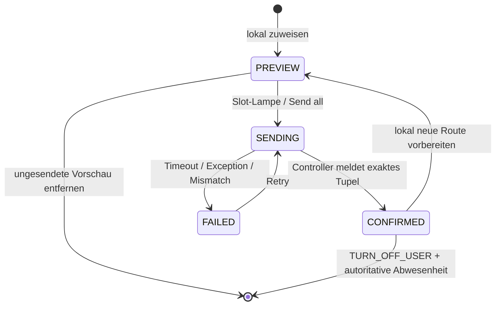
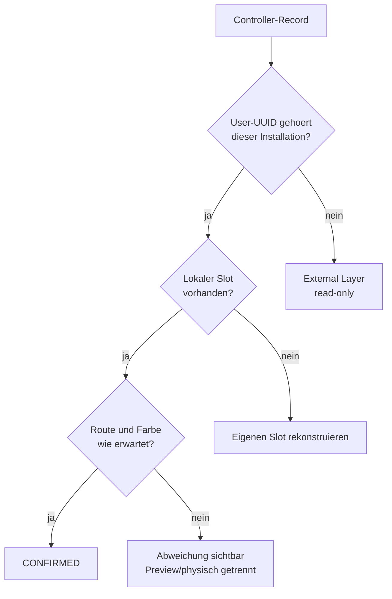
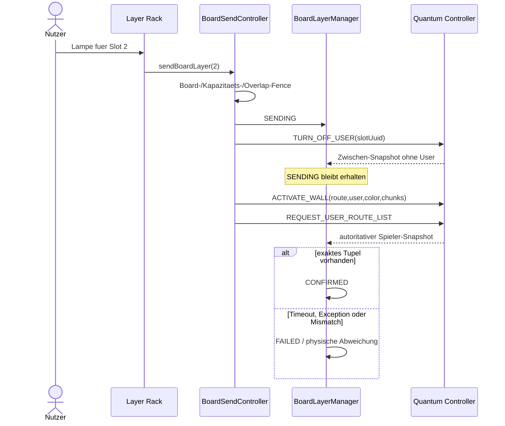

# Architektur der Quantum-Board-Layer

> **Normativer Satz:** Ein Board-Layer ist eine unabhaengig identifizierbare physische
> Projektion eines Controllers. Eine lokale Vorschau ist noch keine Projektion; eine
> Projektion ist erst bestaetigt, wenn der faehige Controller die erwartete
> Route/User/Farbe-Kombination autoritativ zurueckmeldet.

## 1. Warum „Layer“ und nicht „vier Sends“

Quantum kann bis zu vier Climbs gleichzeitig darstellen. Das ist kein Stapel von vier
klassischen Single-Climb-Frames, sondern ein Controllerzustand mit unabhaengigen Spielern:

- jeder Slot hat eine stabile User-Identitaet,
- jeder Slot hat Route und Farbe,
- ein Slot kann einzeln ersetzt oder entfernt werden,
- fremde Apps oder Kletternde koennen weitere Controllerplaetze belegen,
- der Controller ist die Autoritaet ueber die tatsaechliche Belegung.

CruxCoach modelliert das als generische Board-Faehigkeit. Quantum ist der erste Adapter
mit `maxSimultaneousClimbs = 4` und unabhaengiger Layer-Identitaet. Die UI fragt nach
Faehigkeiten und bleibt damit fuer zukuenftige Controller erweiterbar.

## 2. Drei Wahrheiten des Layer-Racks

Auch hier sind drei Ebenen getrennt:

| Ebene | Beispiel | Autoritaet |
|---|---|---|
| lokaler Plan | Slot 2 soll „Moon Rider“ in Cyan zeigen | Nutzer / `BoardLayerManager` |
| laufende Transaktion | Slot 2 wird gerade ersetzt | Send-Controller |
| physischer Controller | User-UUID X zeigt Route Y in Cyan | Quantum-Readback |

`BoardClimbLayer` traegt deshalb sowohl den gewuenschten `routeUuid`/`color` als auch
`confirmedRouteUuid`/`confirmedColor`. Ein neues Preview darf nicht so tun, als sei die
alte physische Projektion bereits verschwunden.



## 3. Faehigkeitsgrenze

Die Layer-Architektur wird durch Board-Eigenschaften aktiviert:

- `maxSimultaneousClimbs`
- `supportsIndependentClimbLayers`
- unabhaengige Identitaet und Entfernung im Adapter
- optionaler Controller-Readback

Boards ohne diese Eigenschaften:

- zeigen keinen Layer-Strip und kein Layer-Rack,
- benutzen den bestehenden Single-Projection-Weg,
- behalten Wire-Format und Sendesemantik byte-fuer-byte,
- werden nicht durch Quantum-spezifische Annahmen belastet.

> **Prinzip:** Neue Hardwarefaehigkeit erweitert den abstrakten Vertrag; sie darf nicht
> dazu fuehren, dass alle bestehenden Boards einen kuenstlichen Vier-Slot-Zustand erhalten.

## 4. Lokales Staging

Das Rack hat vier lokale Slots. `assignPreview` ist bewusst rein lokal:

- kein BLE-Write,
- kein BoardCell-Command,
- kein implizites Senden beim Oeffnen oder Swipen,
- verwendbar waehrend kurzer Disconnects,
- entfernbar, solange keine physische Projektion derselben Identitaet existiert.

Diese Trennung ist UX und Sicherheit zugleich. Menschen koennen eine Mehrfachbelegung
zusammenstellen und auf Konflikte pruefen, bevor die erste LED veraendert wird.

### 4.1 Preview und bestaetigter Vorgänger

Wenn ein bestaetigter Slot lokal mit einem neuen Climb ueberschrieben wird, bleiben
`confirmedRouteUuid` und `confirmedColor` erhalten. Dadurch kann die UI gleichzeitig
sagen:

```text
Geplant:       neuer Climb, Magenta
Am Controller: alter Climb, Gruen
Status:        PREVIEW
```

Ein einzelnes Feld wuerde entweder die neue Absicht oder die alte physische Wahrheit
verlieren.

## 5. Installationsidentitaet und Datenschutz

CruxCoach erzeugt eine zufaellige, app-private Installations-ID und leitet daraus vier
stabile UUIDv4-foermige Slot-Identitaeten mit SHA-256 ab.

Eigenschaften:

- stabil ueber App-Restarts,
- nicht an Nostr-, Vendor- oder CruxCoach-Accounts gekoppelt,
- nur an das lokal verbundene Board gesendet,
- pro Installation und Slot verschieden,
- FIPS-kompatible Ableitung ohne MD5-basierte Name-UUID.

Die Stabilitaet ist funktional notwendig: Quantum behaelt Projektionen nach Disconnect.
Nach Reconnect muss CruxCoach seine eigenen Controller-Eintraege erkennen und gezielt
entfernen koennen, ohne fremde Layer anzutasten.

## 6. Bindung an das physische Board

Ein Layer ist ein Diodenplan fuer genau einen Controller und ein Modell. Daher bindet
`BoardLayerBoardIdentity` das Rack an:

- `physicalBoardId`,
- `productSizeId`.

Das Modell ist kein Metadatum. Dieselbe Placement-ID oder derselbe Climb auf einer anderen
Boardgroesse kann andere LEDs und Holds bedeuten.

| Neue Identitaet | Verhalten | Begruendung |
|---|---|---|
| identisch | Rack vollstaendig behalten | Reconnect zum selben Controller |
| verschieden | Previews und externe Layer verwerfen | Zustand gehoert zu anderem Board |
| `null` | behalten | Disconnect oder noch nicht aufgeloeste Groesse ist kein Boardwechsel |

Vor dem physischen Write prueft der Send-Controller die Bindung erneut. Das schliesst das
Race, in dem zwischen UI-Tap und Write ein anderes Board verbunden wird.

## 7. Farben sind Protokollidentitaet, nicht Dekoration

Die vier eindeutigen Controllerfarben sind:

| Name | RGB | Rolle |
|---|---|---|
| Gruen | `#00ff00` | eindeutige Layerfarbe |
| Cyan | `#00ffff` | eindeutige Layerfarbe |
| Magenta | `#ff00ff` | eindeutige Layerfarbe |
| Gelb | `#ffff00` | eindeutige Layerfarbe |

Sechs visuelle eWalls-Swatches kollabieren nach BLE-Normalisierung auf diese vier
Protokollfarben. Zwei UI-Farben, die auf denselben Low-24-bit-Wert abgebildet werden,
waeren keine zusaetzlichen Identitaeten.

Farben, die der Controller bereits fuer eigene oder fremde Spieler meldet, stehen nicht
erneut zur Auswahl. Compose verwendet ARGB; das Protokoll die unteren 24 RGB-Bits.

### 7.1 Accessibility-Folge

Farbe darf niemals das einzige Label sein:

- jeder Slot hat eine Nummer,
- jeder Swatch hat einen lokalisierten Farbnamen,
- Auswahl und Disabled-Zustand sind semantisch exponiert,
- Layernummer und Farbe erscheinen redundant in Strip und Rack,
- Ueberlagerungen werden nicht nur durch Farbblendung erklaert.

## 8. Controller-Wahrheit und Reconciliation

Quantum-Notifications werden streng nach Geraeteadresse, Payloadlaenge und maximaler
Spielerzahl verarbeitet. Ein autoritativer Snapshot enthaelt bis zu vier Records aus:

```text
route UUID + user UUID + remaining seconds + RGB
```

`BoardLayerManager.reconcile` teilt sie auf:

- eigene User-UUID + erwartete Route/Farbe -> `CONFIRMED`,
- eigene User-UUID + andere Route/Farbe -> physische Abweichung bleibt sichtbar,
- bekannte eigene User-UUID ohne lokalen Slot -> eigener Controllerzustand wird rekonstruiert,
- unbekannte User-UUID -> read-only `ExternalBoardLayer`,
- bestaetigter eigener Slot fehlt -> physisch entfernt,
- `SENDING` fehlt im Zwischen-Snapshot -> Placeholder bleibt waehrend der Transaktion.



## 9. Projektionstransaktion

Eine konservative Slot-Projektion besteht aus:

1. `TURN_OFF_USER(ownSlotUuid)`
2. `ACTIVATE_WALL(route, ownSlotUuid, colour, diodes)` in protokollgerechten Chunks
3. `REQUEST_USER_ROUTE_LIST`
4. Erfolg erst, wenn ein autoritativer Snapshot das exakte Route/User/Farbe-Tupel enthaelt



Der vorgeschaltete `TURN_OFF_USER` ist bewusst slot-spezifisch. Normales Umschalten sendet
niemals `TURN_OFF_ALL`, weil das fremde Projektionen loeschen koennte.

## 10. Kapazitaet

Die physische Belegung ist nicht gleich der Zahl lokaler Karten:

```text
occupiedCount = eigene Slots mit confirmedRouteUuid + externe Controller-Layer
```

Reine Previews belegen keinen Controllerplatz. Das Ersetzen einer bereits bestaetigten
eigenen Identitaet benoetigt keinen zusaetzlichen Platz. Ein neuer eigener User benoetigt
einen freien Controllerplatz.

### 10.1 Send-all ist eine vorab validierte Gruppe

Vor dem ersten Write prueft Send-all:

- passen alle neuen eigenen Identitaeten in die verbleibende Kapazitaet?
- gibt es bekannte Hold-Ueberlappungen?
- gehoert das Rack zum verbundenen Board/Modell?
- besitzt keine BoardCell die Wand?
- ist die Verbindung weiterhin Quantum und gesund?

Schlaegt eine Vorbedingung fehl, beginnt kein Slot. Das verhindert ein halb appliziertes
Rack, bei dem zwei Layer gesendet wurden und der dritte an Kapazitaet scheitert.

## 11. Hold-Konflikte und Visualisierung

Quantum kann einer Diode nicht zwei Userfarben gleichzeitig zuweisen. Bekannte
Ueberlappungen lokaler Layer werden deshalb vor BLE abgelehnt.

Auf dem Boardbild werden Holds mehrerer Previews als benachbarte Ringsegmente gezeichnet,
nicht zu einer Mischfarbe verblendet. Eine Mischfarbe waere visuell attraktiv, wuerde aber
die beteiligten Layeridentitaeten vernichten.

Unbekannte externe Layer bleiben controllerautoritativ. Falls deren Holds nicht lokal
bekannt sind, kann die App nur Kapazitaet darstellen und spaetere Firmware-Konflikte
ehrlich melden; sie darf nicht behaupten, Overlap vorab ausgeschlossen zu haben.

## 12. Fremde Layer

Fremde Spieler sind:

- sichtbar,
- in controllergemeldeter Farbe dargestellt,
- kapazitaetsrelevant,
- read-only,
- niemals automatisch zu verdraengen.

Die Formulierung muss vorsichtig sein: Ein externer Layer kann von einer anderen App, einer
anderen CruxCoach-Installation oder einem Gruppenpfad stammen. Die UI soll Beobachtung
benennen, nicht Eigentum erraten.

## 13. Harte Grenze zur BoardCell

Das aktuelle BoardCell-Wire-Modell traegt eine kanonische `BoardProjection` mit Climb,
Winkel und Disconnect-Semantik. Ein Quantum-Layer braucht zusaetzlich:

- Route-ID,
- User-/Slot-UUID,
- Farbe,
- unabhaengigen Lebenszyklus und Readback.

Wuerde ein Layer durch den generischen Mesh-Pfad geschickt, gingen diese Daten verloren.
Ein blosses „Request angenommen“ duerfte dann nicht als `CONFIRMED` im Rack erscheinen.

Deshalb gilt bei aktiver BoardCell:

| Aktion | Erlaubt? | Warum |
|---|---|---|
| Layer lokal zuweisen/ersetzen | ja | rein lokale Planung |
| ungesendetes Preview entfernen | ja | kein physischer Effekt |
| einzelnen Layer senden | nein | Wire kann Identitaet nicht erhalten |
| Send-all | nein | gleicher Grund, plus kein zweiter Writer |
| bestaetigten Layer entfernen | nein | waere physischer Write ausserhalb Gruppenpfad |
| kanonische Einzelprojektion der Playlist | ja | aktueller BoardCell-Vertrag |

Diese Grenze ist kein langfristiges Produktverbot. Multi-Layer im Mesh benoetigt jedoch
eine explizite Protokollversion, gemischten Client-Rollout, deterministische Merge-Regeln,
Layer-Ownership und Handover-Semantik. Es darf nicht als zusaetzliches optionales Feld
„hineingeschoben“ werden.

### 13.1 Was seither dazugekommen ist

Die Playlist selbst schreibt auf einem Quantum-Board inzwischen ueber eine Lane: das Geraet
am Controller adressiert die kanonische Projektion mit einer stabilen Slot-Identitaet statt
mit der Null-UUID, kann sie dadurch nach einem Reconnect wiedererkennen und gezielt
entfernen. Mesh-Mitglieder planen und lesen, schreiben aber keine Lane — genau aus dem
Grund, den die Tabelle oben nennt. Die vollstaendige Semantik, die Kompatibilitaetsmatrix
und die entworfene, noch nicht transportierte Rack-/Claim-Schemaversion stehen in
[QUANTUM_PLAYLIST_LAYERS.md](QUANTUM_PLAYLIST_LAYERS.md).

## 14. UI-Informationsarchitektur

Der Detail-Screen zeigt nicht das volle Rack inline:

- Ein kompakter `BoardLayerStrip` zeigt Slots, Farben, Belegung und Gruppenhinweis.
- Tap oeffnet `BoardLayerSheet` mit dem vollstaendigen Rack.
- Das Rack enthaelt Auswahl, Farbe, Zuweisung, Slot-Lampe, Send-all, Entfernen,
  externe Spieler, Capacity- und Overlap-Feedback.

Der Strip ist Orientierung; das Sheet ist Manipulation. So bleibt das Boardbild die
primaere Arbeitsflaeche und die Mehrfachbelegung trotzdem jederzeit sichtbar.

## 15. Fehlersemantik

| Fehler | Verhalten |
|---|---|
| Rack gehoert zu anderem Board | kein Write, klare Boardwechsel-Meldung |
| Board voll | kein Slot wird verdraengt |
| bekannte Hold-Ueberlappung | vor Write ablehnen |
| Controller-Exception | spezifische, gemappte Meldung |
| Timeout | `FAILED`, niemals `CONFIRMED` |
| Zwischen-Snapshot ohne User | `SENDING` behalten |
| fremde Belegung | read-only anzeigen und Kapazitaet reduzieren |
| BoardCell aktiv | physische Layer-Aktionen deaktivieren und begruenden |

## 16. Lebensdauer und Persistenz

Persistiert wird die installationsweite Slot-Identitaet. Das komplette Rack wird nicht als
dauerhafte Wahrheit pro Board gespeichert.

Begruendung:

- Controller-Readback ist die dauerhafte physische Wahrheit,
- ein persistiertes Preview braeuchte eigene Staleness- und Modellmigrationsregeln,
- „diese Session, dieses Board“ ist ein klareres Produktmodell,
- Reconnect zum selben Board kann ueber stabile User-UUIDs reconciliert werden.

## 17. Testvertraege

### Identitaet und Reconnect

- vier stabile, verschiedene Slot-UUIDs,
- gleiche Installation rekonstruiert eigene Controller-Layer,
- fremde UUID bleibt extern,
- Reconnect zum selben Board behaelt Preview,
- anderes Board oder Modell leert Rack,
- `null`-Bindung leert es nicht.

### Transaktion

- Preview sendet nichts,
- Reihenfolge Off -> Activate -> Readback,
- Zwischen-Off verliert `SENDING` nicht,
- Erfolg nur bei exakt passendem Route/User/Farbe-Tupel,
- Timeout und Exception enden in `FAILED`,
- Entfernen eines Previews ist lokal, Entfernen eines aktiven Slots physisch.

### Konflikt und Kapazitaet

- externe Spieler reduzieren Kapazitaet,
- Ersetzen eigener aktiver Identitaet verbraucht keinen neuen Slot,
- Send-all startet bei unzureichender Kapazitaet keinen Write,
- bekannte Overlaps werden vor BLE abgewiesen,
- fremde Layer werden nie durch `TURN_OFF_ALL` geloescht.

### BoardCell-Grenze

- Zuweisung und lokales Entfernen bleiben moeglich,
- Send, Send-all und aktives Entfernen werden am Dispatch verweigert,
- UI und Controller verwenden dieselbe Ownership-Policy,
- ein Ownership-Wechsel zwischen Tap und Write wird gefenced.

### Accessibility

- jeder Swatch besitzt Name, Rolle und Auswahlzustand,
- Slotnummer bleibt unabhaengig von Farbe lesbar,
- deaktivierte Aktionen erklaeren den Grund,
- Strip und Sheet liefern dieselbe Belegung, nicht zwei Interpretationen.

## 18. Hardware-Verifikation

Simulator- und Protokolltests beweisen Parser, Chunking und Zustandsmaschine. Sie ersetzen
keine Hardware-Verifikation. Solange vier reale Controllergenerationen, Konflikt,
Reconnect und Multi-Chunk-Verhalten nicht aufgezeichnet wurden, bleibt
`hardware_verified: false` die ehrliche Aussage. Nicht verifizierte atomare Befehle wie
`BOARD_SWIPE` bleiben ungenutzt.
