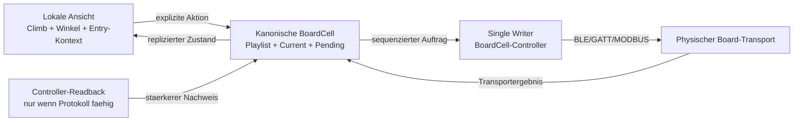
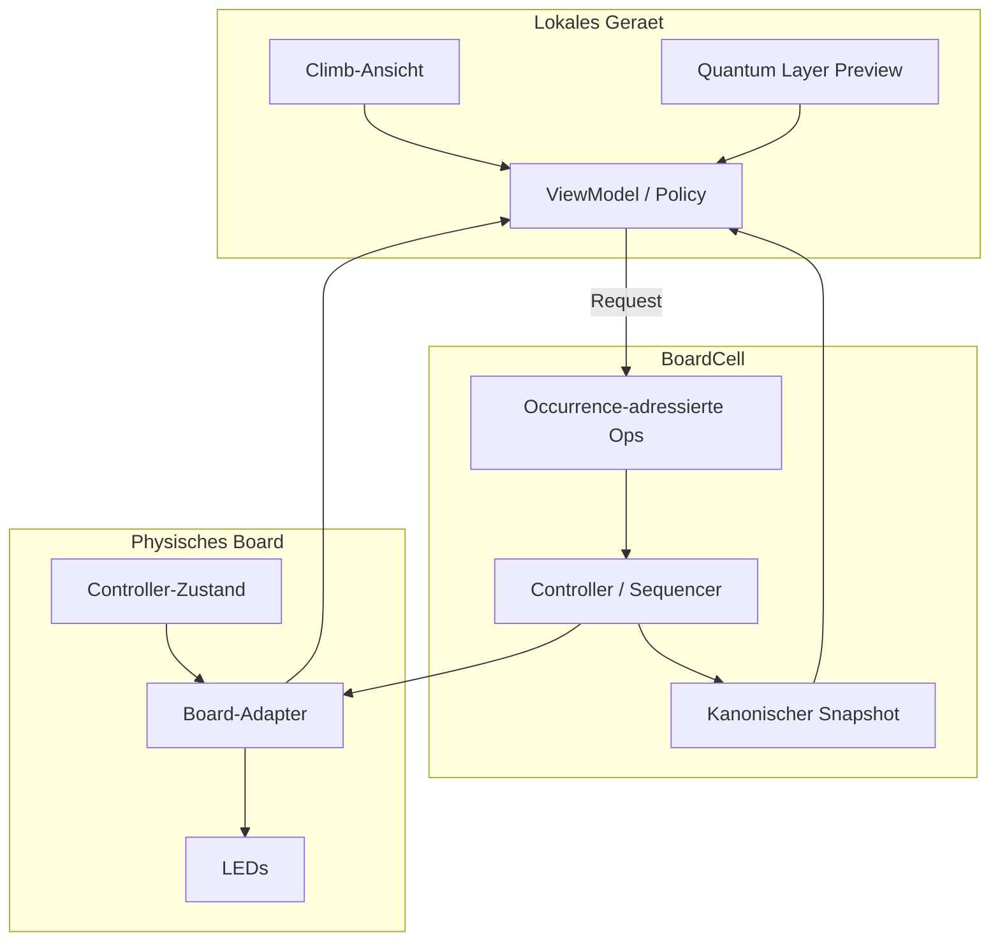
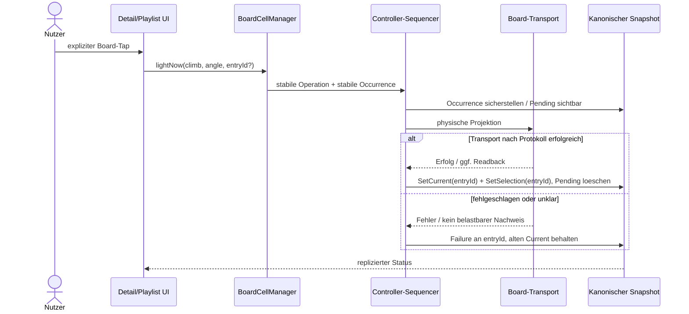

# Playlist, Board-Projektion und Quantum-Layer: Architekturueberblick

> **Status:** Normative Zielarchitektur fuer `feat/fips-board-playlist-ux`
>
> **Scope:** gemeinsame Board-Playlist, physische Board-Projektion, Quantum-Layer und die
> dazugehoerige Android-UI/UX
>
> **Nicht im Scope:** allgemeines FIPS-Routing, Kryptografie, Katalog-Synchronisation und
> CruxRelay-Transportdetails, soweit sie die Playlist-Semantik nicht veraendern

Diese Dokumentreihe beschreibt nicht nur, *welche* Komponenten existieren, sondern vor
allem, *warum* die Grenzen an genau diesen Stellen liegen. Sie ist die dauerhafte
Architekturerklaerung hinter den Produktentscheidungen und ersetzt weder Tests noch das
versionierte Wire-Format.

Die Dokumente:

0. [PLAYLIST_OCCURRENCE_FOCUS_AND_COMMIT.md](PLAYLIST_OCCURRENCE_FOCUS_AND_COMMIT.md) —
   atomarer Teilnehmer-Send, lokale Occurrence-Fokussierung, Fehlergrenzen,
   responsive UI und CI/Publish-Entscheidungen.

1. [BOARD_PLAYLIST_ARCHITECTURE.md](BOARD_PLAYLIST_ARCHITECTURE.md) — kanonischer Zustand,
   Occurrence-Identitaet, Operationen, Single Writer, `lightNow`, Retry, Undo und
   Projektionskonfidenz.
2. [QUANTUM_LAYER_ARCHITECTURE.md](QUANTUM_LAYER_ARCHITECTURE.md) — vier unabhaengige
   Controller-Layer, lokale Vorschau, physische Controller-Wahrheit, Identitaet,
   Konflikte und die harte BoardCell-Grenze.
3. [PLAYLIST_UI_UX_PRINCIPLES.md](PLAYLIST_UI_UX_PRINCIPLES.md) — Informationsarchitektur,
   Interaktionsgrammatik, Detail-Screen, Playlist, Aktionsdock, Layer-Sheet,
   Accessibility und Fehlersprache.
4. [QUANTUM_PLAYLIST_LAYERS.md](QUANTUM_PLAYLIST_LAYERS.md) — die Verbindung der beiden:
   zeitlicher Backlog gegen gleichzeitiges Rack, neutrale Lanes, Kompatibilitaetsmatrix,
   Claims als Leases, Browser-Filter und die bewusst gezogene Protokollgrenze.

## 1. Die zentrale Unterscheidung

Das Produkt hat nicht einen, sondern drei verschiedene Zustaende. Sie duerfen nicht zu
einem scheinbar bequemen Boolean wie `isOnBoard` zusammengezogen werden.

| Zustand | Reichweite | Autoritaet | Beispiel |
|---|---|---|---|
| lokale Ansicht | genau ein Geraet | Nutzer dieses Geraets | geoeffneter Detail-Climb, Pager, Info-Sheet |
| kanonische Gruppenabsicht | gesamte BoardCell | controller-sequenzierter Snapshot | Playlist-Reihenfolge, Occurrence, Current, Rest |
| physische Board-Wahrheit | realer Controller | Transport bzw. Controller-Readback | LEDs wurden transportiert; Quantum meldet Route zurueck |

Das fuehrt zum wichtigsten Architekturprinzip:

> **Betrachten ist lokal. Koordinieren ist kanonisch. Behauptungen ueber die Wand sind
> nur so stark wie der beste Beweis des jeweiligen Protokolls.**



Die Pfeile sind absichtlich gerichtet. Ein lokales Swipe ist kein Rueckkanal zur Wand.
Ein erfolgreicher GATT-Aufruf ist kein erfundener optischer LED-Readback. Eine lokale
Quantum-Vorschau ist keine kanonische Gruppenprojektion.

## 2. Systeminvarianten

Die folgenden Regeln sind keine UI-Praeferenzen. Sie sind Invarianten, gegen die Domain,
Wire, Controller, ViewModel und Compose gemeinsam entworfen werden.

### 2.1 Eine physische Wand hat genau einen Schreibpfad

Wenn eine BoardCell aktiv ist, schreibt nur ihr Controller auf das physische Board. UI,
Playlist-Player, Relay und Mesh-Mitglieder duerfen Auftraege erzeugen, aber keinen zweiten
Writer etablieren. Diese Regel verhindert Split Brain nicht durch Timing, sondern durch
Topologie.

### 2.2 Explizite Handlung vor physischem Seiteneffekt

Detail-Navigation, Swipe, Reconnect und Winkel-/Info-Betrachtung senden niemals. Auch eine
aktivierte Einstellung `Automatic` macht Browsing nicht zu einer Board-Anweisung.
Automatik darf nur auf explizite gemeinsame Progressionsereignisse reagieren.

### 2.3 Identitaet bezeichnet eine Occurrence, nicht einen Climb

Ein Climb darf mehrfach in einer Playlist vorkommen. Deshalb adressiert jede Mutation
eine stabile `entryId`. Climb-UUID plus Index ist nicht ausreichend: Die Climb-UUID ist
nicht eindeutig, und ein Index verliert bei konkurrierenden Edits seine Bedeutung.

### 2.4 Current ist eine bestaetigte gemeinsame Tatsache

`Current` bedeutet nicht „in der UI ausgewaehlt“ und nicht „Send wurde angetippt“. Es
bezeichnet die Occurrence, deren Projektion nach dem bestmoeglichen Protokollnachweis als
erfolgreich gilt. Ein Fehler oder unbekanntes Resultat darf den letzten bestaetigten
Current nicht ueberschreiben.

Deshalb sind Auswahlcursor und Current **zwei Felder**: `selectedEntryId` bewegt sich mit
Add, Remove, Next, Previous, Rest und Restore, `currentEntryId` ausschliesslich nach
terminal erfolgreichem Transport. Ein einziges gemeinsames Feld hat genau das verletzt,
was dieser Abschnitt fordert — es wurde beim Normalisieren, beim Loeschen und beim
Weiterblaettern gesetzt, ohne dass je etwas geschrieben worden waere.

### 2.5 Lokale Optimistik darf kanonische Wahrheit nicht verdecken

Drag-and-drop darf sofort fluessig reagieren; ein Layer darf lokal als Preview sichtbar
sein. Beide muessen jedoch nach Timeout, Ablehnung oder autoritativem Snapshot auf die
tatsaechliche Wahrheit konvergieren. Optimismus ist eine Darstellungsstrategie, keine
zweite Datenquelle.

### 2.6 Faehigkeiten statt Marken-Sonderfaelle

UI und Domain fragen nach Eigenschaften wie `maxSimultaneousClimbs`,
`supportsIndependentClimbLayers` und
`confirmsProjectionByControllerReadback`. Quantum ist der erste Adapter mit diesen
Faehigkeiten, aber nicht die Definition des abstrakten Modells.

### 2.7 Fehler bleiben unterscheidbar

`PENDING`, `TRANSPORTED`, `CONTROLLER_CONFIRMED`, `UNKNOWN` und `FAILED` werden nicht auf
„an/aus“ reduziert. Ebenso sind „keine Berechtigung“, „Bluetooth aus“, „kein Board“,
„Board nicht erreichbar“, „Transport fehlgeschlagen“ und „Controller kann nicht
bestaetigen“ unterschiedliche Nutzerprobleme.

## 3. Besitz- und Wahrheitsmodell



| Frage | Verantwortliche Ebene |
|---|---|
| Welchen Climb betrachtet dieses Telefon? | lokale Navigation |
| Welche Occurrences stehen in welcher Reihenfolge an? | BoardCell-Playlist |
| Welche Occurrence ist der bestaetigte Current? | BoardCell-Controller nach Transportnachweis |
| Welche vier Quantum-Spieler haelt der Controller? | Quantum-Controller-Readback |
| Welche Layer hat dieses Telefon nur vorbereitet? | lokaler `BoardLayerManager` |
| Ist ein Board-Pfad vorhanden? | `BoardReachability`, nicht das Vorhandensein lokaler BLE allein |

## 4. Entscheidungsmatrix fuer Board-Aktionen

| Kontext | Sichtbare Board-Aktion | Ausfuehrung | Automatisch? |
|---|---|---|---|
| direkte Single-Layer-Verbindung | `Board` | direkter Board-Adapter | nein |
| klassische geteilte Session | Queue/Lampe | Session-Queue | nein vom Detail-Browsing |
| aktive BoardCell | `Board` | `lightNow` ueber Controller/Playlist | nein |
| Quantum ohne BoardCell | Layer-Lampen und Send-all | direkte, identitaetserhaltende Layer-Transaktion | nein |
| Quantum mit BoardCell | Preview erlaubt; physische Layer-Kommandos gesperrt | kanonische Einzelprojektion der Gruppe | nein |
| kein gueltiger Board-Pfad | kontextuelle Recovery-Aktion | BLE-/Status-/Recovery-Sheet | nein |

Die Matrix verhindert zwei typische Fehlentwuerfe:

- „Das Telefon ist nicht per BLE verbunden, also gibt es keinen Board-Pfad.“ Mesh und
  Relay koennen einen gueltigen Pfad liefern.
- „Quantum kann vier Layer, also kann die BoardCell vier Layer replizieren.“ Das aktuelle
  BoardCell-Protokoll traegt genau eine kanonische `BoardProjection`.

## 5. Datenfluss fuer `Jetzt aufs Board`



Die physische Uebertragung darf fuer geringe Latenz parallel vorbereitet werden. Logisch
bleibt sie trotzdem eine Transaktion: Operation-ID, Entry-ID, Pending, Resultat, Retry und
Undo muessen dieselbe Nutzerhandlung beschreiben.

## 6. Architekturentscheidungen und ihre Gegenentwuerfe

| Entscheidung | Verworfenes Modell | Grund |
|---|---|---|
| Row-Tap oeffnet lokal | Row-Tap setzt gemeinsamen Cursor | Lesen darf die Gruppe nicht steuern |
| explizite Lampe setzt die Wand | Navigation sendet automatisch | verhindert unbeabsichtigte Seiteneffekte |
| Occurrence-ID | Climb-ID oder Listenindex | Duplikate und konkurrierende Edits bleiben eindeutig |
| Current nach Erfolg | Current vor Transport | verhindert sichtbaren Split Brain |
| Quantum-Readback ist staerker | jeder erfolgreiche Write ist „bestaetigt“ | Protokolle liefern unterschiedliche Evidenz |
| Layer lokal und controllergebunden | Layer ungeprueft durchs Mesh routen | Wire verliert User-, Farb- und Slot-Identitaet |
| Banner-Plus mit Append-only-Semantik | breiter Add-Block im Detail-Dock | Playlist-Aktion bleibt beim Playlist-Kontext und der Boardbereich gewinnt Platz |
| eine Playlist + neutrales Rack | eine Playlist pro Layer | vier Listen haetten vier Historien, vier Resttimer und keine Antwort auf „wo steht der Warm-up“ |
| Eligibility abgeleitet | Eligibility gespeichert | die Wand aendert jemand anderes; ein Cache faellt still hinter die Realitaet zurueck |
| unbekannte Holds bleiben unbekannt | leere Holdmenge als „leuchtet nichts“ | genau so sieht ein unsicherer Send sicher aus |
| kompakter Strip + Sheet | kompletter Rack inline | Board-Visualisierung bleibt primaer |

## 7. Konsistenz ueber Schichten

Eine Produktregel gilt erst dann als implementiert, wenn alle betroffenen Schichten
dieselbe Bedeutung tragen:

```text
Produktvertrag
  -> Domain-Invarianten und pure Policies
  -> kanonische Operationen / versioniertes Wire-Format
  -> Controller-Sequenzierung und Transport-Fencing
  -> ViewModel als abgeleitete Darstellung
  -> Compose-UI, Semantik und Fehlertexte
  -> State-, Race-, UI-, Wire- und Regressionstests
```

Eine reine UI-Sperre ist kein Ownership-Schutz. Ein neues Enum ohne ViewModel- und
UI-Verwendung ist kein Konfidenzmodell. Ein erfolgreicher lokaler Test ohne
Handover-/Retry-Szenario ist kein Idempotenznachweis.

## 8. Quellanker

Die wichtigsten Implementierungsanker sind:

- `boardcell/BoardCellModels.kt` — kanonische Typen und Snapshot
- `boardcell/BoardPlaylistOps.kt` — Operationen, Normalisierung und Policies
- `boardcell/BoardProjectionConfidencePolicy.kt` — ehrliche Evidenzableitung
- `boardcell/BoardCellManager.kt` — Sequenzierung und physischer Single Writer
- `ble/BoardLayerManager.kt` — lokale Quantum-Layer und Controller-Abgleich
- `ui/board/BoardDeliveryPolicy.kt` — genau eine Nutzerroute zum Board
- `ui/board/BoardSendController.kt` — Dispatch-Fencing und Transport
- `ui/board/BoardPlaylistViewModel.kt` — kanonischen Zustand fuer die UI ableiten
- `ui/board/BoardPlaylistScreen.kt` — gemeinsame Playlist-Interaktion
- `ui/board/BoardClimbDetailScreen.kt` — lokale Detailansicht, Layer und Aktionsdock
- `ui/board/BoardPlaylistAddActions.kt` — Split-Button-Semantik
- `docs/QUANTUM_MULTI_CLIMB.md` — Quantum-Protokollvertrag

## 9. Aenderungsregel

Eine Aenderung an Occurrence-Semantik, Current, Layer-Identitaet, Projektionskonfidenz
oder BoardCell-Projektion ist eine Architektur- und meist eine Wire-Entscheidung. Sie darf
nicht als lokaler UI-Fix behandelt werden. Vor einer Aenderung sind mindestens folgende
Fragen zu beantworten:

1. Welche Ebene besitzt die neue Wahrheit?
2. Ist die Identitaet ueber Retry, Reconnect und Handover stabil?
3. Was weiss ein Peer tatsaechlich, und was waere nur geraten?
4. Kann eine alte App die neuen Bytes lesen und dieselbe Bedeutung ableiten?
5. Gibt es weiterhin genau einen physischen Writer?
6. Wie wird Fehler, Unklarheit und spaeter Erfolg jeweils dargestellt?
7. Bleiben Maus, Touch, Tastatur, TalkBack und Switch Access funktional gleichwertig?
