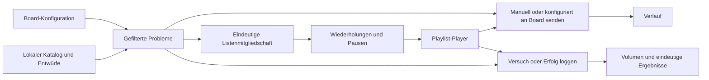
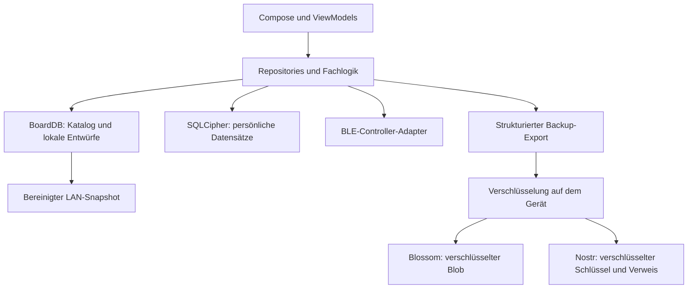

# Grundbegriffe und Architektur

[English](../en/CORE_CONCEPTS.md) · [Dokumentationsübersicht](../README.md)

**Geltungsbereich:** implementierter Code bei `4fc067e87`, Vorbereitung von
0.2.3. Veröffentlicht ist weiterhin 0.2.2. Die unten beschriebenen Korrekturen
an Ergebnisstatistik und Trefferzahlen gehören zur Vorbereitungslinie.

## Board, Layout, Winkel und Problem

Die **Board-Familie** bestimmt Fähigkeiten und Controller-Protokoll. MoonBoard
und Quantum sind beispielsweise nicht mit Aurora-kompatiblen Boards
austauschbar. Das **Layout** beschreibt die Griffanordnung. Eine konkrete
Installation hat außerdem eine Größe, montierte Griffsets und unterstützte
Winkel. Die Gym-Auswahl hilft bei dieser Konfiguration; der Board-Fit-Filter
schließt Probleme aus, die darauf nicht passen. Die Bluetooth-Verbindung
bestimmt, welchen Controller das Handy tatsächlich ansteuern kann.

Ein **Problem** (im Code `climb`) hat eine Identität und Griff-Frames. Der
**Winkel** ist die Neigung beim Suchen, Beleuchten oder Loggen. Der Setter-Winkel
ist Kontext; Community-Bewertungen können je nach Winkel abweichen. Fehlende
Statistik bei einem Winkel bedeutet nicht automatisch, dass das Problem dort
unbenutzbar ist. Maßgeblich sind die Winkel des ausgewählten Boards.

## Katalog, eigene und Community-Probleme

Diese Begriffe beschreiben Herkunft und Veröffentlichungszustand, nicht drei
unabhängige Kopien jedes Problems.

- **Katalog:** importierte Board-Inhalte, lokal zum Browsen gespeichert.
  Quellen und Verfügbarkeit unterscheiden sich je nach Board; nicht jeder
  Katalogeintrag stammt aus einer offiziellen Herstellerveröffentlichung.
- **Eigene Probleme:** unter der aktiven Identität erstellte Probleme,
  einschließlich lokaler Entwürfe. Speichern und Veröffentlichen sind getrennt.
- **Community-Probleme:** über signierte Nostr-Events und die Katalog-Pipeline
  verbreitet. Die Problemidentität kann gleich bleiben, während sich
  Veröffentlichungsziele und Sync-Status ändern.

Das Schema trennt `origin` (wo erstellt), `source` (aktuelle Datenquelle),
Autor und Veröffentlichungszustand. Ein einzelnes Feld beweist weder Besitz
noch Veröffentlichung. Eine Signatur identifiziert den Autor; sie bestätigt
nicht die Richtigkeit des Inhalts oder Schwierigkeitsgrads.

## Logbuch: Versuche, Begehungen und eindeutige Ergebnisse

Das Board-Logbuch speichert **Ascents** (erfolgreiche Begehungen) und **Bids**
(Versuche ohne Erfolg). Ein Eintrag kann mehrere körperliche Versuche in
`bid_count` zusammenfassen. Zwei Fehlversuche und eine anschließende Begehung
können deshalb drei Versuche, aber nur ein erfolgreiches Problem sein.

| Kennzahl | Aktuelle Berechnung |
|---|---|
| Versuchsvolumen | Summe von `bid_count`, mindestens eins je Eintrag, einschließlich erfolgreicher Einträge |
| Begehungen insgesamt | Erfolgreiche Logeinträge; Wiederholungen können erneut zählen |
| Ergebnisverteilung / Ergebnisse je Grad | Ein bestes Ergebnis pro Board-Familie und Problem-UUID im Zeitraum: Flash vor Rotpunkt vor versucht |
| Flash-Erkennung | Erster Eintrag der gesamten Historie für Board-Familie + Problem-UUID + Winkel muss erfolgreich sein und höchstens einen Versuch enthalten |

Ergebnisdiagramme fassen die Winkel eines Problems zusammen; die
Flash-Erkennung betrachtet Winkel getrennt. Nicht alle Statistiken verwenden
denselben Schlüssel. Ein späterer Erfolg entfernt das versuchte Ergebnis
eines früheren Zeitraums nicht. Fehlende Importhistorie begrenzt außerdem,
wie zuverlässig ein Flash erkannt werden kann.

**Verlauf** ist etwas anderes: Er protokolliert an ein Board gesendete
Projektionen. Ein beleuchtetes Problem belegt weder einen Versuch noch Erfolg.

## Filter und Trefferzahlen

Die Board-Konfiguration begrenzt, was physisch passt. Browser-Filter grenzen
weiter nach Grad, Herkunft, Griffen, Status und anderen Eigenschaften ein.
Die Statusgruppen überschneiden sich nicht: **Neu** bedeutet ohne Bid und
Begehung, **Versucht** bedeutet Bid ohne Begehung, **Geschafft** bedeutet
mindestens eine Begehung. Mehrere gewählte Gruppen werden vereinigt; keine
Auswahl bedeutet alle Status. Diese Abfragen verwenden Problem-UUIDs und
bilden keine winkelabhängige Versuchshistorie ab.

„Nur unbewertete“ wählt fehlende Grade aus und bedeutet nicht „versucht“.
Ignorierte Probleme, Board-Fit und Quantum-Überlappung können die Auswahl
weiter einschränken. Auf diesem Branch zählt der Browser die passenden
Ergebnisse einschließlich der nach der SQL-Abfrage angewandten Filter.
Eigene Entwürfe bleiben absichtlich winkelübergreifend auffindbar; vor einer
Änderung muss dieser eigene Abfragepfad berücksichtigt werden.

## Listen und abspielbare Playlists

Eine Liste enthält jedes Problem höchstens einmal. Favoriten sind eine
integrierte Liste. Jede Liste hat Wiedergabe-Voreinstellungen; ein optionaler
Ablaufplan ergänzt wiederholte Probleme, feste Winkel und Pausen. Vier
Wiederholungen gehören in den Ablaufplan, nicht als vier Mitgliedschaften in
die Liste. Das Löschen des Plans lässt die Liste bestehen. Der Player
koordiniert Schritte, Pausen und Logging; sein Start belegt keine Begehungen.

## Lokale Daten und Synchronisation

Heruntergeladene Kataloge, lokales Logging und Listenverwaltung arbeiten mit
lokalem Speicher. Erstdownload und entfernte Funktionen benötigen weiterhin
ein Netzwerk. „Local-first“ bedeutet nicht, dass die App nie Server kontaktiert.

SQLDelight definiert beide Datenbankschemata. **BoardDB ist unverschlüsselt**
und enthält auch lokale Problementwürfe. Sie ist deshalb kein vollständig
öffentlicher Export. **SecureDB nutzt SQLCipher** für Logbuch und weitere
persönliche Datensätze; Android Keystore schützt das Schlüsselmaterial.
Einstellungen und Dateien existieren zusätzlich außerhalb der Datenbanken.
„Alle persönlichen Daten sind verschlüsselt“ wäre daher zu weitgehend.

Das optionale Backup ist standardmäßig aus. Es exportiert strukturierte Daten,
komprimiert und verschlüsselt sie mit einem AES-GCM-Datenschlüssel und legt
den verschlüsselten Blob auf Blossom ab. Schlüssel und Verweis werden per
Nostr an die eigene Identität verschlüsselt. Es ist kein Upload der rohen
SQLCipher-Datei; der Datenschlüssel ist auch nicht einfach der private
Nostr-Schlüssel. Wiederherstellung benötigt die Entschlüsselungsfähigkeit
derselben Identität und erreichbare Backup-Daten. Das Veröffentlichen von
Community-Problemen ist eine getrennte öffentliche Aktion.

Nearby-BLE-Sessions und LAN-Übertragung von App/Katalog sind ebenfalls
getrennte Funktionen. Der LAN-Sender bereinigt einen Snapshot vor der
Übertragung. Eine unverschlüsselte BoardDB darf nicht ungeprüft geteilt werden.
Diese Funktionen implementieren nicht die separaten Entwürfe für persönliches
Teilen oder BoardCell/FIPS-Mesh.

## Orientierung im Quellcode

Die [Quellcode-Tabelle der englischen Fassung](../en/CORE_CONCEPTS.md#source-map)
verlinkt Board-Fähigkeiten, Repository-Modelle, SQL-Schemata, Filter,
Statistik samt Tests, Player, Community-Publishing, Backup und Update-Prüfung.
Sie ist die gemeinsame Pfadreferenz für beide Fassungen.

Android-UI, BLE, Hintergrundarbeit und Dependency Injection liegen unter
`androidApp/src/main/java/com/cruxcoach/android/`; gemeinsame Kotlin-Fachlogik
und SQLDelight unter `shared/src/commonMain/`. Gemeinsamer Code allein ist
noch kein veröffentlichter iOS-Client.

APK-Signierung, vertrauenswürdige Katalog-Publisher und persönliche
Nostr-Identität sind getrennte Vertrauensbereiche. Ein Hash prüft Bytes,
nicht deren Autorisierung. Updates prüfen zusätzlich Signaturidentität bzw.
Signaturhistorie. Feature-Veröffentlichung hat eigene Publisher- und
Receipt-Anforderungen. Vor Änderungen an diesen Grenzen gelten
[SECURITY](../../SECURITY.md) und der [Release-Status](../RELEASE_GITHUB.md).
