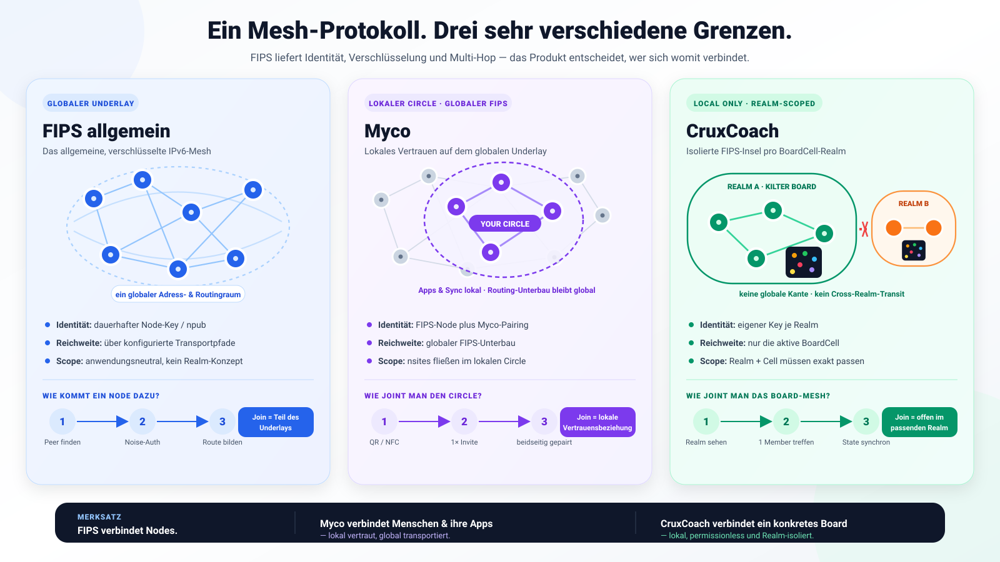

# FIPS verständlich erklärt: CruxCoach, Myco und fips-android im Architekturvergleich

**Sprache:** Deutsch | [English](../en/FIPS_MESH_ARCHITECTURE_COMPARISON.md)

**Stand:** 17. August 2026<br>
**Zielgruppe:** Leserinnen und Leser ohne Networking-Vorkenntnisse<br>
**Untersuchter CruxCoach-Stand:** `feat/board-cell-mesh-mvp-20260814` bei Commit `ed2a4b44`<br>
**Kurzantwort für Gym-Betreiber:** Für das derzeitige lokale CruxCoach-Board-Mesh ist **keine separate, vom Gym betriebene FIPS-Node erforderlich**. Jedes teilnehmende CruxCoach-Handy ist selbst eine FIPS-Node. Ein dauerhaftes Gym-Gerät kann später Verfügbarkeit und Funkabdeckung verbessern, ist im jetzigen Modell aber weder Voraussetzung noch automatisch nützlich. Eine allgemeine `fips-android`-Installation oder ein beliebiger FIPS-Daemon kann die CruxCoach-Board-Insel derzeit nicht einfach erweitern.



## 1. Das Wichtigste zuerst

FIPS ist nicht „ein Server“ und auch nicht automatisch „das Internet ohne Internet“. FIPS ist ein **Netzwerkprotokoll und eine Laufzeitumgebung**, mit der Geräte:

1. sich kryptografisch ausweisen,
2. direkte Verbindungen über verschiedene Übertragungswege herstellen,
3. Pakete für andere Geräte weiterleiten und
4. eine Ende-zu-Ende-verschlüsselte Kommunikation über mehrere Zwischenstationen aufbauen können.

Was mit diesen Fähigkeiten geschieht, entscheidet die jeweilige App:

| Ansatz | Was ist die eigentliche Anwendung? | Welche Netzgrenze wird gebaut? | Was wird ausgetauscht? |
| --- | --- | --- | --- |
| **FIPS allgemein** | ein anwendungsneutrales Mesh-Netz | potenziell ein großes, transportübergreifendes Netz | beliebige IPv6- oder native Datagramme |
| **fips-android** | ein allgemeiner Netzwerkzugang für ausgewählte Android-Apps | Zugang zum allgemeinen FIPS-Netz über VPN/TUN und vorhandenes IP | Netzwerkverkehr beliebiger ausgewählter Apps |
| **Myco** | ein Offline-App- und Inhaltsverteilungssystem | FIPS-Verbindungen zwischen Myco-Geräten; Vertrauen zusätzlich über den „Circle“ | signierte nsite-Manifeste, Nostr-Events und Blossom-Blobs |
| **CruxCoach** | gemeinsame, konsistente Zustände an genau einem physischen Kletterboard | eine absichtlich isolierte FIPS-Insel pro BoardCell | Boardzustand, Playlist, Mitgliedschaft, Befehle und lokale Wettbewerbsdaten |

Der wichtigste Satz für das weitere Verständnis lautet:

> **FIPS transportiert und routet Pakete. FIPS entscheidet nicht, was ein gültiger Boardzustand, eine installierbare App oder ein vertrauenswürdiger Gym-Teilnehmer ist. Diese Regeln liegen jeweils oberhalb von FIPS.**

## 2. Networking von null an: die notwendigen Grundbegriffe

### 2.1 Node, Link, Peer und Mesh

Eine **Node** ist ein laufendes Gerät beziehungsweise ein laufender FIPS-Prozess. In unserem Fall kann das ein Handy, ein Laptop oder ein Router sein.

Ein **Link** ist eine direkte Verbindung zwischen zwei Nodes. Beispiele:

- zwei Handys sprechen direkt per Bluetooth;
- ein Handy spricht per WLAN/UDP mit einem Rechner;
- zwei Rechner sprechen über TCP im Internet;
- ein Rechner erreicht einen anderen über Tor.

Die beiden Enden eines direkten Links heißen **Peers**. Ein **Mesh** entsteht, wenn mehrere Nodes nicht nur ihre eigenen Daten senden, sondern auch Daten für andere Nodes weiterleiten.

Ein kleines Beispiel:

```text
Handy A  <---- direkter Link ---->  Handy B  <---- direkter Link ---->  Handy C

Handy A und C haben keinen direkten Funkkontakt.
Wenn B Pakete weiterleitet, kann A C trotzdem erreichen.
Der Weg A -> B -> C hat zwei "Hops" (Etappen).
```

Das ist **Multi-Hop-Routing**. „Mesh“ heißt also nicht, dass jedes Gerät jedes andere direkt sehen muss.

### 2.2 Transport und Protokoll sind unterschiedliche Ebenen

Ein **Transport** beantwortet die Frage: „Wie kommen Bytes zum nächsten direkten Gerät?“ Bluetooth L2CAP, UDP, TCP, Ethernet und Tor sind mögliche FIPS-Transporte.

FIPS beantwortet darüber die Fragen:

- Wer ist mein direkter Peer?
- Ist dieser Peer kryptografisch echt?
- Welcher nächste Peer führt in Richtung des Zielgeräts?
- Wie bleibt der Inhalt auch über Zwischenstationen geschützt?

Die Anwendung beantwortet schließlich:

- Ist diese Nachricht in meiner aktuellen Gym-Session erlaubt?
- Darf dieses Mitglied die Playlist ändern?
- Ist Snapshot Nummer 42 neuer und gültig?
- Muss eine fehlende Nachricht erneut angefordert werden?

Diese Trennung kann man sich wie einen Paketdienst vorstellen:

```text
Anwendung       Inhalt und Geschäftsregel: "Setze Climb X bei 40°"
FIPS-Session    Versiegelter Umschlag für das wirkliche Ziel
FIPS-Mesh       Routenwahl und versiegelter Transport zum nächsten Knoten
Transport       Bluetooth-, UDP-, TCP- oder anderer konkreter Link
```

### 2.3 Adresse ist nicht gleich Funkadresse

Ein Handy kann gleichzeitig mehrere Adressen besitzen:

- eine Bluetooth-Adresse für den lokalen Funklink;
- eine IP-Adresse im WLAN;
- eine öffentliche Mobilfunkadresse beziehungsweise eine NAT-Zuordnung;
- eine FIPS-Identität und daraus abgeleitete FIPS-Adresse.

Bluetooth- und IP-Adressen können wechseln. FIPS verwendet deshalb ein kryptografisches Schlüsselpaar als Identität. Der öffentliche Schlüssel wird im Nostr-Format häufig als **`npub`** dargestellt. Daraus leitet FIPS intern eine `node_addr` und für die IPv6-Anpassung eine Adresse aus `fd00::/8` ab.

Vereinfacht:

```text
privater Schlüssel
        |
        +--> öffentlicher Schlüssel / npub       (für Menschen und Apps)
        +--> node_addr                            (für FIPS-Routing)
        +--> fd..-IPv6-Adresse                    (für normale IP-Programme)
```

Der private Schlüssel darf das Gerät nicht verlassen. Wer ihn besitzt, kann sich als diese Node ausgeben.

Wichtig für CruxCoach: Der FIPS-Schlüssel ist **nicht** der normale CruxCoach-/Nostr-Account-Schlüssel. Ein Beobachter soll die lokale Transportidentität nicht automatisch dem öffentlichen Benutzerkonto zuordnen können.

### 2.4 Discovery ist noch keine Verbindung

**Discovery** bedeutet nur „Gegenstellen finden“. Ein BLE-Advertisement ist zum Beispiel ein sehr kleiner, regelmäßig ausgesendeter Hinweis: „Hier läuft etwas, das dieses Protokoll spricht.“

Danach folgen getrennte Schritte:

```text
1. Discovery       Gerät wird gesehen
2. Link-Aufbau     Bluetooth-L2CAP- oder IP-Verbindung entsteht
3. Authentisierung Schlüsselbesitz wird kryptografisch bewiesen
4. Admission       die App entscheidet, ob das Gerät in diesen Kontext darf
5. Datenaustausch  gültige Anwendungsnachrichten fließen
```

Ein Advertisement ist absichtlich **nicht autoritativ**. Signalstärke, Gerätename und Bluetooth-Adresse beweisen weder Identität noch Berechtigung.

### 2.5 Routing ist keine Speicherung

FIPS liefert einen **Best-Effort-Datagrammdienst**. Das ähnelt eher UDP als einer Datenbank:

- Ein Paket wird geroutet, wenn gerade ein Weg existiert.
- FIPS verspricht der Anwendung keine zuverlässige Zustellung oder feste Reihenfolge.
- FIPS hält eine Nachricht nicht automatisch tagelang zurück, bis ein heute ausgeschaltetes Ziel morgen wieder auftaucht.

Darum brauchen Myco und CruxCoach zusätzliche, aber unterschiedliche Schichten:

- Myco ergänzt **Store-and-forward**: Inhalte werden dauerhaft gespeichert und später erneut angeboten.
- CruxCoach ergänzt **Snapshots, Sequenzen, Hashes, ACKs, Outbox und Anti-Entropy**: verlorene Zustandsnachrichten werden erkannt und der gemeinsame Zustand wird repariert.

### 2.6 TUN und VpnService

Ein **TUN-Interface** ist eine virtuelle Netzwerkkarte. Ein Programm erhält von ihr komplette IP-Pakete als Bytes und kann Pakete zurückschreiben. Android stellt Apps ein solches Interface über `VpnService` bereit.

Das Wort „VPN“ ist hier leicht irreführend. Es muss keinen zentralen Firmen-VPN-Server geben. `VpnService` ist zunächst nur Androids kontrollierte Schnittstelle, um Verkehr ausgewählter Apps in einen eigenen Netzwerkprozess umzuleiten.

```text
normale Android-App
        |
        | IPv6-Paket an fd.. oder Name *.fips
        v
Android VpnService / TUN
        |
        v
eingebettete FIPS-Node
        |
        v
FIPS-Mesh
```

`fips-android` und Myco verwenden diesen Weg. CruxCoach installiert bewusst **kein Android-VPN**. Es erzeugt intern nur die wenigen IPv6/UDP-Pakete, die seine eingebettete FIPS-Version derzeit als Anwendungsschnittstelle erwartet.

## 3. FIPS selbst: was unter der Haube passiert

### 3.1 Die drei wesentlichen Protokollschichten

Das aktuelle FIPS-Design trennt drei Kernbereiche:

| Schicht | Fachbegriff | Aufgabe |
| --- | --- | --- |
| Transport | Transport Plugin | Datagramme über ein konkretes Medium zum direkten Peer bringen |
| Mesh | FIPS Mesh Protocol (**FMP**) | direkte Peers authentisieren, Links verschlüsseln, Topologie aufbauen und Pakete weiterleiten |
| Session | FIPS Session Protocol (**FSP**) | zwei Endpunkte über beliebig viele Hops hinweg authentisieren und Ende-zu-Ende verschlüsseln |

Oberhalb davon kann die IPv6-Anpassung gewöhnliche Programme anbinden. Alternativ ist eine native FIPS-Datagramm-API vorgesehen beziehungsweise im aktuellen Upstream im Ausbau.

### 3.2 Wie FIPS ohne zentrale Routingtabelle Wege findet

In klassischen kleinen Netzen kennt ein Router eine Tabelle „Zielnetz → nächster Router“. FIPS soll sich ohne zentrale Verwaltung organisieren und nicht auf jeder Node die komplette globale Topologie speichern.

Dazu verwendet es vereinfacht:

- einen **Spanning Tree**, also eine gemeinsam entstehende Baumstruktur mit Koordinaten;
- **Bloom-Filter**, kompakte probabilistische Datenstrukturen mit Hinweisen, welche Ziele über welche Nachbarn erreichbar sein könnten;
- lokale Entscheidungen an jedem Hop;
- Fehlersignale und erneute Suche, wenn ein vermuteter Pfad nicht funktioniert.

Ein Bloom-Filter kann fälschlich „vielleicht vorhanden“ sagen, aber nicht fälschlich „sicher nicht vorhanden“. Darum ist er ein platzsparender Wegweiser, keine Wahrheitsdatenbank.

### 3.3 Zwei Verschlüsselungsebenen

FIPS verschlüsselt auf zwei Ebenen:

1. **Hop-by-hop mit Noise IK:** Jeder direkte Link, zum Beispiel A↔B und B↔C, ist separat authentisiert und verschlüsselt.
2. **Ende-zu-Ende mit Noise XK:** Zusätzlich ist die eigentliche Sitzung A↔C verschlüsselt. B kann weiterleiten, aber den Anwendungsinhalt nicht lesen.

```text
A                         B                         C
|--- Noise-IK-Link A/B ---|--- Noise-IK-Link B/C ---|
|===================================================|
          Noise-XK-Sitzung A/C, Ende zu Ende
```

Der Zwischenknoten benötigt genügend Routinginformation für die Weiterleitung. Er soll aber nicht den Klartext der Session sehen.

### 3.4 FIPS ist transportagnostisch, aber nicht jede Plattform bietet jeden Transport

Das allgemeine FIPS-Projekt unterstützt derzeit unter anderem UDP, TCP, Ethernet, Tor, Nym und BLE L2CAP. Das bedeutet nicht, dass jede Android-Einbettung alle diese Wege aktiviert:

- Der allgemeine Desktop-/Linux-Daemon kann viele Transporte betreiben.
- `fips-android` aktiviert auf Android vor allem UDP und optional TCP, Nostr-Discovery und mDNS. Sein README sagt ausdrücklich: aktuell kein BLE- oder Ethernet-Transport auf Android.
- Myco ergänzt eine Android-BLE-Brücke und Wi-Fi Aware als schnellen lokalen UDP-Pfad.
- CruxCoach aktiviert ausschließlich seine Android-BLE-L2CAP-Brücke für das BoardCell-Mesh.

„Beide verwenden FIPS“ garantiert deshalb noch keine praktische Verbindung. Mindestens ein gemeinsamer Transport, kompatible Protokollversionen, passende Discovery und die Zulassung durch die Anwendung müssen zusammenkommen.

### 3.5 Reifegrad und Sicherheitsgrenze

FIPS ist aktiv in Entwicklung. Der aktuelle Upstream bezeichnet Protokoll und APIs ausdrücklich als noch nicht stabil und nennt einen Security Audit sowie Protokollstabilisierung als offene Ziele. Das heißt nicht, dass die Kryptografie offensichtlich unwirksam ist. Es heißt:

- Integrationen müssen auf einen exakten Commit pinnen;
- Wire- und API-Kompatibilität kann sich ändern;
- Produktcode muss Größenlimits, Timeouts und Backpressure selbst ernst nehmen;
- „verschlüsselt“ ersetzt keine anwendungsspezifische Autorisierung;
- produktionskritische Aussagen brauchen reale Geräte-, Interoperabilitäts- und Sicherheitstests.

CruxCoach pinnt deshalb FIPS auf `967776079ba5ddc8fe118c3f289365b51eb03737` und kompiliert den Rust-Code in `libcruxcoach_fips.so` ein.

## 4. Ansatz 1: fips-android als allgemeiner Netzwerkadapter

### 4.1 Produktidee

`fr34aky/fips-android` macht aus einem Android-Gerät eine möglichst allgemeine FIPS-Node. Ausgewählte, bereits vorhandene Apps sollen FIPS-Ziele verwenden können, ohne FIPS selbst zu kennen.

Beispiel: Ein Browser oder SSH-Client möchte `alice.fips` beziehungsweise eine `fd..`-IPv6-Adresse erreichen. `fips-android` fängt diesen Netzwerkverkehr über ein per-App-`VpnService` ab und reicht ihn an die eingebettete Rust-Node weiter.

### 4.2 Datenweg

```text
ausgewählte Android-App
        |
        | normaler TCP-/UDP-/DNS-Verkehr
        v
FipsVpnService mit TUN, MTU 1280
        |
        +--> fd00::/8 und *.fips --> FIPS TunPacketProcessor --> FIPS-Mesh
        |
        +--> normaler Internetverkehr --> Userspace-Forwarder --> geschützte
                                          WLAN-/Mobilfunk-Sockets
```

**Split Tunnel** bedeutet: Nur ausgewählte Apps laufen durch diesen Tunnel. Andere Apps behalten ihren normalen Netzwerkpfad. Innerhalb der ausgewählten Apps trennt der native „Pump“ wiederum Mesh- und normalen Internetverkehr.

### 4.3 Identität und Lebensdauer

Die App erzeugt eine langfristige FIPS-Identität. Der geheime `nsec` wird verschlüsselt, wobei das Android Keystore einen nicht exportierbaren Schlüssel schützt. Dadurch behält das Handy dieselbe Mesh-Adresse über Neustarts hinweg, bis der Nutzer die Identität bewusst regeneriert.

Das ist für ein allgemeines Netz sinnvoll: Andere Nodes und Dienste sollen dieses Gerät wiedererkennen und dauerhaft adressieren können.

### 4.4 Discovery und Transporte

Der Standardpfad nutzt vorhandene IP-Infrastruktur:

- UDP, optional TCP;
- optional Nostr-vermittelte Discovery und NAT-Traversal;
- optional mDNS für direkte Peers im selben WLAN;
- Wechsel zwischen WLAN und Mobilfunk mit Neustart beziehungsweise Rebinding des eingebetteten Nodes.

Der aktuelle Android-Port stellt **kein BLE** bereit. Ohne WLAN, Mobilfunk, Ethernet-Adapter oder einen anderen IP-Pfad kann er daher nicht einfach per Bluetooth ein rein lokales Handy-Mesh aufspannen.

### 4.5 Was fips-android bewusst nicht liefert

`fips-android` kennt keine Kletterboards, Playlists oder nsites. Es stellt Erreichbarkeit bereit. Eine Anwendung muss auf dem Ziel weiterhin einen Dienst anbieten, etwa einen HTTP-Server, SSH oder ein eigenes Protokoll.

Das ist wie eine neue Straße: Die Straße macht ein Gebäude erreichbar, baut aber weder das Gebäude noch dessen Zugangskontrolle.

## 5. Ansatz 2: Myco als Offline-Inhaltsnetz

### 5.1 Produktidee

Myco verteilt keine nativen Android-APKs. Eine Myco-„App“ ist ein **nsite**: eine statische Web-App mit einem signierten Nostr-Manifest und per SHA-256 adressierten Dateien in Blossom.

Das Smartphone ist gleichzeitig:

- Myco-Oberfläche und WebView-App-Shell,
- FIPS-Node,
- lokales Nostr-Relay,
- lokaler Blossom-Server,
- Inhaltscache und erneut anbietende Quelle.

### 5.2 Die sechs Schichten

Mycos Architekturdokument beschreibt vereinfacht:

```text
1. Android UI: Library, Pair, Discover, Settings
2. NsiteActivity: eine fullscreen WebView pro nsite
3. lokales Gateway: *.nsite -> localhost, Manifest prüfen, Dateien ausliefern
4. eingebettetes Relay + Blossom: Events und content-addressed Blobs speichern
5. myco-core/JNI: Inhalte, FIPS und Android-Radios verbinden
6. FIPS: Identität, verschlüsselte Links, Routing, BLE/UDP/TCP/...
```

Der Browser lädt die nsite-Dateien lokal. Der FIPS-Pfad wird für die Synchronisation zwischen Geräten gebraucht, nicht bei jedem späteren Öffnen einer bereits vollständig gespeicherten App.

### 5.3 Mycos eigentlicher Zusatznutzen: Store-and-forward

Angenommen:

```text
Montag:    Alice trifft Bob. Bob übernimmt ein signiertes nsite von Alice.
Dienstag:  Alice ist nicht da. Bob trifft Carla.
           Carla kann dasselbe nsite nun von Bob erhalten.
```

FIPS allein würde das nicht leisten, weil Alice am Dienstag nicht erreichbar ist. Mycos lokales Relay und der Blossom-Cache machen Bob zu einer neuen Quelle. Das Manifest bleibt überprüfbar signiert; Blobs werden anhand ihres SHA-256-Hashs geprüft.

Diese Unterscheidung ist zentral:

- **FIPS:** Jetzt einen Weg zum aktuell erreichbaren Ziel finden.
- **Myco:** Inhalte behalten und später selbst weitergeben.

### 5.4 Vertrauen: FIPS-Identität plus Myco-Circle

Myco baut auf der FIPS-Identität eine weitere soziale beziehungsweise anwendungsspezifische Vertrauensschicht. Nutzer paaren sich per QR/NFC und bilden einen **Circle**. FIPS kann theoretisch viel mehr Nodes routen; Myco entscheidet, von welchen bekannten Personen Inhalte angeboten und synchronisiert werden.

„Im selben FIPS-Netz erreichbar“ und „in meinem Myco-Circle zugelassen“ sind damit zwei verschiedene Aussagen.

### 5.5 Lokale Funkwege

Myco verwendet:

- BLE L2CAP CoC als grundlegenden Offline-Pfad;
- Wi-Fi Aware als optionalen, schnelleren lokalen UDP-Pfad für größere Datenmengen;
- eine lokale Access-Point/LAN-Lane;
- je nach FIPS-Konfiguration weitere IP-Transporte.

BLE ist praktisch für Discovery, Kontrolle und kleine Daten. Für große Web-App-Blobs ist Wi-Fi Aware oder WLAN deutlich geeigneter. FIPS kann einen alternativen Link verwenden; das ist nicht automatisch paralleles „Striping“ derselben Datei über mehrere Radios.

### 5.6 TUN und Dienste

Myco behält einen Android-`VpnService`/TUN. Er macht FIPS-Ziele wie `<npub>.fips` für IP-basierte interne Dienste erreichbar. Das eingebettete Relay und Blossom sind an Ports gebunden und werden über FIPS adressiert. Die lokale `.nsite`-Auslieferung bleibt dagegen auf dem Gerät.

Myco ist deshalb deutlich mehr als eine FIPS-Benutzeroberfläche: Es ist eine komplette, domänenspezifische Verteilungs- und Laufzeitplattform auf dem FIPS-Unterbau.

## 6. Ansatz 3: CruxCoach als isolierte BoardCell

### 6.1 Produktidee

CruxCoach will kein allgemeines Netzwerk für andere Apps bereitstellen und keine globalen Inhalte verteilen. Das Ziel ist enger:

> Alle beigetretenen CruxCoach-Geräte vor demselben physischen Board sollen denselben bestätigten Boardzustand, dieselbe Playlist, dieselbe Mitgliedschaft und dieselben lokalen Wettbewerbsdaten sehen — auch ohne Internet.

Diese Begrenzung ist eine bewusste Sicherheits- und Produktentscheidung.

### 6.2 Eine FIPS-Insel pro physischem Board

CruxCoach verwendet die ausgewählte **Variante A**: isolierte FIPS-Realms.

```text
Board A / BoardCell A              Board B / BoardCell B

Handy 1 ---- Handy 2               Handy 4 ---- Handy 5
   \            |                                      \
     ---- Handy 3                         Handy 6 -------

Kein automatischer FIPS-Link zwischen A und B.
Kein globaler FIPS-Adressraum für diese BoardCell-Sitzungen.
```

Ein **Realm** ist hier die Transport- und Zulassungsgrenze. Bei einer normalen BoardCell entspricht die `realmId` der `BoardCellId`. Geräte mit einem anderen Realm-/Cell-Kontext werden vor und nach dem kryptografischen Linkaufbau abgewiesen.

Das allgemeine FIPS-Protokoll besitzt kein solches CruxCoach-Board-Realm-Konzept. Es ist eine von CruxCoach hinzugefügte Policy.

### 6.3 Vier Identitäten mit vier Aufgaben

| Identität | Bedeutung | Warum getrennt? |
| --- | --- | --- |
| `PhysicalBoardId` | das konkrete physische Kletterboard | Zwei benachbarte Boards dürfen niemals vermischt werden. |
| `BoardCellId` | deterministischer Zustandsraum dieses Boards | Mehrere Handys müssen ohne Server denselben Scope ableiten. |
| `realmId` | lokale FIPS-Verbindungsgrenze | Fremde Cells sollen gar nicht erst am lokalen Mesh teilnehmen. |
| FIPS-`npub` | kryptografische Identität dieses Geräts im Realm | BLE-Adresse und IP sind keine stabile, sichere Identität. |

Der Code speichert pro Realm einen 32-Byte-Secret verschlüsselt in `EncryptedSharedPreferences`, geschützt durch einen Android-Master-Key. Die Identität bleibt bei Bluetooth- und Prozessneustarts im selben Realm stabil. Sie ist nicht mit dem öffentlichen Benutzer-`npub` identisch.

### 6.4 Discovery und Aufnahme, Schritt für Schritt

Auf Android 10/API 29+ verwendet CruxCoach BLE **L2CAP CoC**. Kotlin besitzt die Android-Radioobjekte, Rust besitzt FIPS. Eine kleine JNI-Brücke reicht L2CAP-Kanäle und Bytes zwischen beiden Welten weiter.

Der Ablauf beim Beitritt:

1. Eine laufende Cell sendet ein kleines BLE-Advertisement.
2. Darin stehen Protokollversion, dynamischer L2CAP-PSM, kurze Realm-/Cell-Hinweise beziehungsweise in V2 die BoardCell-UUID sowie ein Tag eines kurzlebigen Nonce.
3. Das beitretende Handy öffnet einen L2CAP-Kanal.
4. FIPS führt den kryptografischen Peer-Handshake aus.
5. CruxCoach sendet zusätzlich einen `CCJ1`-Hello mit vollständiger Realm-ID, vollständiger BoardCell-ID, frischem Nonce und Zeitstempel.
6. Nur ein direkt authentisierter BLE-Peer mit passendem vollständigem Scope wird für die Cell validiert.
7. Ein bestehendes Mitglied beziehungsweise der Controller nimmt die Node in die kanonische Mitgliedschaft auf.
8. Das neue Mitglied erhält einen vollständigen Snapshot. Erst danach ist es fachlich synchron.

Die vier Byte kurzen Tags im Advertisement sind nur Vorfilter. Eine zufällige Kollision reicht nicht zur Aufnahme, weil nach dem FIPS-Handshake die vollständigen IDs geprüft werden.

### 6.5 Was der eingebettete Rust-Teil genau tut

CruxCoach startet eine echte `fips::Node`, schaltet aber fast alles Allgemeine ab:

```text
aktiv:
  - eigene FIPS-Identität
  - FMP/FSP, Noise, Routing und Multi-Hop
  - genau ein Android-BLE-L2CAP-Transport
  - app-owned-TUN-Kanäle als interne Paket-Schnittstelle

deaktiviert:
  - Betriebssystem-TUN
  - Android VpnService
  - *.fips-DNS
  - Control Socket
  - Nostr-Discovery
  - Internet-/LAN-UDP und TCP für die BoardCell
  - Tor und öffentliche Relays
```

Da der gepinnte FIPS-Stand die benötigte native App-Schnittstelle noch nicht als fertigen Produktpfad bereitstellt, erzeugt CruxCoach intern standardkonforme IPv6/UDP-Datagramme an Port `42424` und schiebt sie durch FIPS' **app-owned TUN seam**. Es existiert aber keine virtuelle Netzwerkkarte im Android-System. Keine andere Android-App sieht dieses Netz.

Eine Anwendungsnachricht darf bis zu 1 MiB groß sein. CruxCoach zerlegt sie in 900-Byte-Chunks, gibt jedem vollständigen Payload eine SHA-256-basierte Nachrichten-ID, begrenzt parallele Assemblies und Puffergrößen und prüft nach dem Zusammensetzen den vollständigen Hash. Das schützt Ressourcen und erkennt beschädigte beziehungsweise unvollständige Assemblies. Die FIPS-Datagramme selbst bleiben klein.

### 6.6 BoardCell ist die eigentliche Konsistenzschicht

FIPS weiß nicht, welcher Climb gerade am Board leuchtet. Dafür existiert die BoardCell-Schicht oberhalb des Transports.

Ein kanonischer Snapshot enthält unter anderem:

- physisches Board, Cell, Lineage und Epoch;
- Controller und Controller-Term;
- Sequenznummer und Hash;
- aktuelle Mitglieder;
- zuletzt erfolgreich projizierten Climb und Winkel;
- vollständige Playlist und aktuelle Position;
- Verfügbarkeits- und Handover-Zustand;
- zuletzt verarbeitete Command-IDs zur Idempotenz.

Es gibt absichtlich einen **kanonischen Controller** statt eines frei zusammenführbaren CRDT. Ein physisches LED-Board kann am Ende nur eine konkrete Reihenfolge von Schreibvorgängen erleben. Der Controller serialisiert daher zustandsändernde Befehle.

Jedes Event:

- gehört zu Board, Cell und Epoch;
- erhöht die Sequenz genau um eins;
- bindet vorherigen und resultierenden Hash;
- wird auf allen Replicas mit demselben deterministischen Reducer angewendet.

Bei einer Lücke oder einem Hash-Konflikt rät eine Replica nicht. Sie friert den betroffenen Pfad ein und fordert einen vollständigen Snapshot an.

### 6.7 Was passiert bei Paketverlust?

FIPS ist Best Effort. CruxCoach ergänzt deshalb:

- persistente Snapshots;
- eine begrenzte Outbox;
- korrelierte Command-ACKs;
- Wiederholung mit derselben Command-ID;
- Deduplizierung und Idempotenz;
- regelmäßige Digest-/Anti-Entropy-Nachrichten;
- Snapshot-Reparatur bei Lücken.

Ein verlorenes Event wird damit nicht durch „magisch zuverlässiges FIPS“ geheilt, sondern durch die BoardCell-Protokollregeln erkannt und repariert.

### 6.8 Physisches Board und Controller-Fencing

Nur ein logischer Controller soll auf das Board schreiben. Bei Controller-Ausfall startet eine gestaffelte Übernahme. Ein Kandidat erhält Schreibautorität erst, nachdem er die physische Board-Verbindung erwerben konnte. Diese Verbindung wirkt als **Fencing Token**: Sie verhindert, dass zwei logische Controller unabhängig erfolgreiche physische Writes akzeptieren.

Ein geplanter Handover besitzt persistente Phasen. Ein Crash soll nicht dazu führen, dass Quelle und Ziel beide glauben, sie seien Controller.

Auch der Board-Write selbst besitzt eine Write-Ahead-Logik:

```text
WAL PREPARED
    -> physischer BLE-Write
    -> WAL PHYSICAL_WRITE_SUCCEEDED
    -> Snapshot + COMMITTED-ACK dauerhaft speichern
    -> Event verteilen
```

Wenn der Prozess genau nach dem physischen Write, aber vor dem kanonischen Commit stirbt, kann CruxCoach den semantischen Boardinhalt nicht sicher vom Board zurücklesen. Es meldet dann ehrlich „unbekannt/frozen“ und verlangt eine bewusste Reprojektion.

### 6.9 Android-Lifecycle und Fallback

Das Mesh läuft nur, wenn eine logische Funktion es besitzt, zum Beispiel BoardCell, Session, Nearby-Join oder Handover. Ein Connected-Device-Foreground-Service hält eine aktive Runtime im Hintergrund sichtbar am Leben.

- Ab API 29 ist FIPS/BLE-L2CAP der bevorzugte Datenpfad.
- API 28 verwendet den bestehenden GATT-Kompatibilitätspfad, nicht FIPS.
- Bluetooth aus beendet die lokale Funkruntime; der kanonische Controller entfernt ein verschwundenes Mitglied nach den Liveness-Regeln.
- Für einen großen Offline-Share kann CruxCoach FIPS bewusst pausieren, damit BLE und CPU/SQLite nicht gleichzeitig um knappe Ressourcen konkurrieren.
- Die Zahl direkter FIPS-BLE-Verbindungen ist derzeit auf sieben begrenzt. Multi-Hop kann mehr logische Mitglieder erlauben, ersetzt aber keine Hardwaretests für reale Topologien.

## 7. Die drei Ansätze direkt verglichen

### 7.1 Unterschied 1: Netzgrenze und Zulassung

| Frage | fips-android | Myco | CruxCoach |
| --- | --- | --- | --- |
| Grundscope | allgemeines FIPS-Netz | FIPS-Netz plus persönlicher Myco-Circle | isolierte Insel genau einer BoardCell |
| Wie wird ein Peer gefunden? | statische Peers, Nostr, mDNS, IP | BLE, Wi-Fi Aware, LAN/AP und FIPS-Pfade | BLE-Advertisement mit Cell-Kontext |
| Reicht FIPS-Authentisierung? | für den Link; Dienste brauchen eigene Policy | nein, Myco-Pairing/Circle kommt hinzu | nein, vollständiger Realm/Cell-Check und kanonische Mitgliedschaft kommen hinzu |
| Soll globale Erreichbarkeit entstehen? | grundsätzlich ja | für Transport möglich, Inhalte bleiben Circle-/Policy-gesteuert | ausdrücklich nein |

**Intuition:** `fips-android` baut eine allgemeine Straße, Myco baut darauf ein Vertrauens- und Liefernetz, CruxCoach sperrt einen kleinen Parkplatz für genau ein Board ab.

### 7.2 Unterschied 2: Einbindung in Android

| Frage | fips-android | Myco | CruxCoach |
| --- | --- | --- | --- |
| Android `VpnService`? | ja, zentraler Produktbestandteil | ja, für FIPS-IP-Erreichbarkeit | nein |
| Betriebssystem-TUN sichtbar? | ja, per-App Split Tunnel | ja, app-eigener TUN | nein; nur interne Paketkanäle |
| Können fremde Apps FIPS nutzen? | ausgewählte Apps ja | primär Myco-eigene Dienste/WebViews | nein |
| Native Grenze | Kotlin-VPN ↔ Rust-Shim/JNI | Kotlin UI/Radios/VPN ↔ `myco-core` | Kotlin BoardCell/Radios ↔ minimale Rust-Brücke |

**Konsequenz:** CruxCoach belegt nicht den einzigen Android-VPN-Slot und muss keinen allgemeinen Internetverkehr forwarden. Dafür ist seine Einbettung bewusst nicht als allgemeiner FIPS-Zugang wiederverwendbar.

### 7.3 Unterschied 3: Daten- und Konsistenzmodell

| Frage | fips-android | Myco | CruxCoach |
| --- | --- | --- | --- |
| Bedeutung der Nutzdaten | beliebige IP-Pakete | signierte Events/Manifeste und gehashte Blobs | geordnete BoardCell-Events, Snapshots und Commands |
| Speicherung für später | nicht Aufgabe von FIPS | ja, Relay + Blossom Store-and-forward | dauerhafte Snapshots/Outbox zur Zustandsreparatur, kein allgemeiner Content-Cache |
| Konfliktregel | Sache der jeweiligen App | Signaturen, Versionen und Content-Hashes | ein kanonischer Controller, Sequenz, Epoch und Hash-Kette |
| Offline-Ziel nicht erreichbar | Paket scheitert zunächst | ein anderer Cache kann den Inhalt später liefern | Replica holt bei Wiederverbindung Snapshot/fehlenden Zustand |

**Konsequenz:** Ein Router-Node verbessert möglicherweise Erreichbarkeit. Er löst aber weder Mycos Inhaltsverteilung noch CruxCoachs Zustandskonsistenz allein.

### 7.4 Unterschied 4: aktivierte Übertragungswege

Dieser vierte Unterschied ist praktisch so wichtig, dass er trotz der drei Grundachsen separat genannt werden sollte:

| Transport | fips-android aktuell | Myco aktuell | CruxCoach-BoardCell aktuell |
| --- | ---: | ---: | ---: |
| BLE L2CAP auf Android | nein | ja | ja |
| Wi-Fi Aware | nein | ja, optionaler Fast Path | nein |
| WLAN/LAN über UDP | ja | ja | nein |
| Mobilfunk/Internet über UDP/TCP | ja | konfigurierbar | nein |
| Nostr-Discovery | optional | FIPS-/Myco-abhängig | nein |

Darum kann eine `fips-android`-Node im selben Raum die CruxCoach-BLE-Insel nicht automatisch sehen. Es fehlt schon der gemeinsame aktive Transport; zusätzlich fehlen CruxCoach-Realm und BoardCell-Protokoll.

## 8. Muss ein Gym Owner eine FIPS-Node betreiben?

### 8.1 Für das aktuelle CruxCoach-Mesh: nein

Sobald CruxCoach das lokale Board-Mesh aktiviert, läuft die FIPS-Node **im CruxCoach-Prozess auf dem Handy**. Das erste Handy erzeugt beziehungsweise reaktiviert den Realm der BoardCell. Weitere Handys treten über BLE bei. Ein separater Server ist nicht Teil des Datenwegs.

```text
kein Gym-Server nötig

Handy A mit CruxCoach/FIPS  <--- BLE --->  Handy B mit CruxCoach/FIPS
          |
          +--- BLE-Verbindung zum physischen Board (wenn A Controller ist)
```

Das Gym muss daher nicht:

- einen Linux-Rechner installieren;
- eine öffentliche IP bereitstellen;
- einen Nostr-Relay betreiben;
- `fips-android` auf einem separaten Handy laufen lassen;
- Internetzugang für die Session bereitstellen.

### 8.2 Was heißt dann „das lokale Mesh erstellen“?

Im aktuellen CruxCoach-Modell erstellt kein zentraler Betreiber vorab einen leeren Raum. Die Cell wird aus der Identität des ausgewählten physischen Boards abgeleitet. Das erste berechtigte CruxCoach-Gerät bootstrapped den kanonischen Zustand und übernimmt zunächst die Controllerrolle. Weitere Geräte entdecken die laufende Cell und erhalten nach der Aufnahme einen Snapshot.

Wenn niemand mehr teilnimmt, existiert kein dauerhaft sendender Funkknoten. Dauerhafte Daten liegen auf den Geräten in ihren lokalen Snapshots; FIPS selbst ist kein Server, der die leere Session in der Luft weiterlaufen lässt.

### 8.3 Würde eine dauerhaft laufende Gym-Node trotzdem Vorteile bringen?

Ja, **wenn** sie als bewusstes CruxCoach-Produktfeature gebaut wird. Mögliche Vorteile:

1. **Schnelleres Auffinden:** Ein festes Gerät könnte die BoardCell während der Öffnungszeiten kontinuierlich annoncieren.
2. **Stabilerer Controller:** Ein dauerhaft mit Strom versorgtes Gerät nahe am Board könnte seltener verschwinden als ein Kundenhandy.
3. **Funkbrücke:** Bei verwinkelten Hallen könnte es als zusätzlicher Hop zwischen Bereichen dienen.
4. **Kontinuität:** Ein laufender Snapshot-/Controllerknoten könnte Übergaben beim Gehen einzelner Teilnehmer reduzieren.
5. **Diagnostik:** Ein vom Gym verwaltetes Gerät könnte lokale, datensparsame Funk- und Zustandsdiagnosen bereitstellen.
6. **Künftiger schneller Link:** Eine spätere CruxCoach-Version könnte auf einem Gym-Gerät zusätzlich LAN/Wi-Fi Aware aktivieren und BLE nur für Discovery verwenden.

Das sind echte Vorteile, aber **keine kostenlosen Eigenschaften eines beliebigen FIPS-Daemons**. Das Gerät müsste:

- CruxCoachs Realm- und BoardCell-Protokoll sprechen;
- die physische Boardidentität korrekt und dauerhaft binden;
- die Controller-, WAL-, Handover- und Snapshot-Regeln implementieren;
- von der Produkt- und Sicherheits-Policy als Gym-Gerät zugelassen werden;
- im aktuellen BLE-Modell in Reichweite sein.

Am einfachsten wäre daher kein nackter FIPS-Router, sondern ein dedizierter **CruxCoach Gym Node Mode** auf einem unterstützten Android-Gerät oder später einer explizit dafür entwickelten Appliance.

### 8.4 Wann wäre eine Gym-Node irrelevant oder sogar nachteilig?

Sie ist weitgehend irrelevant, wenn sich typischerweise nur zwei bis drei Personen direkt am selben Board befinden und deren Handys sich zuverlässig per BLE sehen. Multi-Hop und Dauerbetrieb lösen dann kein vorhandenes Problem.

Mögliche Nachteile:

- zusätzliches Gerät, Stromversorgung, Updates und Support;
- dauerhaftes BLE-Advertising und höhere Funk-/Batterielast;
- eine weitere Node belegt eine direkte Verbindungskapazität;
- unklare Besitz- und Datenschutzfragen bei gespeicherten Sessiondaten;
- Gefahr, einen Infrastrukturknoten fälschlich als zentrale Vertrauensinstanz zu behandeln;
- mehr Komplexität bei Controller-Handover und physischem Boardzugriff;
- ein dauerhafter Knoten kann zum Single Point of Operational Failure werden, obwohl das Protokoll selbst keinen zentralen Server benötigt.

Die richtige Produktregel wäre deshalb: Das Mesh muss ohne Gym-Node vollständig funktionieren. Eine Gym-Node darf nur **optimieren**, nicht zur versteckten Voraussetzung werden.

### 8.5 Kann das Gym einfach fips-android installieren?

Für CruxCoach derzeit: **nein, nicht mit dem gewünschten Effekt**.

`fips-android`:

- nutzt auf Android aktuell UDP/TCP statt BLE;
- tritt dem allgemeinen FIPS-Netz bei;
- kennt keine CruxCoach-`realmId`, `BoardCellId`, `CCJ1`-Admission oder Snapshots;
- bietet ausgewählten Apps ein IP-Netz, aber keinen CruxCoach-Controller.

CruxCoach:

- aktiviert für BoardCell nur BLE L2CAP;
- deaktiviert UDP, TCP, Nostr-Discovery, DNS und OS-TUN;
- akzeptiert nur den passenden lokalen Board-Realm;
- erwartet das BoardCell-Wire-Protokoll oberhalb von FIPS.

Eine Verbindung müsste bewusst entworfen werden. „Beide enthalten FIPS“ ist ungefähr so wenig ausreichend wie „beide Geräte sprechen IP“: Ein Webbrowser wird dadurch nicht automatisch zu einem Datenbankserver.

### 8.6 Wie sieht es bei Myco aus?

Auch Myco benötigt keinen Gym-Owner-Server. Jedes Myco-Handy ist selbst Node, Relay, Blossom-Quelle und Cache.

Ein permanentes Gym-Gerät könnte hier aber stärker helfen als bei reinen Live-Nachrichten:

- häufig benötigte nsites und Blobs dauerhaft cachen;
- Inhalte auch anbieten, wenn der ursprüngliche Besucher nicht mehr da ist;
- als gut erreichbarer BLE-/WLAN-Peer dienen;
- große Inhalte über einen schnelleren lokalen Pfad bereitstellen.

Ein nackter FIPS-Router verbessert nur den Weg. Für den Store-and-forward-Nutzen muss das Gerät auch Mycos Relay-/Blossom-/nsite-Schichten betreiben und nach Mycos Trust-Policy gepaart sein.

### 8.7 Wie sieht es beim allgemeinen FIPS beziehungsweise fips-android aus?

Hier kann ein Gym-Knoten sinnvoller Netzwerkinfrastruktur sein:

- lokaler, per mDNS auffindbarer UDP-Peer im Gym-WLAN;
- stabiler Einstiegspunkt in ein größeres FIPS-Mesh;
- Router zwischen lokalem WLAN und anderen FIPS-Transporten;
- Host für lokale Dienste;
- auf Linux/OpenWrt optional Gateway für Geräte, die FIPS nicht selbst ausführen.

Er ist nicht zwingend, wenn die Handys über Internet/Nostr-Discovery bereits andere FIPS-Peers erreichen. Für ein **vollständig offline arbeitendes fips-android-Setup** ist dagegen vorhandene lokale IP-Infrastruktur wichtig, weil der aktuelle Android-Port kein BLE unterstützt. Das kann ein Gym-WLAN plus ein erreichbarer FIPS-Daemon sein. Der Daemon erzeugt dabei kein Internet; er stellt nur Mesh-Erreichbarkeit und gegebenenfalls lokal gehostete Dienste bereit.

## 9. Konkrete Szenarien im Gym

### Szenario A: Zwei Personen direkt am Board

```text
Handy A <--- BLE ---> Handy B
   |
   +--- Board
```

**Gym-Node:** unnötig.<br>
**Nutzen von FIPS:** authentisierter Link, später Multi-Hop möglich.<br>
**Nutzen von BoardCell:** gemeinsamer kanonischer Zustand und kontrollierte Board-Writes.

### Szenario B: Drei Personen, eine steht hinter einer dicken Wand

```text
Handy A <--- BLE ---> Handy B <--- BLE ---> Handy C
   |
   +--- Board
```

**Gym-Node:** nicht zwingend. B kann routen, sofern die reale BLE-Topologie und die FIPS-Verbindungen stabil sind.<br>
**Wichtig:** C muss zunächst entsprechend der Admission-Regeln direkt in die Cell aufgenommen worden sein; Multi-Hop ersetzt nicht die anfängliche Scoping- und Mitgliedschaftsprüfung.

### Szenario C: Das letzte Kundenhandy verlässt die Halle

```text
keine laufende CruxCoach-Node -> kein live annoncierendes Mesh
```

**Gym-Node:** könnte die Cell während der Öffnungszeiten verfügbar halten.<br>
**Heute:** nicht erforderlich und nicht als eigener Betriebsmodus spezifiziert. Ein späterer Besucher kann eine neue beziehungsweise persistiert wiedererkannte Cell am Board starten.

### Szenario D: Das Gym möchte Katalogdateien dauerhaft lokal verteilen

Das ist nicht dasselbe Problem wie Live-Boardzustand.

- FIPS allein speichert die Datei nicht für später.
- CruxCoach BoardCell ist kein allgemeiner Blob-Cache.
- Ein dauerhaftes Gerät bräuchte eine explizite, signierte Content-/Manifest-Schicht ähnlich Mycos Blossom-Modell oder CruxCoachs bestehenden signierten Katalogpfaden.

Hier kann eine Gym-Appliance sinnvoll sein, aber die Architektur sollte **Content-Verteilung** und **Live-Control-Mesh** getrennt halten.

### Szenario E: Das Gym möchte Internet für alle bereitstellen

FIPS ist kein Ersatz für einen Internet-Uplink. Ein FIPS-Gateway kann definierte Netze oder Dienste verbinden. Für gewöhnlichen Internetzugang braucht es weiterhin einen tatsächlichen Uplink und eine bewusst konfigurierte Gateway-/Exit-Policy. Das aktuelle CruxCoach-Mesh aktiviert keinerlei solchen Pfad.

## 10. Bewertung der CruxCoach-Integration

### 10.1 Was architektonisch gut gelöst ist

1. **Enger Scope:** Ein Board ist eine eigene Insel. Das begrenzt versehentliche Datenvermischung und unnötige globale Metadaten.
2. **Keine Account-Schlüssel-Wiederverwendung:** Transportidentität und öffentliche Benutzeridentität bleiben getrennt.
3. **Discovery ist nicht Autorität:** Kurze BLE-Tags werden nach FIPS-Authentisierung mit vollständigen IDs ergänzt.
4. **Kein unnötiger VPN-Slot:** CruxCoach bindet nur seine eigenen Nachrichten an FIPS.
5. **FIPS und Fachzustand sind getrennt:** Routing entscheidet nicht über Boardwahrheit.
6. **Verlust wird einkalkuliert:** Snapshot, Outbox, ACKs und Anti-Entropy passen zum Best-Effort-Unterbau.
7. **Physische Realität wird berücksichtigt:** Ein erfolgreicher Board-Write und die Board-Verbindung sind Teil der Autoritätslogik.
8. **Ressourcen sind begrenzt:** Frame-, Queue-, Assembly-, Peer- und Timeout-Limits verhindern ungebremstes Wachstum.
9. **Fallback ist explizit:** API 28 bleibt auf GATT; API 29+ kann L2CAP/FIPS verwenden.
10. **Upstream ist gepinnt:** Builds hängen nicht unbemerkt von einem wandernden Branch-HEAD ab.

### 10.2 Wichtige Grenzen und offene Risiken

1. **Reale Hardware ist der Maßstab:** Android-BLE- und L2CAP-Verhalten variiert nach Hersteller. JVM-Tests beweisen keine Funkstabilität.
2. **FIPS ist noch instabil:** Der gepinnte Stand liegt hinter dem aktuellen Upstream. Änderungen müssen bewusst portiert und erneut getestet werden.
3. **Kein abgeschlossener Security Audit:** Die Kombination aus FIPS-Kryptografie, JNI, Android-Radio und BoardCell-Admission braucht weiterhin Review.
4. **Kurze Advertisement-Tags leaken Nähe und Aktivität:** Sie enthalten keine Accountidentität, zeigen aber, dass ein kompatibles Mesh vorhanden ist. V2 annonciert die vollständige öffentliche BoardCell-UUID.
5. **Realm-Secret-Persistenz ist eine Produktentscheidung:** Im aktuellen Code rotiert `end(realmId)` den gespeicherten Secret nicht; er bleibt pro Realm erhalten und der Speicher ist auf 64 Realms begrenzt. Architekturtexte, UI und Datenschutzbeschreibung müssen diese tatsächliche Semantik konsistent benennen.
6. **Maximal sieben direkte Verbindungen:** Größere Sessions hängen von Multi-Hop, Topologie und OEM-Grenzen ab.
7. **Kein allgemeiner Bulk-Pfad:** BoardCell-Nachrichten passen zu BLE; große Kataloge oder Medien brauchen weiterhin einen getrennten WLAN-/Chunk-Pfad.
8. **FIPS garantiert keine Zustellung:** Korrektheit hängt weiterhin an BoardCell-Outbox und Anti-Entropy.
9. **Fremde Board-Apps bleiben außerhalb der Autorität:** Wenn eine Dritt-App direkt zum Board schreibt, kann CruxCoach diesen Write nur begrenzt erkennen oder semantisch zuordnen.
10. **Ein dauerhafter Gym-Modus ist noch kein fertiges Produkt:** Dafür fehlen Betreiberidentität, Provisioning, Updates, Datenschutz, Recovery und UI-Policy.

### 10.3 Was vor einem Gym-Node-Produkt entschieden werden sollte

Nicht mit Hardware beginnen, sondern diese Fragen beantworten:

1. Soll die Node nur routen, oder auch Controller sein?
2. Darf sie BoardCell-Zustand über Nacht behalten?
3. Wer besitzt und rotiert ihre FIPS-/Gym-Schlüssel?
4. Wie wird sie eindeutig an ein physisches Board gebunden?
5. Wer darf sie administrieren, aktualisieren und zurücksetzen?
6. Soll sie Kunden ohne Bestätigung automatisch aufnehmen?
7. Welche Diagnosedaten darf der Betreiber sehen?
8. Was passiert bei Strom-, WLAN- oder Boardausfall?
9. Muss die Session ohne diese Node weiterhin vollständig funktionieren?
10. Ist ein Android-Gerät, ein OpenWrt-Router oder eine eigene Board-Appliance der richtige Formfaktor?

Für den aktuellen Anwendungsfall ist die beste Antwort auf Frage 9 eindeutig **ja**.

## 11. Ein vollständiger Nachrichtenweg in CruxCoach

Angenommen, Mitglied C drückt „Next“, der Controller ist A und B ist der Funk-Zwischenknoten:

```text
C UI
  -> semantischer Playlist-Command mit commandId und Basisrevision
  -> BoardCell-Wireformat
  -> Fragmentierung in begrenzte Frames
  -> interne IPv6/UDP-Datagramme
  -> FIPS Ende-zu-Ende-Session C/A
  -> FIPS Link C/B über BLE L2CAP
  -> B routet verschlüsseltes Sessionpaket
  -> FIPS Link B/A über BLE L2CAP
  -> A setzt Frames zusammen und prüft SHA-256
  -> A ordnet Absender über die authentisierte FIPS-Quelle zu
  -> BoardCell prüft Cell, Epoch, Mitgliedschaft und semantische Vorbedingungen
  -> Controller serialisiert den Befehl
  -> gegebenenfalls physischer Board-Write mit WAL
  -> kanonisches Event/Snapshot mit neuer Sequenz und neuem Hash
  -> Verteilung an B und C
  -> korreliertes COMMITTED-ACK für dieselbe commandId
  -> UI zeigt den bestätigten Zustand
```

Jede Schicht löst dabei ein anderes Problem:

- L2CAP: lokale Bytes;
- FIPS: Identität, Verschlüsselung, Route;
- FrameCodec: begrenzte, wieder zusammensetzbare Nachricht;
- BoardCellWire: typisierte Fachnachricht;
- Coordinator: Autorität und Reihenfolge;
- DurableStore/WAL: Crashkonsistenz;
- UI: verständliche Rückmeldung.

Wenn eine Schicht ausfällt, darf die darüberliegende Schicht ihre Garantie nicht einfach annehmen. Ein offener L2CAP-Kanal ist noch kein authentisierter Peer; ein authentisierter Peer ist noch kein Cell-Mitglied; ein angenommener Command ist noch kein physisch bestätigter Boardzustand.

## 12. Entscheidungsmatrix für Gym-Betreiber

| Bedarf | Separate Gym-Node? | Passender Ansatz |
| --- | --- | --- |
| Zwei bis wenige CruxCoach-Nutzer teilen live ein Board | nein | eingebettetes CruxCoach-FIPS |
| Schlechte BLE-Abdeckung mit echten Funklöchern | eventuell als zusätzlicher CruxCoach-Hop | erst messen, dann Gym-Node-Modus entwerfen |
| BoardCell soll während der gesamten Öffnungszeit sichtbar bleiben | optional sinnvoll | dedizierter CruxCoach Gym Node Mode |
| Nsites/Offline-Web-Apps sollen dauerhaft lokal gecacht werden | optional sehr sinnvoll | vollständige Myco-Node, nicht nur FIPS-Router |
| Beliebige Apps sollen `.fips`-Dienste erreichen | pro Handy `fips-android`; lokaler Peer optional | fips-android + kompatibler FIPS-Peer |
| Reines Offline-fips-android-Netz ohne BLE | lokale IP-Infrastruktur wahrscheinlich nötig | Gym-WLAN + FIPS-Daemon/mDNS/UDP |
| Nicht-FIPS-Geräte sollen Mesh-Dienste erreichen | ja, Gateway kann sinnvoll sein | FIPS-Gateway auf Linux/OpenWrt |
| Große Boarddaten oder APKs lokal verteilen | nicht durch FIPS allein gelöst | separater signierter Manifest-/Blob-Transfer |
| Internetzugang bereitstellen | FIPS allein genügt nicht | echter Uplink + explizite Gateway-/Exit-Policy |

## 13. Empfehlung

Für CruxCoach sollte der jetzige Grundsatz beibehalten werden:

> **Jedes Nutzergerät ist eine vollständige eingebettete Node; das lokale Board-Mesh funktioniert ohne Betreiberinfrastruktur.**

Eine lokale Gym-Node sollte erst dann gebaut werden, wenn Messungen ein konkretes Problem zeigen, etwa häufige Controllerwechsel, Funklöcher oder den Wunsch nach dauerhafter Auffindbarkeit. Sie sollte als CruxCoach-spezifische Rolle entworfen werden, nicht als unkonfigurierter allgemeiner FIPS-Router.

Der sinnvollste gestufte Weg wäre:

1. Zwei- und Drei-Geräte-Tests des vorhandenen BLE-L2CAP-Meshes auf mehreren realen Android-Herstellern abschließen.
2. Reichweite, Join-Zeit, Paketverlust, Controller-Handover, Doze und direkte Verbindungslimits im echten Gym messen.
3. Nur bei belegtem Bedarf einen „Gym Node Mode“ spezifizieren.
4. Diesen zunächst als optionales, stromversorgtes CruxCoach-Android-Gerät umsetzen.
5. Schnelleren LAN-/Wi-Fi-Aware-Transport und Content-Cache als getrennte Erweiterungen behandeln.
6. Niemals die korrekte BoardCell-Funktion von diesem Gerät abhängig machen.

Damit bleibt der Offline-Vorteil erhalten: Ein Gym kann die Erfahrung verbessern, muss aber keine Serverinfrastruktur betreiben, damit zwei Menschen gemeinsam klettern können.

## 14. Glossar

| Begriff | Einfache Erklärung |
| --- | --- |
| **Admission** | Entscheidung der App, ob ein bereits technisch erreichbares und authentisiertes Gerät in einen konkreten Kontext aufgenommen wird |
| **Advertisement** | sehr kleine BLE-Rundsendung zur Discovery |
| **Anti-Entropy** | regelmäßiger Vergleich von Zustandsständen, um verpasste Updates zu erkennen und zu reparieren |
| **Backpressure** | Begrenzung oder Verzögerung neuer Arbeit, wenn ein Empfänger beziehungsweise Puffer voll ist |
| **BLE** | Bluetooth Low Energy |
| **Blossom** | content-addressed Blob-Speicher aus dem Nostr-Ökosystem; Inhalte werden über Hashes identifiziert |
| **Bloom-Filter** | kompakter probabilistischer Hinweis, ob ein Ziel über einen Pfad erreichbar sein könnte |
| **BoardCell** | CruxCoachs vollständiger Zustands- und Autoritätsraum für ein physisches Board |
| **Controller** | die eine BoardCell-Node, die kanonische Änderungen ordnet und physische Board-Writes autorisiert |
| **CRDT** | Datenstruktur, deren parallele Änderungen sich deterministisch zusammenführen lassen; CruxCoach verwendet für das physische Board bewusst keinen frei schreibbaren CRDT-Ansatz |
| **Datagramm** | einzelne, in sich abgegrenzte Nachricht ohne automatische Zustellgarantie |
| **Discovery** | Mechanismus zum Finden möglicher direkter Peers |
| **Fencing Token** | exklusiv erwerbbare Ressource oder Generation, die alte Schreiber zuverlässig aussperrt; hier insbesondere die physische Board-Verbindung plus Controller-Term |
| **FMP** | FIPS Mesh Protocol: direkte Links, Linkverschlüsselung, Topologie und Routing |
| **FSP** | FIPS Session Protocol: Ende-zu-Ende-Sitzung zwischen zwei FIPS-Nodes |
| **Hop** | eine Etappe von einer Node zur nächsten |
| **Idempotenz** | wiederholte Ausführung derselben Command-ID erzeugt nicht mehrfach dieselbe Wirkung |
| **JNI** | Schnittstelle zwischen Kotlin/Java und nativer Rust-/C-Bibliothek auf Android |
| **L2CAP CoC** | Bluetooth-Kanal mit verbindungsorientierten, kreditbasierten Datenpaketen; von der FIPS-Android-BLE-Brücke verwendet |
| **Lineage** | Kennung einer zusammenhängenden kanonischen BoardCell-Historie; unterschiedliche Lineages helfen Partitionen/Forks zu erkennen |
| **Mesh** | Netz, in dem Nodes auch Daten für andere Nodes weiterleiten |
| **MTU** | größte Paketgröße, die ein Pfad ohne weitere Zerlegung tragen kann |
| **Multi-Hop** | Ziel wird über mindestens eine weiterleitende Zwischen-Node erreicht |
| **NAT** | Übersetzung zwischen privaten und öffentlichen IP-Adressen, typisch an Routern und im Mobilfunk |
| **Noise IK/XK** | standardisierte kryptografische Handshake-Muster für authentisierte Schlüsselvereinbarung |
| **Node** | laufender Teilnehmer des FIPS-Netzes |
| **npub/nsec** | Nostr-Darstellung eines öffentlichen beziehungsweise privaten Schlüssels; `nsec` muss geheim bleiben |
| **nsite** | signierte statische Web-App beziehungsweise Website im Nostr-/Blossom-Modell |
| **Outbox** | lokaler Bestand noch zu sendender oder erneut zu sendender Nachrichten |
| **Peer** | direkte oder logisch adressierte Gegenstelle; im Kontext immer prüfen, ob „direkter Link-Peer“ oder „Endziel“ gemeint ist |
| **PSM** | Protocol/Service Multiplexer; bei L2CAP ungefähr die dynamische Dienstnummer, zu der verbunden wird |
| **Realm** | CruxCoach-spezifische lokale Transport- und Zulassungsgrenze einer BoardCell oder Competition |
| **Replica** | lokale Kopie des kanonischen BoardCell-Zustands |
| **Routing** | Auswahl des nächsten Hops auf dem Weg zum Ziel |
| **Snapshot** | vollständige, gehashte Momentaufnahme des BoardCell-Zustands |
| **Spanning Tree** | Schleifen vermeidende Baumstruktur, die FIPS als Grundlage seiner Selbstorganisation nutzt |
| **Split Tunnel** | nur ausgewählte Apps oder Ziele laufen durch ein VPN/TUN; der Rest nutzt den normalen Pfad |
| **Store-and-forward** | Daten jetzt speichern und später selbst an andere weitergeben |
| **TUN** | virtuelle Netzwerkkarte, die vollständige IP-Pakete als Bytes an ein Programm übergibt |
| **UDP/TCP** | verbreitete Transportprotokolle auf IP; UDP ist nachrichtenorientiert/best effort, TCP liefert einen geordneten Bytestrom |
| **VPN/VpnService** | auf Android die kontrollierte Schnittstelle, um App-Netzverkehr über ein virtuelles Interface zu führen |
| **WAL** | Write-Ahead Log: ein beabsichtigter Write wird vor der physischen Wirkung dauerhaft protokolliert |
| **Wi-Fi Aware** | direkte lokale Geräteerkennung und Datenpfade ohne klassischen Access Point, sofern die Android-Hardware es unterstützt |

## 15. Quellen und untersuchte Stände

### CruxCoach

- [`native/fips-bridge/Cargo.toml`](../../native/fips-bridge/Cargo.toml) – gepinnte FIPS-Abhängigkeit
- [`native/fips-bridge/src/android.rs`](../../native/fips-bridge/src/android.rs) – eingebettete Node, aktivierter BLE-Transport und interne TUN-/DNS-Seams
- [`FipsMeshRuntime.kt`](../../androidApp/src/main/java/com/cruxcoach/android/fips/FipsMeshRuntime.kt) – Android-Lifecycle, Realm, Peers, Frames und Foreground-Service
- [`FipsBleRadio.kt`](../../androidApp/src/main/java/com/cruxcoach/android/fips/FipsBleRadio.kt) – Android-L2CAP-, Scan- und Advertising-Brücke
- [`FipsRealm.kt`](../../androidApp/src/main/java/com/cruxcoach/android/fips/FipsRealm.kt) – Realm-/Cell-Tags und direkte Admission
- [`FipsRealmKeyStore.kt`](../../androidApp/src/main/java/com/cruxcoach/android/fips/FipsRealmKeyStore.kt) – persistente, vom Account getrennte Realm-Identität
- [`FipsFrameCodec.kt`](../../androidApp/src/main/java/com/cruxcoach/android/fips/FipsFrameCodec.kt) – begrenzte Fragmentierung und Assembly
- [`BoardCellCoordinator.kt`](../../androidApp/src/main/java/com/cruxcoach/android/boardcell/BoardCellCoordinator.kt) – kanonischer Controller und Commit-Regeln
- [`OFFLINE-BOARDCELL-FIPS-ARCHITECTURE.md`](../specs/0.2.3/OFFLINE-BOARDCELL-FIPS-ARCHITECTURE.md) – normative Detailarchitektur
- [`FIPS_DEVICE_TEST_PROTOCOL.md`](../FIPS_DEVICE_TEST_PROTOCOL.md) – Hardware-Abnahmetests

### FIPS allgemein

Untersucht wurden der von CruxCoach gepinnte Commit [`967776079ba5ddc8fe118c3f289365b51eb03737`](https://github.com/jmcorgan/fips/tree/967776079ba5ddc8fe118c3f289365b51eb03737) vom 7. August 2026 sowie der aktuelle Upstream-Stand [`23ec0a7b811a0e986fe2d2cb51fffe8f10f7a57d`](https://github.com/jmcorgan/fips/tree/23ec0a7b811a0e986fe2d2cb51fffe8f10f7a57d) vom 17. August 2026:

- [FIPS README](https://github.com/jmcorgan/fips/blob/23ec0a7b811a0e986fe2d2cb51fffe8f10f7a57d/README.md)
- [FIPS Concepts](https://github.com/jmcorgan/fips/blob/23ec0a7b811a0e986fe2d2cb51fffe8f10f7a57d/docs/design/fips-concepts.md)
- [FIPS Architecture](https://github.com/jmcorgan/fips/blob/23ec0a7b811a0e986fe2d2cb51fffe8f10f7a57d/docs/design/fips-architecture.md)
- [Security Reference](https://github.com/jmcorgan/fips/blob/23ec0a7b811a0e986fe2d2cb51fffe8f10f7a57d/docs/reference/security.md)
- [Transport Reference](https://github.com/jmcorgan/fips/blob/23ec0a7b811a0e986fe2d2cb51fffe8f10f7a57d/docs/reference/transports.md)

### Myco

Untersucht wurde Myco `main` bei Commit [`85316faf80fda48bfef8977584ab4ad68203de02`](https://github.com/Origami74/myco/tree/85316faf80fda48bfef8977584ab4ad68203de02) vom 9. August 2026:

- [README](https://github.com/Origami74/myco/blob/85316faf80fda48bfef8977584ab4ad68203de02/README.md)
- [System Architecture](https://github.com/Origami74/myco/blob/85316faf80fda48bfef8977584ab4ad68203de02/docs/design/architecture.md)
- [Propagation / Store-and-forward](https://github.com/Origami74/myco/blob/85316faf80fda48bfef8977584ab4ad68203de02/docs/design/propagation.md)
- [Identity and Pairing](https://github.com/Origami74/myco/blob/85316faf80fda48bfef8977584ab4ad68203de02/docs/design/identity-pairing.md)
- [BLE Interop](https://github.com/Origami74/myco/blob/85316faf80fda48bfef8977584ab4ad68203de02/docs/design/ble-interop.md)
- [Wi-Fi Aware Interop](https://github.com/Origami74/myco/blob/85316faf80fda48bfef8977584ab4ad68203de02/docs/design/wifi-aware-interop.md)

### fips-android

Untersucht wurde `fr34aky/fips-android` `main` bei Commit [`6db0108e6f5e6766863d96bb32df9b43294d701b`](https://github.com/fr34aky/fips-android/tree/6db0108e6f5e6766863d96bb32df9b43294d701b) vom 15. August 2026. Das Projekt pinnt seinen FIPS-Fork auf `d187c078a15ba7b6dd0ee14c1431658a65ca690b`:

- [README und Betriebsgrenzen](https://github.com/fr34aky/fips-android/blob/6db0108e6f5e6766863d96bb32df9b43294d701b/README.md)
- [Rust Engine](https://github.com/fr34aky/fips-android/blob/6db0108e6f5e6766863d96bb32df9b43294d701b/shim/src/engine.rs)
- [Android FipsVpnService](https://github.com/fr34aky/fips-android/blob/6db0108e6f5e6766863d96bb32df9b43294d701b/android/app/src/main/java/org/fips/android/FipsVpnService.kt)
- [Shim-Konfiguration](https://github.com/fr34aky/fips-android/blob/6db0108e6f5e6766863d96bb32df9b43294d701b/shim/src/config.rs)

Die externen Projekte entwickeln sich weiter. Aussagen über „aktuell“ in diesem Dokument beziehen sich auf die oben genannten, reproduzierbar verlinkten Commits.
