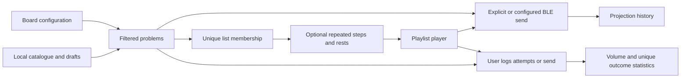
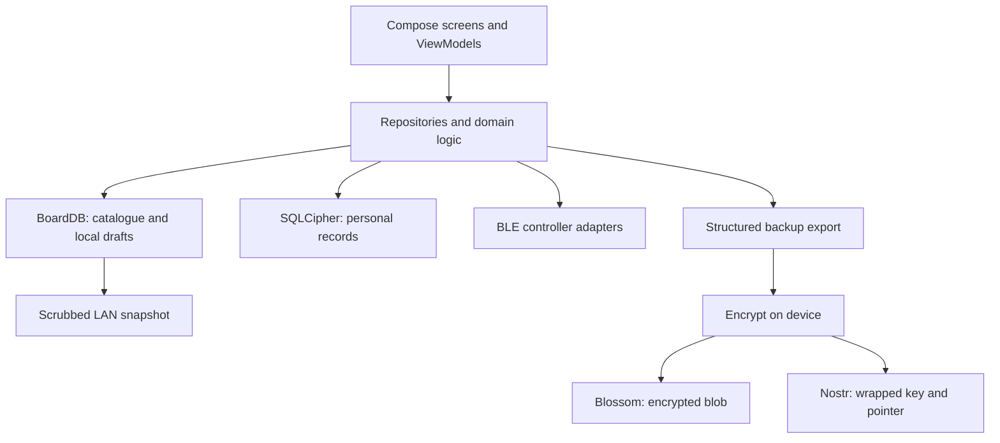

# Core concepts and architecture

[Deutsch](../de/CORE_CONCEPTS.md) · [Documentation index](../README.md)

**Scope:** implemented source at `4fc067e87`, preparing 0.2.3. Published app:
0.2.2. The outcome/count corrections below belong to this preparation line.

## Board, layout, angle, problem

A **board family** selects capabilities and a controller protocol: for example,
MoonBoard and Quantum are not interchangeable with Aurora-compatible boards.
A **layout** describes the hold arrangement. A physical installation also has
a size, mounted hold sets and supported angles. Selecting a gym helps choose
that configuration; the board-fit filter excludes climbs that cannot fit it.
A Bluetooth connection identifies the controller you can actually light.

A **problem** (called a climb in code) has an identity and hold frames. Its
**angle** is the incline used to browse, project or log it. The setter's angle
is context; community grade/quality statistics can differ by angle, and an
angle with no statistics does not automatically mean the problem is unusable.
Use the selected board's allowed angles rather than a universal Kilter range.

## Catalogue, own climbs and community

These are views of data with different origins and publication states, not
three independent copies of every problem.

- **Catalogue:** imported board content, stored locally for browsing. Import
  sources and availability differ by board; “catalogue” does not mean every
  row is an official manufacturer publication.
- **Own climbs:** authored by the active identity, including local drafts.
  Saving a draft and publishing it are separate actions.
- **Community climbs:** shared through signed Nostr events and catalogue
  convergence. A climb can remain one identity while publication destinations
  and sync state change.

The board schema keeps `origin` (where authored), `source` (current data
source), creator and publication state separately. Do not infer ownership or
publication from one field alone. A public signature identifies an author;
it does not make a climb's content or grade authoritative.

## Logbook: attempts, sends and unique outcomes

The board logbook stores **ascents** (successful sends) and **bids** (attempts
without a send). A row can consolidate multiple physical tries in `bid_count`.
Two failed tries followed by a send can therefore be three attempts and one
successful problem, rather than three separate problems.

The statistics have different denominators:

| Measure | What the current computation counts |
|---|---|
| Attempt volume | Sum of `bid_count`, at least one per entry, including send entries |
| Total sends | Successful log entries; repeat sends can count again |
| Outcome distribution / grade outcomes | One best outcome per board family and climb UUID in the selected period: flash, then redpoint, then attempted |
| Flash eligibility | First recorded entry across the full history for board family + climb UUID + angle must be a send with at most one try |

Unique outcome charts collapse angles for the same problem; flash detection
is angle-specific. Do not assume all statistics use either one of these keys.
A send in a later period does not erase the attempted outcome in an earlier
period. Missing import history also limits what can be inferred about a flash.

**History / Verlauf** is separate: it records projections sent to a board.
Lighting a problem is not proof of attempting or completing it.

## Filters and result counts

Board configuration constrains what can fit. Browser filters then narrow the
available set by grade, origin, holds, status and other selected properties.
Status buckets are disjoint: **new** has no send or bid, **attempted** has a bid
but no send, **sent** has a send. Selecting several buckets combines them;
selecting none means all statuses. These status lookups use climb UUIDs,
so they are not a per-angle attempt history.

“Ungraded only” selects missing grades; it is not the same as “attempted.”
Ignored climbs, board fit and Quantum overlap checks can further narrow the
set. On this branch, the browser result count follows the matching results,
including filters applied after the database query, rather than presenting a
raw catalogue count as the number visible. Own-climb browsing deliberately
keeps drafts discoverable across angles; check the dedicated path before
changing its filters.

The **Exclude sent problems** switch edits this same status selection. From
All or Sent-only it selects New + Attempted; a narrower unsent choice remains
narrow when toggling sent visibility. There is no separate hidden status rule.

MoonBoard preview rings retain green/blue/red role colours with light and dark
outlines. These are display strokes; the MoonBoard encoder still transmits role
tokens rather than customizable RGB values.

## Lists and playable playlists

A list is a unique set of climb memberships. Favourites are a built-in list.
Every list has playback defaults; an optional ordered plan adds repeated
climbs, pinned angles and rest steps. Four repetitions belong in that plan,
not four duplicate memberships. Deleting a plan leaves the underlying list.
The player coordinates the active step, rests and logging; starting playback
is not evidence that every step was climbed.

## Local-first storage and sync

Browsing downloaded catalogues, local logging and list management use local
storage. Initial downloads and remote features still require a network.
“Local-first” does not mean the app never contacts a server.

SQLDelight defines both database schemas. **BoardDB is unencrypted** and also
contains local climb drafts; it must not be treated as an entirely public
export. **SecureDB uses SQLCipher** for logbook and other personal records,
with database key material protected by Android Keystore. Preferences and
files exist outside these databases, so “all personal data is encrypted” is
too broad a guarantee.

Optional backup is off by default. It exports structured data, compresses and
encrypts it with an AES-GCM data key, stores the encrypted blob on Blossom,
and wraps the key and pointer in Nostr self-encryption. It is not a raw
SQLCipher-file upload and the data key is not simply the Nostr private key.
Restoring requires the same identity's decryption capability and reachable
backup data. Publishing community climbs is a separate public operation.

Nearby BLE sessions and LAN app/catalogue transfer are also separate features.
The LAN sender scrubs a snapshot before serving it; an unencrypted BoardDB
file must never be assumed safe to share directly. This tree's sharing does
not implement the proposed personal-sharing or BoardCell/FIPS mesh designs.

## Settings and explanations

The settings overview leads to twelve task pages. Titles, current values and
controls provide the main orientation; optional explanations open from the
adjacent info button. Reading help never changes a setting or opens its action.
Dialogs use readable, scrollable text and can be closed to return to the same
page. Current errors, missing prerequisites, backup status and warnings before
destructive actions stay visible where they matter.

Use `SettingsDestinationRow`, `SettingsToggleRow` and `SettingsInfoHeading` in
`ui/settings/SettingsLayout.kt`, with `ui/common/InfoButton.kt` for shared help.

## Source map

Paths below are relative to the repository, linked for direct navigation.
Read implementation and focused tests together before changing a concept.

| Concern | Source of truth |
|---|---|
| Board capabilities and codecs | [shared domain/board](../../shared/src/commonMain/kotlin/com/cruxcoach/domain/board/) |
| Browse models, queries and personal repositories | [shared data/repository](../../shared/src/commonMain/kotlin/com/cruxcoach/data/repository/) |
| Catalogue, origin and draft schema | [Board.sq](../../shared/src/commonMain/sqldelight/board/com/cruxcoach/db/board/Board.sq) |
| Ascents, bids, lists and projection history | [SecureDB schemas](../../shared/src/commonMain/sqldelight/secure/com/cruxcoach/db/secure/) |
| Filters and counts | [BoardBrowserViewModel](../../androidApp/src/main/java/com/cruxcoach/android/ui/board/BoardBrowserViewModel.kt) |
| Statistics and outcome grouping | [BoardStatsComputer](../../androidApp/src/main/java/com/cruxcoach/android/ui/board/BoardStatsComputer.kt) and [tests](../../androidApp/src/test/java/com/cruxcoach/android/ui/board/BoardStatsComputerTest.kt) |
| Playback | [PlaylistPlaybackCoordinator](../../androidApp/src/main/java/com/cruxcoach/android/data/PlaylistPlaybackCoordinator.kt) and [player UI](../../androidApp/src/main/java/com/cruxcoach/android/ui/playlist/) |
| Drafts and publication | [community](../../androidApp/src/main/java/com/cruxcoach/android/community/) |
| Key protection | [SqlCipherKeyManager](../../androidApp/src/main/java/com/cruxcoach/android/data/SqlCipherKeyManager.kt) |
| Backup envelope and restore | [backup](../../androidApp/src/main/java/com/cruxcoach/android/nostr/backup/) |
| LAN snapshot exclusions | [LocalShareSchema](../../androidApp/src/main/java/com/cruxcoach/android/data/LocalShareSchema.kt) and [wire contract](LOCAL_SHARE_CONTRACT.md) |
| Update integrity | [IntegrityVerifier](../../androidApp/src/main/java/com/cruxcoach/android/updater/IntegrityVerifier.kt) |

Android-specific UI, BLE, background work and dependency injection live in
`androidApp/src/main/java/com/cruxcoach/android/`. Shared Kotlin domain logic
and SQLDelight live in `shared/src/commonMain/`; shared code does not by itself
constitute a shipped iOS client.

APK signing, catalogue publisher trust and the user's Nostr identity are
separate trust domains. A content hash checks bytes, not who authorized them.
Update acceptance also checks signing identity/lineage; feature publication
has its own trusted publisher and receipt requirements. Read [SECURITY](../../SECURITY.md)
and [release status](../RELEASE_GITHUB.md) before crossing these boundaries.
