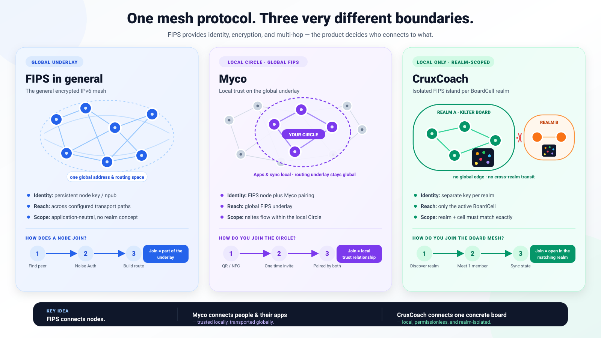

# FIPS explained: an architectural comparison of CruxCoach, Myco, and fips-android

**Language:** [Deutsch](../de/FIPS_MESH_ARCHITECTURE_COMPARISON.md) | English

**As of:** August 17, 2026<br>
**Audience:** readers with no networking background<br>
**CruxCoach revision examined:** `feat/board-cell-mesh-mvp-20260814` at commit `ed2a4b44`<br>
**Short answer for gym operators:** The current local CruxCoach board mesh requires **no separate FIPS node operated by the gym**. Every participating phone running CruxCoach is itself a FIPS node. A permanently installed gym device could improve availability and radio coverage in the future, but it is neither required nor automatically useful in the current model. A generic `fips-android` installation or arbitrary FIPS daemon cannot simply extend the CruxCoach board island today.



## 1. The most important points first

FIPS is neither “a server” nor automatically “the internet without the internet.” FIPS is a **network protocol and runtime** that lets devices:

1. prove their identities cryptographically;
2. establish direct links over different transports;
3. forward packets for other devices; and
4. establish end-to-end encrypted communication across multiple intermediaries.

Each application decides what to do with those capabilities:

| Approach | What is the actual application? | What network boundary does it create? | What does it exchange? |
| --- | --- | --- | --- |
| **FIPS in general** | an application-neutral mesh network | potentially one large network spanning multiple transports | arbitrary IPv6 or native datagrams |
| **fips-android** | general network access for selected Android apps | access to the general FIPS network through VPN/TUN and existing IP connectivity | network traffic from arbitrary selected apps |
| **Myco** | an offline application and content distribution system | FIPS links between Myco devices, with additional trust through a “Circle” | signed nsite manifests, Nostr events, and Blossom blobs |
| **CruxCoach** | shared, consistent state at exactly one physical climbing board | one intentionally isolated FIPS island per BoardCell | board state, playlist, membership, commands, and local competition data |

The key sentence for everything that follows is:

> **FIPS transports and routes packets. FIPS does not decide what constitutes valid board state, an installable app, or a trusted gym participant. Those rules live above FIPS.**

## 2. Networking from first principles

### 2.1 Node, link, peer, and mesh

A **node** is a running device or FIPS process. In this context it can be a phone, laptop, or router.

A **link** is a direct connection between two nodes. For example:

- two phones communicate directly over Bluetooth;
- a phone communicates with a computer over Wi-Fi/UDP;
- two computers communicate over TCP through the internet;
- one computer reaches another through Tor.

The two endpoints of a direct link are **peers**. A **mesh** emerges when several nodes send not only their own data but also forward data on behalf of other nodes.

A small example:

```text
Phone A  <---- direct link ---->  Phone B  <---- direct link ---->  Phone C

Phones A and C have no direct radio contact.
If B forwards packets, A can still reach C.
The A -> B -> C path contains two "hops".
```

This is **multi-hop routing**. A mesh therefore does not require every device to see every other device directly.

### 2.2 Transport and protocol are different layers

A **transport** answers: “How do bytes reach the next directly connected device?” Bluetooth L2CAP, UDP, TCP, Ethernet, and Tor are possible FIPS transports.

On top of that, FIPS answers:

- Who is my direct peer?
- Is that peer cryptographically authentic?
- Which next peer leads toward the destination device?
- How does the content remain protected across intermediaries?

Finally, the application answers:

- Is this message allowed in my current gym session?
- May this member modify the playlist?
- Is snapshot number 42 newer and valid?
- Must a missing message be requested again?

Think of this separation as a parcel service:

```text
Application      Content and business rule: "Set climb X at 40°"
FIPS session     Sealed envelope for the actual destination
FIPS mesh        Route selection and sealed forwarding to the next node
Transport        The concrete Bluetooth, UDP, TCP, or other link
```

### 2.3 An address is not the same as a radio address

A phone may have several addresses at once:

- a Bluetooth address for the local radio link;
- an IP address on Wi-Fi;
- a public mobile address or NAT mapping;
- a FIPS identity and a FIPS address derived from it.

Bluetooth and IP addresses can change. FIPS therefore uses a cryptographic key pair as identity. The public key is commonly represented as an **`npub`** in Nostr notation. FIPS internally derives a `node_addr` from it and an address in `fd00::/8` for its IPv6 adaptation.

Simplified:

```text
private key
     |
     +--> public key / npub       (for people and applications)
     +--> node_addr               (for FIPS routing)
     +--> fd.. IPv6 address       (for ordinary IP programs)
```

The private key must never leave the device. Anyone possessing it can impersonate that node.

For CruxCoach, importantly, the FIPS key is **not** the regular CruxCoach/Nostr account key. An observer should not automatically be able to associate the local transport identity with the public user account.

### 2.4 Discovery is not yet a connection

**Discovery** only means “find possible counterparts.” A BLE advertisement, for example, is a very small message broadcast repeatedly to say: “Something speaking this protocol is running here.”

Separate steps follow:

```text
1. Discovery       A device is noticed
2. Link setup      A Bluetooth L2CAP or IP connection is established
3. Authentication  Ownership of a key is proven cryptographically
4. Admission       The app decides whether the device belongs in this context
5. Data exchange   Valid application messages begin to flow
```

An advertisement is deliberately **not authoritative**. Signal strength, device name, and Bluetooth address prove neither identity nor permission.

### 2.5 Routing is not storage

FIPS provides a **best-effort datagram service**. It resembles UDP more than a database:

- A packet is routed if a path currently exists.
- FIPS does not promise the application reliable delivery or fixed ordering.
- FIPS does not automatically retain a message for days until a destination that is offline today returns tomorrow.

Myco and CruxCoach therefore add different layers:

- Myco adds **store-and-forward**: content is retained and offered again later.
- CruxCoach adds **snapshots, sequences, hashes, ACKs, an outbox, and anti-entropy**: lost state messages are detected and shared state is repaired.

### 2.6 TUN and VpnService

A **TUN interface** is a virtual network card. A program receives complete IP packets from it as bytes and can write packets back. Android exposes such an interface to applications through `VpnService`.

The term “VPN” is slightly misleading here. There need not be a central corporate VPN server. `VpnService` is first of all Android's controlled interface for redirecting traffic from selected apps into a custom network process.

```text
ordinary Android app
        |
        | IPv6 packet to fd.. or a *.fips name
        v
Android VpnService / TUN
        |
        v
embedded FIPS node
        |
        v
FIPS mesh
```

`fips-android` and Myco use this path. CruxCoach deliberately installs **no Android VPN**. Internally it creates only the small number of IPv6/UDP packets expected by its currently embedded FIPS version as an application interface.

## 3. FIPS itself: what happens under the hood

### 3.1 The three essential protocol layers

The current FIPS design separates three core areas:

| Layer | Technical term | Responsibility |
| --- | --- | --- |
| Transport | Transport Plugin | carry datagrams to a directly connected peer over a concrete medium |
| Mesh | FIPS Mesh Protocol (**FMP**) | authenticate direct peers, encrypt links, build topology, and forward packets |
| Session | FIPS Session Protocol (**FSP**) | authenticate two endpoints across any number of hops and encrypt end to end |

Above these, the IPv6 adaptation can connect ordinary programs. Alternatively, a native FIPS datagram API is planned and is being developed upstream.

### 3.2 How FIPS finds paths without a central routing table

In conventional small networks, a router knows a table of “destination network → next router.” FIPS is intended to organize itself without central administration and without storing the complete global topology on every node.

In simplified terms, it uses:

- a **spanning tree**, a jointly formed tree structure with coordinates;
- **Bloom filters**, compact probabilistic structures indicating which destinations might be reachable through which neighbors;
- local decisions at every hop;
- error signals and another search when a suspected path does not work.

A Bloom filter may incorrectly say “possibly present,” but it cannot incorrectly say “definitely absent.” It is therefore a space-efficient signpost, not a database of truth.

### 3.3 Two encryption layers

FIPS encrypts at two levels:

1. **Hop by hop with Noise IK:** each direct link, such as A↔B and B↔C, is separately authenticated and encrypted.
2. **End to end with Noise XK:** the actual A↔C session is encrypted as well. B can forward it but cannot read the application payload.

```text
A                         B                         C
|--- Noise IK link A/B ---|--- Noise IK link B/C ---|
|===================================================|
              Noise XK session A/C, end to end
```

The intermediate node needs enough routing information to forward the packet, but it should not see the session plaintext.

### 3.4 FIPS is transport-agnostic, but platforms enable different transports

The general FIPS project currently supports UDP, TCP, Ethernet, Tor, Nym, and BLE L2CAP, among others. This does not mean every Android embedding enables all of them:

- The general desktop/Linux daemon can run many transports.
- On Android, `fips-android` primarily enables UDP and optionally TCP, Nostr discovery, and mDNS. Its README explicitly says that BLE and Ethernet transports are not currently available on Android.
- Myco adds an Android BLE bridge and Wi-Fi Aware as a fast local UDP path.
- CruxCoach enables only its Android BLE L2CAP bridge for the BoardCell mesh.

“Both use FIPS” therefore does not guarantee a practical connection. They need at least one common transport, compatible protocol versions, compatible discovery, and application-level admission.

### 3.5 Maturity and security boundary

FIPS is under active development. The current upstream explicitly describes its protocol and APIs as not yet stable and lists protocol stabilization and a security audit as open work. This does not mean its cryptography is obviously ineffective. It means:

- integrations must pin an exact commit;
- wire and API compatibility may change;
- product code must enforce size limits, timeouts, and backpressure itself;
- “encrypted” does not replace application-specific authorization;
- production-critical claims require tests on real devices as well as interoperability and security testing.

CruxCoach therefore pins FIPS at `967776079ba5ddc8fe118c3f289365b51eb03737` and compiles the Rust code into `libcruxcoach_fips.so`.

## 4. Approach 1: fips-android as a general network adapter

### 4.1 Product concept

`fr34aky/fips-android` turns an Android device into a broadly usable FIPS node. Selected existing apps should be able to use FIPS destinations without knowing anything about FIPS themselves.

For example, a browser or SSH client wants to reach `alice.fips` or an `fd..` IPv6 address. `fips-android` intercepts that traffic through a per-app `VpnService` and passes it to the embedded Rust node.

### 4.2 Data path

```text
selected Android app
        |
        | ordinary TCP/UDP/DNS traffic
        v
FipsVpnService with TUN, MTU 1280
        |
        +--> fd00::/8 and *.fips --> FIPS TunPacketProcessor --> FIPS mesh
        |
        +--> ordinary internet traffic --> userspace forwarder --> protected
                                             Wi-Fi/mobile sockets
```

**Split tunnel** means only selected apps pass through the tunnel. Other apps retain their normal network path. Within selected apps, the native “pump” again separates mesh traffic from ordinary internet traffic.

### 4.3 Identity and lifetime

The app creates a long-lived FIPS identity. Its secret `nsec` is encrypted using a non-exportable key protected by Android Keystore. The phone consequently retains the same mesh address across restarts until the user deliberately regenerates the identity.

That is useful in a general network: other nodes and services should be able to recognize and address the device over time.

### 4.4 Discovery and transports

The default path uses existing IP infrastructure:

- UDP and optionally TCP;
- optional Nostr-mediated discovery and NAT traversal;
- optional mDNS for direct peers on the same Wi-Fi network;
- restart or rebinding of the embedded node when switching between Wi-Fi and mobile data.

The current Android port provides **no BLE**. Without Wi-Fi, mobile data, an Ethernet adapter, or another IP path, it therefore cannot simply establish a purely local phone mesh over Bluetooth.

### 4.5 What fips-android deliberately does not provide

`fips-android` knows nothing about climbing boards, playlists, or nsites. It provides reachability. An application must still expose a service at the destination, such as an HTTP server, SSH, or a custom protocol.

It is like a new road: the road makes a building reachable, but it constructs neither the building nor its access control.

## 5. Approach 2: Myco as an offline content network

### 5.1 Product concept

Myco does not distribute native Android APKs. A Myco “app” is an **nsite**: a static web app with a signed Nostr manifest and SHA-256-addressed files in Blossom.

The phone is simultaneously:

- the Myco UI and WebView app shell;
- a FIPS node;
- a local Nostr relay;
- a local Blossom server;
- a content cache and a source that can offer content again.

### 5.2 The six layers

In simplified form, Myco's architecture document describes:

```text
1. Android UI: Library, Pair, Discover, Settings
2. NsiteActivity: one full-screen WebView per nsite
3. local gateway: *.nsite -> localhost, validate manifest, serve files
4. embedded relay + Blossom: store events and content-addressed blobs
5. myco-core/JNI: connect content, FIPS, and Android radios
6. FIPS: identity, encrypted links, routing, BLE/UDP/TCP/...
```

The browser loads nsite files locally. The FIPS path is used to synchronize devices, not every time a completely cached app is opened later.

### 5.3 Myco's real additional capability: store-and-forward

Suppose:

```text
Monday:    Alice meets Bob. Bob receives a signed nsite from Alice.
Tuesday:   Alice is absent. Bob meets Carla.
           Carla can now receive the same nsite from Bob.
```

FIPS alone would not accomplish this because Alice is unreachable on Tuesday. Myco's local relay and Blossom cache turn Bob into a new source. The manifest remains verifiably signed, and blobs are checked against their SHA-256 hashes.

This distinction is fundamental:

- **FIPS:** find a route now to a destination that is currently reachable.
- **Myco:** retain content and offer it to others later.

### 5.4 Trust: FIPS identity plus a Myco Circle

Myco adds another social and application-specific trust layer on top of the FIPS identity. Users pair by QR/NFC and form a **Circle**. FIPS could theoretically route many more nodes; Myco decides which known people may offer and synchronize content.

“Reachable on the same FIPS network” and “admitted to my Myco Circle” are therefore different statements.

### 5.5 Local radio paths

Myco uses:

- BLE L2CAP CoC as its basic offline path;
- Wi-Fi Aware as an optional, faster local UDP path for larger transfers;
- a local access-point/LAN lane;
- other IP transports depending on the FIPS configuration.

BLE is practical for discovery, control, and small data. Wi-Fi Aware or ordinary Wi-Fi is much better for large web-app blobs. FIPS can use an alternative link; that does not automatically mean parallel “striping” of the same file over several radios.

### 5.6 TUN and services

Myco retains an Android `VpnService`/TUN. It makes FIPS destinations such as `<npub>.fips` reachable by internal IP-based services. The embedded relay and Blossom server bind to ports and are addressed over FIPS. Local `.nsite` delivery, by contrast, remains on the device.

Myco is therefore much more than a FIPS user interface: it is a complete domain-specific distribution and runtime platform built on FIPS.

## 6. Approach 3: CruxCoach as an isolated BoardCell

### 6.1 Product concept

CruxCoach does not intend to provide a general network for other apps or distribute global content. Its objective is narrower:

> All CruxCoach devices joined at the same physical board should see the same confirmed board state, playlist, membership, and local competition data—even without internet access.

This limitation is a deliberate product and security decision.

### 6.2 One FIPS island per physical board

CruxCoach uses the selected **Variant A**: isolated FIPS realms.

```text
Board A / BoardCell A              Board B / BoardCell B

Phone 1 ---- Phone 2               Phone 4 ---- Phone 5
   \            |                                      \
     ---- Phone 3                         Phone 6 -------

No automatic FIPS link between A and B.
No global FIPS address space for these BoardCell sessions.
```

A **realm** is the transport and admission boundary here. In a normal BoardCell, the `realmId` equals the `BoardCellId`. Devices with a different realm/cell context are rejected both before and after cryptographic link setup.

The general FIPS protocol has no CruxCoach board-realm concept. It is a policy added by CruxCoach.

### 6.3 Four identities with four jobs

| Identity | Meaning | Why keep it separate? |
| --- | --- | --- |
| `PhysicalBoardId` | the concrete physical climbing board | Two neighboring boards must never be mixed. |
| `BoardCellId` | the deterministic state space for that board | Multiple phones must derive the same scope without a server. |
| `realmId` | the local FIPS connection boundary | Foreign cells should not join the local mesh at all. |
| FIPS `npub` | this device's cryptographic identity within the realm | Bluetooth and IP addresses are not stable, secure identities. |

For each realm, the code stores a 32-byte secret encrypted in `EncryptedSharedPreferences` and protected by an Android master key. The identity remains stable within that realm across Bluetooth and process restarts. It is not the public user `npub`.

### 6.4 Discovery and admission, step by step

On Android 10/API 29 and later, CruxCoach uses BLE **L2CAP CoC**. Kotlin owns the Android radio objects; Rust owns FIPS. A small JNI bridge carries L2CAP channels and bytes between the two.

The join flow is:

1. A running cell broadcasts a small BLE advertisement.
2. It contains a protocol version, dynamic L2CAP PSM, short realm/cell hints—or the BoardCell UUID in V2—and a tag for a short-lived nonce.
3. The joining phone opens an L2CAP channel.
4. FIPS performs the cryptographic peer handshake.
5. CruxCoach additionally sends a `CCJ1` hello containing the full realm ID, full BoardCell ID, a fresh nonce, and a timestamp.
6. Only a directly authenticated BLE peer with a matching complete scope is validated for the cell.
7. An existing member or the controller admits the node into canonical membership.
8. The new member receives a complete snapshot. Only then is it synchronized at the application level.

The four-byte tags in the advertisement are only preliminary filters. A random collision cannot grant admission because full IDs are verified after the FIPS handshake.

### 6.5 What the embedded Rust component does

CruxCoach starts a real `fips::Node`, but disables nearly all general-purpose facilities:

```text
enabled:
  - its own FIPS identity
  - FMP/FSP, Noise, routing, and multi-hop
  - exactly one Android BLE L2CAP transport
  - app-owned TUN channels as an internal packet interface

disabled:
  - operating-system TUN
  - Android VpnService
  - *.fips DNS
  - control socket
  - Nostr discovery
  - internet/LAN UDP and TCP for the BoardCell
  - Tor and public relays
```

Because the pinned FIPS revision does not yet expose the required native application interface as a finished product path, CruxCoach internally creates standards-compliant IPv6/UDP datagrams for port `42424` and passes them through FIPS's **app-owned TUN seam**. There is no virtual network interface in Android itself, and no other Android app can see this network.

An application message may be up to 1 MiB. CruxCoach splits it into 900-byte chunks, assigns each full payload a SHA-256-based message ID, limits concurrent assemblies and buffer sizes, and validates the full hash after reassembly. This constrains resource use and detects damaged or incomplete assemblies. The FIPS datagrams themselves remain small.

### 6.6 BoardCell is the actual consistency layer

FIPS does not know which climb is currently lit on the board. The BoardCell layer above the transport provides that knowledge.

A canonical snapshot includes, among other things:

- the physical board, cell, lineage, and epoch;
- controller and controller term;
- sequence number and hash;
- current members;
- the last successfully projected climb and angle;
- the complete playlist and current position;
- availability and handover state;
- recently processed command IDs for idempotency.

There is deliberately one **canonical controller** instead of a freely mergeable CRDT. A physical LED board can ultimately experience only one concrete order of writes, so the controller serializes state-changing commands.

Every event:

- belongs to a board, cell, and epoch;
- increments the sequence by exactly one;
- binds the previous and resulting hashes;
- is applied to every replica using the same deterministic reducer.

When it encounters a gap or hash conflict, a replica does not guess. It freezes the affected path and requests a complete snapshot.

### 6.7 What happens when packets are lost?

FIPS is best effort. CruxCoach therefore adds:

- persistent snapshots;
- a bounded outbox;
- correlated command ACKs;
- retries using the same command ID;
- deduplication and idempotency;
- periodic digest/anti-entropy messages;
- snapshot repair when gaps occur.

A lost event is thus not healed by “magically reliable FIPS.” BoardCell protocol rules detect and repair the problem.

### 6.8 Physical board and controller fencing

Only one logical controller should write to the board. If the controller fails, a staggered takeover begins. A candidate gains write authority only after acquiring the physical board connection. That connection serves as a **fencing token**: it prevents two logical controllers from independently accepting successful physical writes.

A planned handover has persistent phases. A crash should not leave both source and target believing they are the controller.

Board writes also use write-ahead logic:

```text
WAL PREPARED
    -> physical BLE write
    -> WAL PHYSICAL_WRITE_SUCCEEDED
    -> persist snapshot + COMMITTED ACK
    -> distribute event
```

If the process dies exactly after the physical write but before the canonical commit, CruxCoach cannot reliably read the semantic board content back from the board. It truthfully reports “unknown/frozen” and requires deliberate reprojection.

### 6.9 Android lifecycle and fallback

The mesh runs only while a logical feature owns it, such as BoardCell, Session, Nearby Join, or handover. A connected-device foreground service keeps an active runtime visibly alive in the background.

- From API 29 onward, FIPS/BLE L2CAP is the preferred data path.
- API 28 uses the existing GATT compatibility path, not FIPS.
- Turning Bluetooth off stops the local radio runtime; the canonical controller removes a disappeared member according to liveness rules.
- For a large offline share, CruxCoach can deliberately pause FIPS so BLE and CPU/SQLite do not compete for scarce resources simultaneously.
- Direct FIPS BLE connections are currently limited to seven. Multi-hop may allow more logical members, but it cannot replace hardware testing with real topologies.

## 7. Direct comparison of the three approaches

### 7.1 Difference 1: network boundary and admission

| Question | fips-android | Myco | CruxCoach |
| --- | --- | --- | --- |
| Basic scope | general FIPS network | FIPS network plus a personal Myco Circle | isolated island for exactly one BoardCell |
| How is a peer found? | static peers, Nostr, mDNS, IP | BLE, Wi-Fi Aware, LAN/AP, and FIPS paths | BLE advertisement carrying cell context |
| Is FIPS authentication sufficient? | for the link; services need their own policy | no; Myco pairing/Circle is added | no; full realm/cell checks and canonical membership are added |
| Is global reachability intended? | generally yes | possible for transport; content remains governed by Circle/policy | explicitly no |

**Intuition:** `fips-android` builds a general road; Myco builds a trust and delivery network on that road; CruxCoach cordons off a small parking area for exactly one board.

### 7.2 Difference 2: Android integration

| Question | fips-android | Myco | CruxCoach |
| --- | --- | --- | --- |
| Android `VpnService`? | yes, a central product component | yes, for FIPS IP reachability | no |
| OS-visible TUN? | yes, with a per-app split tunnel | yes, an app-owned TUN | no; internal packet channels only |
| Can third-party apps use FIPS? | selected apps can | mainly Myco's own services/WebViews | no |
| Native boundary | Kotlin VPN ↔ Rust shim/JNI | Kotlin UI/radios/VPN ↔ `myco-core` | Kotlin BoardCell/radios ↔ minimal Rust bridge |

**Consequence:** CruxCoach does not occupy Android's sole VPN slot and need not forward general internet traffic. In return, its embedding is intentionally not reusable as general FIPS access.

### 7.3 Difference 3: data and consistency model

| Question | fips-android | Myco | CruxCoach |
| --- | --- | --- | --- |
| Meaning of payload | arbitrary IP packets | signed events/manifests and hashed blobs | ordered BoardCell events, snapshots, and commands |
| Storage for later | not FIPS's responsibility | yes, relay + Blossom store-and-forward | persistent snapshots/outbox for state repair, not a general content cache |
| Conflict rule | up to each application | signatures, versions, and content hashes | one canonical controller, sequence, epoch, and hash chain |
| Offline target unavailable | packet initially fails | another cache may provide the content later | replica obtains a snapshot/missing state after reconnection |

**Consequence:** A router node may improve reachability, but by itself it solves neither Myco's content distribution nor CruxCoach's state consistency.

### 7.4 Difference 4: enabled transports

This fourth difference is so important in practice that it deserves separate treatment despite the three fundamental architectural axes:

| Transport | fips-android today | Myco today | CruxCoach BoardCell today |
| --- | ---: | ---: | ---: |
| BLE L2CAP on Android | no | yes | yes |
| Wi-Fi Aware | no | yes, optional fast path | no |
| Wi-Fi/LAN over UDP | yes | yes | no |
| Mobile/internet over UDP/TCP | yes | configurable | no |
| Nostr discovery | optional | depends on FIPS/Myco configuration | no |

That is why a `fips-android` node in the same room cannot automatically see the CruxCoach BLE island. They already lack a shared enabled transport; in addition, `fips-android` lacks the CruxCoach realm and BoardCell protocol.

## 8. Must a gym owner operate a FIPS node?

### 8.1 For the current CruxCoach mesh: no

As soon as CruxCoach activates the local board mesh, the FIPS node runs **inside the CruxCoach process on the phone**. The first phone creates or reactivates the BoardCell realm. Other phones join over BLE. A separate server is not part of the data path.

```text
no gym server required

Phone A with CruxCoach/FIPS  <--- BLE --->  Phone B with CruxCoach/FIPS
          |
          +--- BLE link to physical board (when A is controller)
```

The gym therefore does not need to:

- install a Linux computer;
- provide a public IP address;
- operate a Nostr relay;
- run `fips-android` on a separate phone;
- provide internet access for the session.

### 8.2 What does “create the local mesh” mean, then?

In the current CruxCoach model, no central operator creates an empty room in advance. The cell is derived from the identity of the selected physical board. The first authorized CruxCoach device bootstraps canonical state and initially assumes the controller role. Other devices discover the running cell and receive a snapshot after admission.

When nobody remains, there is no permanently broadcasting radio node. Persistent data resides in local snapshots on the devices; FIPS itself is not a server that keeps an empty session alive over the air.

### 8.3 Could a permanently running gym node still help?

Yes, **if** it is built as an explicit CruxCoach product feature. Potential benefits include:

1. **Faster discovery:** a fixed device could continuously advertise the BoardCell during opening hours.
2. **More stable controller:** a mains-powered device near the board may disappear less often than a customer's phone.
3. **Radio bridge:** in a difficult building it could provide an additional hop between areas.
4. **Continuity:** a running snapshot/controller node could reduce handovers as individual participants leave.
5. **Diagnostics:** a gym-managed device could provide local, privacy-conscious radio and state diagnostics.
6. **A future faster link:** a later version could also enable LAN or Wi-Fi Aware on the gym device and use BLE only for discovery.

These are real benefits, but they are **not free properties of an arbitrary FIPS daemon**. The device would have to:

- speak the CruxCoach realm and BoardCell protocol;
- bind the physical board identity correctly and persistently;
- implement controller, WAL, handover, and snapshot rules;
- be admitted as a gym device by product and security policy;
- remain in radio range under the current BLE model.

The simplest option would therefore not be a bare FIPS router, but a dedicated **CruxCoach Gym Node Mode** on a supported Android device—or later on a purpose-built appliance.

### 8.4 When is a gym node irrelevant or harmful?

It is largely irrelevant when two or three people usually stand at the same board and their phones communicate reliably over BLE. Multi-hop and permanent operation then solve no demonstrated problem.

Possible disadvantages include:

- another device, power supply, update process, and support burden;
- permanent BLE advertising and greater radio/power use;
- another node consuming direct connection capacity;
- unclear ownership and privacy implications for stored session data;
- the temptation to mistake an infrastructure node for a central trust authority;
- more complicated controller handover and physical board access;
- a permanent node becoming a single point of operational failure even though the protocol requires no central server.

The right product rule is therefore: the mesh must function completely without a gym node. A gym node may only **optimize** it, never become a hidden prerequisite.

### 8.5 Can the gym simply install fips-android?

For CruxCoach today: **no, not with the desired effect**.

`fips-android`:

- currently uses UDP/TCP rather than BLE on Android;
- joins the general FIPS network;
- knows no CruxCoach `realmId`, `BoardCellId`, `CCJ1` admission, or snapshots;
- gives selected apps an IP network, but provides no CruxCoach controller.

CruxCoach:

- enables only BLE L2CAP for BoardCell;
- disables UDP, TCP, Nostr discovery, DNS, and OS TUN;
- accepts only the matching local board realm;
- expects the BoardCell wire protocol above FIPS.

Any bridge would need to be designed deliberately. “Both contain FIPS” is about as sufficient as “both devices speak IP”: that fact does not turn a browser into a database server.

### 8.6 What about Myco?

Myco likewise requires no gym-owner server. Every Myco phone is itself a node, relay, Blossom source, and cache.

A permanent gym device could be more useful here than for pure live messaging because it could:

- cache frequently used nsites and blobs permanently;
- continue offering content after the original visitor has left;
- act as an easily reachable BLE/Wi-Fi peer;
- deliver large content over a faster local path.

A bare FIPS router improves only the path. To provide store-and-forward, the device must also run Myco's relay, Blossom, and nsite layers and be paired according to Myco's trust policy.

### 8.7 What about general FIPS or fips-android?

Here a gym node can be useful network infrastructure:

- a local UDP peer discoverable by mDNS on gym Wi-Fi;
- a stable entry point into a larger FIPS mesh;
- a router between local Wi-Fi and other FIPS transports;
- a host for local services;
- on Linux/OpenWrt, optionally a gateway for devices that do not run FIPS themselves.

It is not mandatory if phones already reach other FIPS peers via internet/Nostr discovery. For a **fully offline fips-android setup**, however, local IP infrastructure matters because the current Android port has no BLE. That could be gym Wi-Fi plus a reachable FIPS daemon. The daemon does not create internet access; it only provides mesh reachability and possibly locally hosted services.

## 9. Concrete gym scenarios

### Scenario A: Two people next to the board

```text
Phone A <--- BLE ---> Phone B
   |
   +--- Board
```

**Gym node:** unnecessary.<br>
**Value of FIPS:** authenticated link, with multi-hop available later.<br>
**Value of BoardCell:** shared canonical state and controlled board writes.

### Scenario B: Three people, one behind a thick wall

```text
Phone A <--- BLE ---> Phone B <--- BLE ---> Phone C
   |
   +--- Board
```

**Gym node:** not necessarily required. B can route if the real BLE topology and FIPS links are stable.<br>
**Important:** C must first have been admitted directly according to the admission rules. Multi-hop does not replace initial scoping and membership checks.

### Scenario C: The last customer phone leaves

```text
no running CruxCoach node -> no live mesh advertisement
```

**Gym node:** could keep the cell available during opening hours.<br>
**Today:** neither required nor specified as a separate operating mode. A later visitor can start a new—or persistently recognized—cell at the board.

### Scenario D: The gym wants to distribute catalog files locally and permanently

This is not the same problem as live board state.

- FIPS alone does not retain the file for later.
- CruxCoach BoardCell is not a general blob cache.
- A permanent device would need an explicit, signed content/manifest layer resembling Myco's Blossom model or CruxCoach's existing signed catalog paths.

A gym appliance may be useful here, but the architecture should keep **content distribution** separate from the **live control mesh**.

### Scenario E: The gym wants to provide internet access to everyone

FIPS is not a replacement for an internet uplink. A FIPS gateway can connect defined networks or services. Ordinary internet access still requires an actual uplink and a deliberately configured gateway/exit policy. The current CruxCoach mesh enables no such path.

## 10. Assessment of the CruxCoach integration

### 10.1 What the architecture gets right

1. **Narrow scope:** each board is its own island, limiting accidental data mixing and unnecessary global metadata.
2. **No account-key reuse:** transport identity and public user identity remain separate.
3. **Discovery is not authority:** short BLE tags are followed by full-ID checks after FIPS authentication.
4. **No unnecessary VPN slot:** CruxCoach connects only its own messages to FIPS.
5. **FIPS and domain state are separate:** routing does not determine board truth.
6. **Loss is expected:** snapshots, outbox, ACKs, and anti-entropy fit the best-effort foundation.
7. **Physical reality is modeled:** successful board writes and the board connection are part of authority decisions.
8. **Resources are bounded:** frame, queue, assembly, peer, and timeout limits prevent uncontrolled growth.
9. **Fallback is explicit:** API 28 remains on GATT; API 29+ can use L2CAP/FIPS.
10. **Upstream is pinned:** builds do not silently depend on a moving branch head.

### 10.2 Important limitations and open risks

1. **Real hardware is the benchmark:** Android BLE and L2CAP behavior varies by manufacturer. JVM tests do not prove radio stability.
2. **FIPS remains unstable:** the pinned revision trails current upstream. Changes must be ported deliberately and retested.
3. **No completed security audit:** the combination of FIPS cryptography, JNI, Android radio handling, and BoardCell admission still needs review.
4. **Short advertisement tags leak proximity and activity:** they contain no account identity, but reveal that a compatible mesh exists. V2 advertises the full public BoardCell UUID.
5. **Realm-secret persistence is a product decision:** in current code, `end(realmId)` does not rotate the stored secret; it remains per realm, and storage is limited to 64 realms. Architecture, UI, and privacy documentation must describe that actual behavior consistently.
6. **At most seven direct links:** larger sessions depend on multi-hop, topology, and OEM limits.
7. **No general bulk path:** BoardCell messages suit BLE; large catalogs or media still require a separate Wi-Fi/chunk path.
8. **FIPS does not guarantee delivery:** correctness continues to depend on the BoardCell outbox and anti-entropy.
9. **Third-party board apps remain outside authority:** if another app writes directly to the board, CruxCoach has limited ability to detect or semantically classify that write.
10. **A permanent gym mode is not a finished product:** operator identity, provisioning, updates, privacy, recovery, and UI policy remain unspecified.

### 10.3 Questions to answer before building a gym-node product

Do not begin with hardware. Answer these questions first:

1. Should the node only route, or also act as controller?
2. May it retain BoardCell state overnight?
3. Who owns and rotates its FIPS/gym keys?
4. How is it bound unambiguously to one physical board?
5. Who may administer, update, and reset it?
6. May it automatically admit customers without confirmation?
7. Which diagnostic data may the operator see?
8. What happens after power, Wi-Fi, or board failure?
9. Must the session remain fully functional without the node?
10. Is an Android device, OpenWrt router, or dedicated board appliance the right form factor?

For the current use case, the answer to question 9 is unequivocally **yes**.

## 11. A complete CruxCoach message path

Assume member C presses “Next,” A is the controller, and B is the radio intermediary:

```text
C UI
  -> semantic playlist command with commandId and base revision
  -> BoardCell wire format
  -> fragmentation into bounded frames
  -> internal IPv6/UDP datagrams
  -> FIPS end-to-end session C/A
  -> FIPS link C/B over BLE L2CAP
  -> B routes the encrypted session packet
  -> FIPS link B/A over BLE L2CAP
  -> A reassembles frames and verifies SHA-256
  -> A maps the sender through the authenticated FIPS source
  -> BoardCell checks cell, epoch, membership, and semantic preconditions
  -> controller serializes the command
  -> if necessary, physical board write with WAL
  -> canonical event/snapshot with a new sequence and hash
  -> distribution to B and C
  -> correlated COMMITTED ACK for the same commandId
  -> UI displays confirmed state
```

Every layer solves a different problem:

- L2CAP: local bytes;
- FIPS: identity, encryption, and route;
- FrameCodec: a bounded, reassemblable message;
- BoardCellWire: a typed domain message;
- Coordinator: authority and ordering;
- DurableStore/WAL: crash consistency;
- UI: understandable feedback.

If one layer fails, the layer above must not simply assume its guarantee. An open L2CAP channel is not yet an authenticated peer; an authenticated peer is not yet a cell member; an accepted command is not yet physically confirmed board state.

## 12. Decision matrix for gym operators

| Need | Separate gym node? | Suitable approach |
| --- | --- | --- |
| A few CruxCoach users share one board live | no | embedded CruxCoach FIPS |
| Poor BLE coverage with real radio dead zones | perhaps, as another CruxCoach hop | measure first, then design Gym Node Mode |
| BoardCell should remain discoverable throughout opening hours | optionally useful | dedicated CruxCoach Gym Node Mode |
| Nsites/offline web apps should remain cached locally | potentially very useful | full Myco node, not merely a FIPS router |
| Arbitrary apps should reach `.fips` services | `fips-android` per phone; local peer optional | fips-android + compatible FIPS peer |
| Fully offline fips-android network without BLE | local IP infrastructure probably required | gym Wi-Fi + FIPS daemon/mDNS/UDP |
| Non-FIPS devices should reach mesh services | yes, a gateway may help | FIPS gateway on Linux/OpenWrt |
| Distribute large board data or APKs locally | not solved by FIPS alone | separate signed manifest/blob transfer |
| Provide internet access | FIPS alone is insufficient | real uplink + explicit gateway/exit policy |

## 13. Recommendation

CruxCoach should retain its current fundamental rule:

> **Every user device is a complete embedded node; the local board mesh works without operator infrastructure.**

A local gym node should be built only when measurements reveal a specific problem, such as frequent controller changes, radio dead zones, or a requirement for permanent discoverability. It should be designed as a CruxCoach-specific role, not as an unconfigured general FIPS router.

A sensible staged path would be:

1. Complete two- and three-device tests of the existing BLE L2CAP mesh across several real Android manufacturers.
2. Measure range, join latency, packet loss, controller handover, Doze behavior, and direct connection limits in an actual gym.
3. Specify a Gym Node Mode only if the need is demonstrated.
4. Initially implement it as an optional mains-powered CruxCoach Android device.
5. Treat a faster LAN/Wi-Fi Aware transport and a content cache as separate extensions.
6. Never make correct BoardCell operation depend on that device.

This preserves the offline advantage: a gym can improve the experience, but need not operate server infrastructure merely so two people can climb together.

## 14. Glossary

| Term | Plain-language explanation |
| --- | --- |
| **Admission** | the application's decision to admit a technically reachable and authenticated device into a particular context |
| **Advertisement** | a very small BLE broadcast used for discovery |
| **Anti-entropy** | periodic comparison of state versions to detect and repair missed updates |
| **Backpressure** | limiting or delaying new work when a receiver or buffer is full |
| **BLE** | Bluetooth Low Energy |
| **Blossom** | a content-addressed blob store from the Nostr ecosystem; hashes identify content |
| **Bloom filter** | a compact probabilistic indication that a destination might be reachable through a path |
| **BoardCell** | CruxCoach's complete state and authority domain for one physical board |
| **Controller** | the single BoardCell node that orders canonical changes and authorizes physical board writes |
| **CRDT** | a structure whose concurrent changes can be merged deterministically; CruxCoach deliberately does not use a freely writable CRDT for the physical board |
| **Datagram** | one self-contained message without an automatic delivery guarantee |
| **Discovery** | a mechanism for finding possible direct peers |
| **Fencing token** | an exclusively acquired resource or generation that reliably excludes stale writers; here especially the physical board connection plus controller term |
| **FMP** | FIPS Mesh Protocol: direct links, link encryption, topology, and routing |
| **FSP** | FIPS Session Protocol: the end-to-end session between two FIPS nodes |
| **Hop** | one leg from one node to the next |
| **Idempotency** | repeating the same command ID does not repeat its effect |
| **JNI** | the interface between Kotlin/Java and a native Rust/C library on Android |
| **L2CAP CoC** | a Bluetooth connection-oriented channel using credit-based packets; used by the FIPS Android BLE bridge |
| **Lineage** | an identifier for one continuous canonical BoardCell history; differing lineages help reveal partitions/forks |
| **Mesh** | a network in which nodes also forward data for other nodes |
| **MTU** | the largest packet a path can carry without further fragmentation |
| **Multi-hop** | reaching a destination through at least one forwarding intermediary node |
| **NAT** | translation between private and public IP addresses, common in routers and mobile networks |
| **Noise IK/XK** | standardized cryptographic handshake patterns for authenticated key agreement |
| **Node** | a running participant in the FIPS network |
| **npub/nsec** | Nostr notation for a public or private key; an `nsec` must remain secret |
| **nsite** | a signed static web app or website in the Nostr/Blossom model |
| **Outbox** | a local collection of messages that remain to be sent or retried |
| **Peer** | a direct or logically addressed counterpart; context determines whether it means a direct-link peer or the ultimate destination |
| **PSM** | Protocol/Service Multiplexer; approximately the dynamic service number to connect to in L2CAP |
| **Realm** | CruxCoach's local transport and admission boundary for a BoardCell or competition |
| **Replica** | a local copy of canonical BoardCell state |
| **Routing** | selecting the next hop toward a destination |
| **Snapshot** | a complete, hashed point-in-time representation of BoardCell state |
| **Spanning tree** | a loop-free tree structure used by FIPS as the basis of its self-organization |
| **Split tunnel** | only selected apps or destinations pass through a VPN/TUN; everything else uses the normal path |
| **Store-and-forward** | retain data now and redistribute it later |
| **TUN** | a virtual network interface that passes complete IP packets to a program as bytes |
| **UDP/TCP** | common IP transport protocols; UDP is message-oriented/best effort, while TCP provides an ordered byte stream |
| **VPN/VpnService** | Android's controlled interface for routing app traffic through a virtual interface |
| **WAL** | write-ahead log: a planned write is persisted before its physical effect |
| **Wi-Fi Aware** | direct local device discovery and data paths without a traditional access point, where supported by Android hardware |

## 15. Sources and revisions examined

### CruxCoach

- [`native/fips-bridge/Cargo.toml`](../../native/fips-bridge/Cargo.toml) — pinned FIPS dependency
- [`native/fips-bridge/src/android.rs`](../../native/fips-bridge/src/android.rs) — embedded node, enabled BLE transport, and internal TUN/DNS seams
- [`FipsMeshRuntime.kt`](../../androidApp/src/main/java/com/cruxcoach/android/fips/FipsMeshRuntime.kt) — Android lifecycle, realm, peers, frames, and foreground service
- [`FipsBleRadio.kt`](../../androidApp/src/main/java/com/cruxcoach/android/fips/FipsBleRadio.kt) — Android L2CAP, scanning, and advertising bridge
- [`FipsRealm.kt`](../../androidApp/src/main/java/com/cruxcoach/android/fips/FipsRealm.kt) — realm/cell tags and direct admission
- [`FipsRealmKeyStore.kt`](../../androidApp/src/main/java/com/cruxcoach/android/fips/FipsRealmKeyStore.kt) — persistent realm identity separated from the account
- [`FipsFrameCodec.kt`](../../androidApp/src/main/java/com/cruxcoach/android/fips/FipsFrameCodec.kt) — bounded fragmentation and assembly
- [`BoardCellCoordinator.kt`](../../androidApp/src/main/java/com/cruxcoach/android/boardcell/BoardCellCoordinator.kt) — canonical controller and commit rules
- [`OFFLINE-BOARDCELL-FIPS-ARCHITECTURE.md`](../specs/0.2.3/OFFLINE-BOARDCELL-FIPS-ARCHITECTURE.md) — normative detailed architecture
- [`FIPS_DEVICE_TEST_PROTOCOL.md`](../FIPS_DEVICE_TEST_PROTOCOL.md) — hardware acceptance tests

### FIPS in general

The revisions examined were CruxCoach's pinned commit [`967776079ba5ddc8fe118c3f289365b51eb03737`](https://github.com/jmcorgan/fips/tree/967776079ba5ddc8fe118c3f289365b51eb03737) from August 7, 2026, and the then-current upstream commit [`23ec0a7b811a0e986fe2d2cb51fffe8f10f7a57d`](https://github.com/jmcorgan/fips/tree/23ec0a7b811a0e986fe2d2cb51fffe8f10f7a57d) from August 17, 2026:

- [FIPS README](https://github.com/jmcorgan/fips/blob/23ec0a7b811a0e986fe2d2cb51fffe8f10f7a57d/README.md)
- [FIPS Concepts](https://github.com/jmcorgan/fips/blob/23ec0a7b811a0e986fe2d2cb51fffe8f10f7a57d/docs/design/fips-concepts.md)
- [FIPS Architecture](https://github.com/jmcorgan/fips/blob/23ec0a7b811a0e986fe2d2cb51fffe8f10f7a57d/docs/design/fips-architecture.md)
- [Security Reference](https://github.com/jmcorgan/fips/blob/23ec0a7b811a0e986fe2d2cb51fffe8f10f7a57d/docs/reference/security.md)
- [Transport Reference](https://github.com/jmcorgan/fips/blob/23ec0a7b811a0e986fe2d2cb51fffe8f10f7a57d/docs/reference/transports.md)

### Myco

The revision examined was Myco `main` at commit [`85316faf80fda48bfef8977584ab4ad68203de02`](https://github.com/Origami74/myco/tree/85316faf80fda48bfef8977584ab4ad68203de02) from August 9, 2026:

- [README](https://github.com/Origami74/myco/blob/85316faf80fda48bfef8977584ab4ad68203de02/README.md)
- [System Architecture](https://github.com/Origami74/myco/blob/85316faf80fda48bfef8977584ab4ad68203de02/docs/design/architecture.md)
- [Propagation / Store-and-forward](https://github.com/Origami74/myco/blob/85316faf80fda48bfef8977584ab4ad68203de02/docs/design/propagation.md)
- [Identity and Pairing](https://github.com/Origami74/myco/blob/85316faf80fda48bfef8977584ab4ad68203de02/docs/design/identity-pairing.md)
- [BLE Interop](https://github.com/Origami74/myco/blob/85316faf80fda48bfef8977584ab4ad68203de02/docs/design/ble-interop.md)
- [Wi-Fi Aware Interop](https://github.com/Origami74/myco/blob/85316faf80fda48bfef8977584ab4ad68203de02/docs/design/wifi-aware-interop.md)

### fips-android

The revision examined was `fr34aky/fips-android` `main` at commit [`6db0108e6f5e6766863d96bb32df9b43294d701b`](https://github.com/fr34aky/fips-android/tree/6db0108e6f5e6766863d96bb32df9b43294d701b) from August 15, 2026. The project pins its FIPS fork at `d187c078a15ba7b6dd0ee14c1431658a65ca690b`:

- [README and operating limits](https://github.com/fr34aky/fips-android/blob/6db0108e6f5e6766863d96bb32df9b43294d701b/README.md)
- [Rust engine](https://github.com/fr34aky/fips-android/blob/6db0108e6f5e6766863d96bb32df9b43294d701b/shim/src/engine.rs)
- [Android FipsVpnService](https://github.com/fr34aky/fips-android/blob/6db0108e6f5e6766863d96bb32df9b43294d701b/android/app/src/main/java/org/fips/android/FipsVpnService.kt)
- [Shim configuration](https://github.com/fr34aky/fips-android/blob/6db0108e6f5e6766863d96bb32df9b43294d701b/shim/src/config.rs)

The external projects continue to evolve. Statements about “current” behavior in this document refer to the reproducibly linked commits above.
