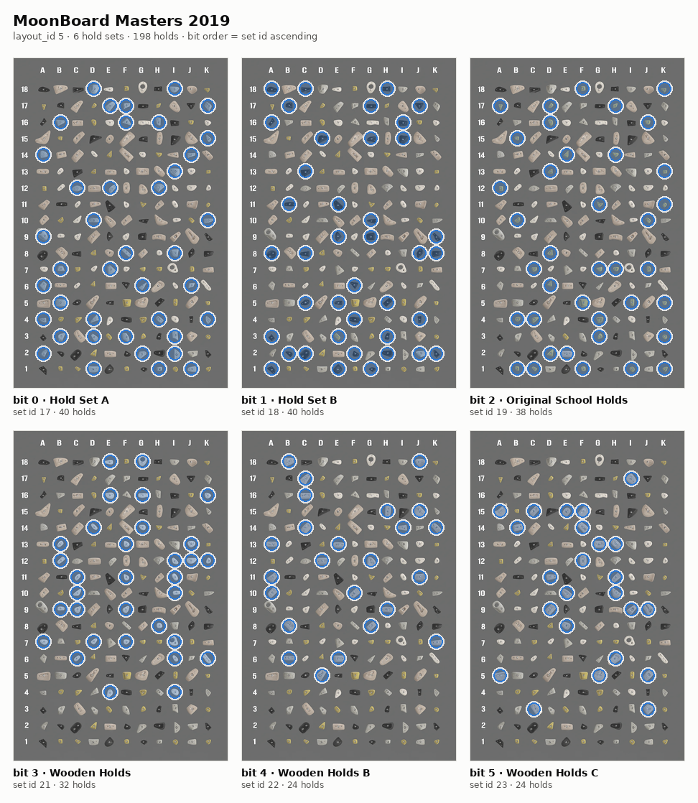
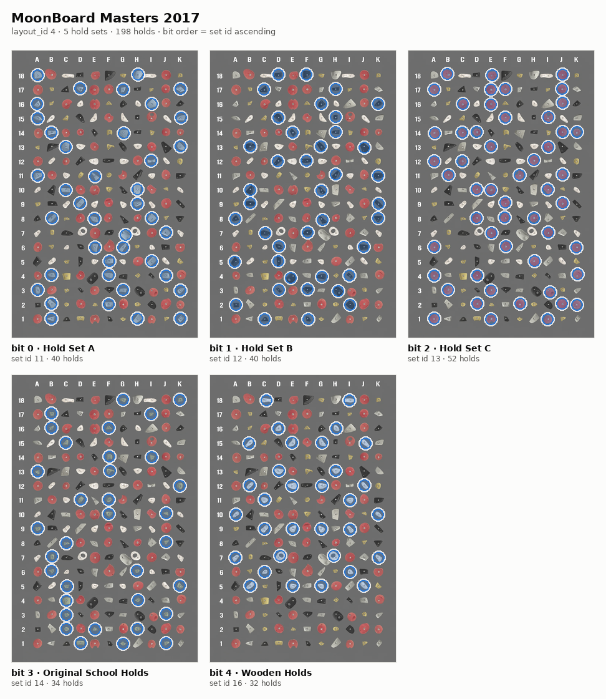
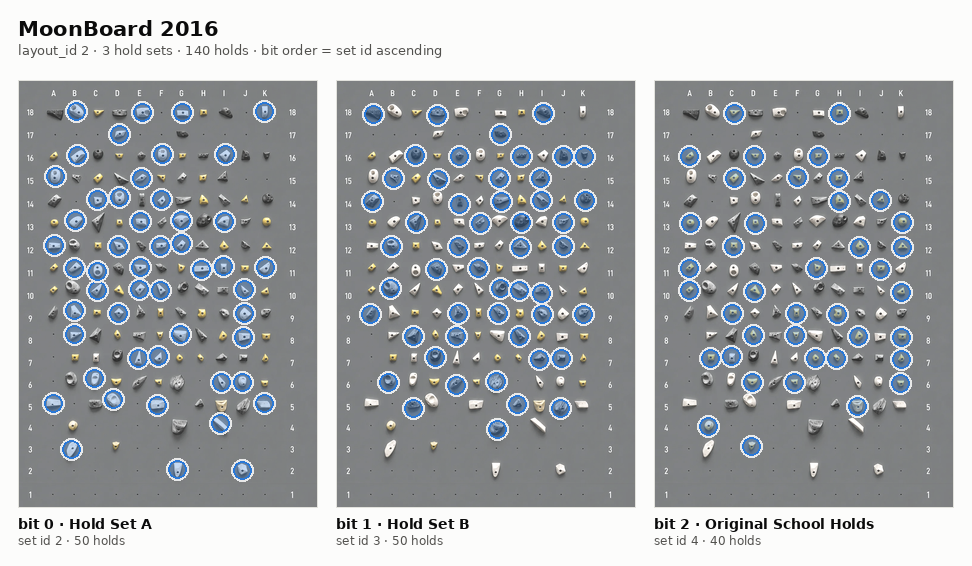
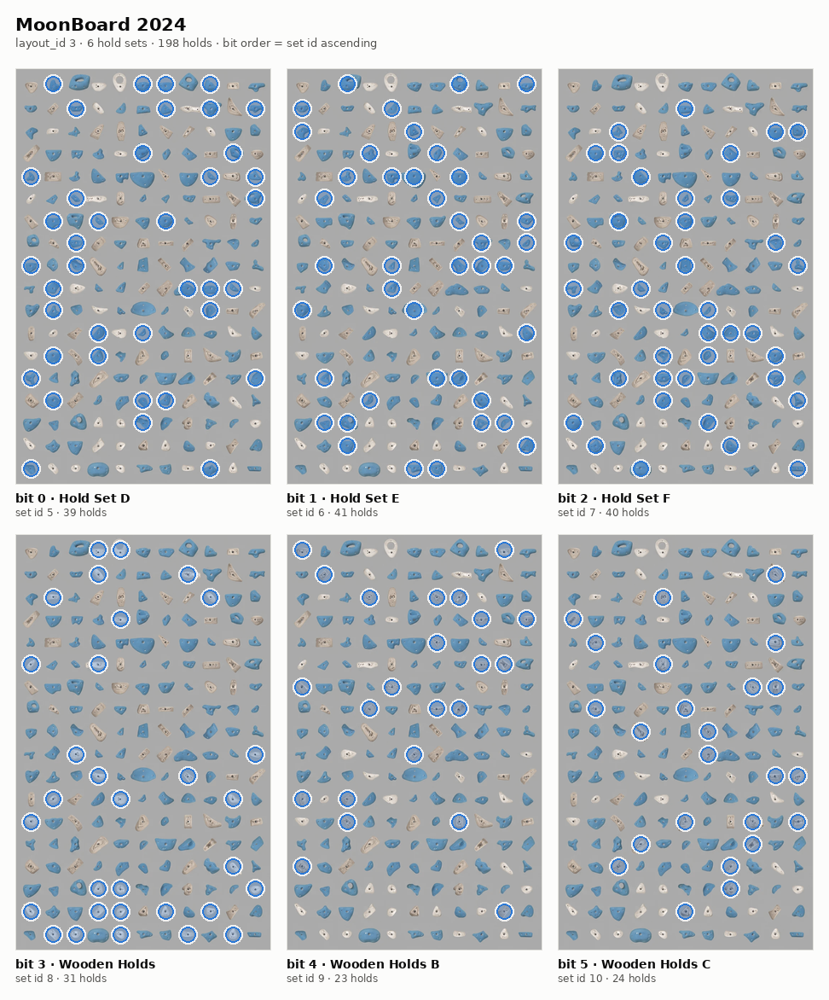
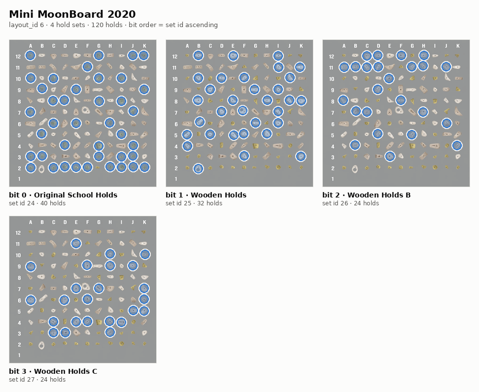
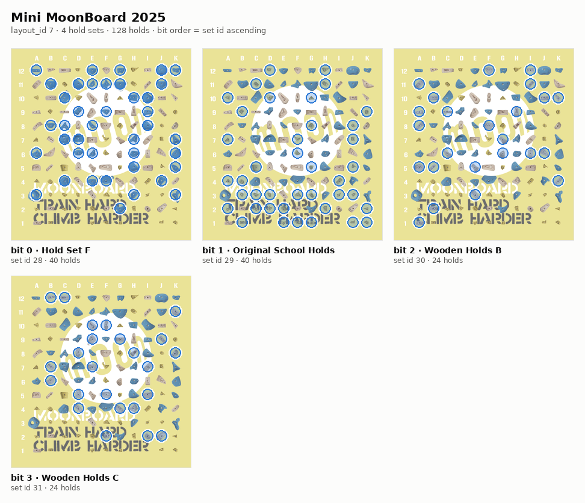
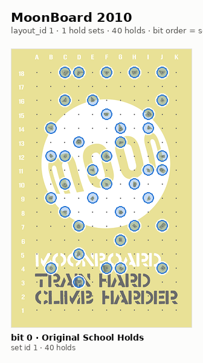

# Feature Spec: MoonBoard Hold-Set Selection

> **Status:** queued — app half only (§8); the pipeline half is tracked separately
> **Depends on:** none
> **Relates to:** FEAT-027 (MoonBoard variants), FEAT-031 (MoonBoard catalogue sync)
> **Upstream:** GitHub issue #9
> **Research:** internal research archive (not public)
> **Scope note:** browse/search/count only — see §8 Q1

## 1. Overview

A MoonBoard is not one fixed wall. Each generation is a **partition of the
board into 3–6 individually purchasable hold sets**, and owners routinely
mount only some of them. The official MoonBoard app models this explicitly —
it ships a `holdsetup_to_holdsets` n:m table and a picker labelled
*"Select your board holdsets"*.

CruxCoach models the same thing as a single fixed configuration. The KDoc on
`MoonBoardVariant.kt:13-15` states the assumption outright — *"Each entry is a
complete, fixed hold configuration, not a selectable collection of hold
sets"* — and `MINI_2025` repeats it (*"The constituent sets are deliberately
not exposed as independent user choices"*). Measured against the real
catalogue, this is wrong, and it costs users most of their board:

| Board | Mounted sets | Actually climbable |
|---|---|---|
| Masters 2019 | everything except Wooden Holds | 33 173 / 58 635 = **56.6 %** |
| Masters 2019 | OSH + A + B only | 4 004 / 58 635 = **6.8 %** |
| Masters 2017 | everything except Wooden Holds | 50 685 / 75 096 = **67.5 %** |
| MoonBoard 2016 | A + B only | 37 689 / 93 907 = **40.1 %** |

A Masters 2019 owner without Wooden Holds is shown **43 % results they cannot
climb**.

The filter mechanism to fix this **already exists and is already wired**:
`climbs.hsm` plus the predicate `(hsm & :hsmExcludedMask) = 0` in every
browse/search/count query. It is inert for MoonBoard because both halves are
empty — every MoonBoard row carries `hsm = 0`, and there is nowhere to record
which sets the user owns.

**Goals**
- Populate `climbs.hsm` for MoonBoard rows **in the Blossom sync pipeline**, so
  the device never recomputes the catalogue.
- Give the user a per-variant selection that leads with the **complete setup**
  they bought and only then exposes individual sets (§3.5), persisted locally.
- Show what a set is by **drawing it on the board**, in the same rendering this
  spec uses for its figures, everywhere the feature appears.
- Make the existing browse filter honour the selection.
- Correct the two KDoc statements that codified the wrong model.

**Non-goals**
- No new `climbs` column, no schema migration, no geometry tables for
  MoonBoard (`placements` / `board_images` / `product_sizes` stay Kilter-only).
- No device-side recomputation of the **catalogue's** `hsm` and no bulk
  backfill — see §3.1. (Per-row computation for locally authored and
  peer-received climbs is in scope; §6.6.)
- No change to Kilter/Tension behaviour.
- Not addressed here: the two unrelated catalogue omissions found during
  research (the MoonBoard DB builder drops climbs ungraded at
  both angles — 3 004 rows on layout 3; `Board.sq:530-534` hides ungraded
  climbs from normal browse). Separate tickets.

## 2. Today's behaviour

1. **`hsm` is 0 for every MoonBoard row.** Verified on the published chunk
   (`moonboard_board.bin`, 2026-07-26): 277 643 climbs, `hsm = 0` in every
   single one — exactly one distinct value across layouts 1–7.
2. **The value was never produced.** BoardSesh's GraphQL `Climb` type has 27
   fields and none of them is `holdsets`; the MoonBoard extractor
   therefore cannot request it, and the MoonBoard DB builder
   creates the column with `DEFAULT 0` and never writes it.
3. **The mask is hard-coded off.** `BoardBrowserViewModel.kt:765` branches on
   `needsBoardReload && !isMoonBoard`; the `else` arm (`:780-785`) sets
   `hsmExcludedMask = 0L`. `(hsm & 0) = 0` is always true.
4. **There is nowhere to store ownership.** MoonBoard has no product size at
   all (`GymBoardPickerViewModel.kt:291`, `MOONBOARD_NO_SIZE`), and for Kilter
   the mounted sets are derived *from* the size
   (`HoldSetMask.excludedMask(layoutSetIds, sizeSetIds)`, both from
   `board_images`). MoonBoard needs a second, independent axis.

## 3. Solution design

### 3.1 Where `hsm` is computed — pipeline, not device

The derivation is done **once, in the catalogue build pipeline**, and shipped in
the chunk. Two facts make the on-device alternative wrong:

- `mergeSnapshotClimbs()` updates catalogue rows with
  `WHERE origin = 'kilter'` (the upstream sentinel — MoonBoard catalogue rows
  carry it, see `BoardDatabaseImporter.kt:401`) and writes `hsm` from the
  snapshot. **Any locally computed value is overwritten on the next sync.**
  With cron running a daily community sync, a weekly delta refresh and a
  monthly full refresh, a device-side backfill over 277 k rows would be a
  recurring cost, not a one-off.
- `hsm` is an **existing column already present in the chunk**, currently all
  zeros. Filling it costs no additional bytes and no additional download; it
  rides along on a refresh that happens anyway.

Pipeline-side work (out of band — a different repo, not featbot's worktree;
see §8 Q2):

- Add the cell map + a MoonBoard branch to the catalogue pipeline's
  hold-set-mask backfill. The existing Kilter path resolves
  `frames → placement_id → placements.set_id`; MoonBoard needs one
  indirection less — `frames → holdId → set_id` — because
  `MoonBoardFrameEncoder.kt:55-56` encodes the grid position directly
  (`holdId = (row-1) * 11 + colIndex + 1`). Verified against the shipped
  chunk: the set of `holdId` values per layout matches the 2023 official dump
  exactly, empty difference in both directions.
- Call it from the MoonBoard DB builder; republish on the normal refresh
  cadence.

### 3.2 The hold-set mapping

**Source of truth: `MOONBOARD_CELL_SETS`** from BoardSesh
(`packages/shared/board-config/src/generated/moonboard-cell-sets.ts`,
Apache-2.0), `layoutId → (holdId → setId)`, 1 022 cells across all 7 layouts.
Its `holdId` key is **the same numbering as our `frames` `p{holdId}` token**,
which is what makes it directly usable.

Cross-validated against the independent 2023 official API dump: a
`position → set` map learned from 143 100 problems reproduces the declared
`holdsets` list for **143 077 of them (99.984 %)**, and agrees with BoardSesh
on **657 shared cells with zero contradictions**. The 23 mismatches are all on
the 2016 board and are source errors in individual problem records (e.g. apiId
19365 "Toad Hall" declares `[Set B]` but uses holds from `[Set A, Set B]`).

**Set-id space.** Adopt BoardSesh's ids **verbatim**. They are globally unique
across layouts (1–31), complete for all 7 layouts, and already the keys of the
map. They are **not** Moon's official `apiId` space (where OSH = 3 everywhere);
we never join against Moon's data, so this does not matter — but the two must
never be mixed. Record this in KDoc.

| Layout | Variant | Set ids → names | Cells |
|---|---|---|---|
| 1 | MoonBoard 2010 | 1 Original School Holds | 40 |
| 2 | MoonBoard 2016 | 2 Hold Set A · 3 Hold Set B · 4 Original School Holds | 140 |
| 3 | MoonBoard 2024 | 5 Hold Set D · 6 Hold Set E · 7 Hold Set F · 8 Wooden Holds · 9 Wooden Holds B · 10 Wooden Holds C | 198 |
| 4 | Masters 2017 | 11 Hold Set A · 12 Hold Set B · 13 Hold Set C · 14 Original School Holds · 16 Wooden Holds | 198 |
| 5 | Masters 2019 | 17 Hold Set A · 18 Hold Set B · 19 Original School Holds · 21 Wooden Holds · 22 Wooden Holds B · 23 Wooden Holds C | 198 |
| 6 | Mini MoonBoard 2020 | 24 Original School Holds · 25 Wooden Holds · 26 Wooden Holds B · 27 Wooden Holds C | 120 |
| 7 | Mini MoonBoard 2025 | 28 Hold Set F · 29 Original School Holds · 30 Wooden Holds B · 31 Wooden Holds C | 128 |

#### What each set actually covers

Rendered from **CruxCoach's own board art**
(`androidApp/src/main/assets/board_images/*.webp|png` + the per-variant
coordinate JSON) with the cell map painted over it — one panel per selectable
set, i.e. one panel per checkbox the picker will offer. Regenerate with
`img/render-hold-sets.py`.

These are a verification artefact as much as an illustration: the per-set hold
counts below are derived independently of the research and match F006 of the
report exactly (2019: 40 / 40 / 38 / 32 / 24 / 24 = 198).

**MoonBoard Masters 2019** — the board from issue #9. Deselecting *Wooden
Holds* alone removes 32 of 198 holds and, with them, 43 % of the catalogue.



**MoonBoard Masters 2017**



**MoonBoard 2016**



**MoonBoard 2024** — note the disjoint set family (D/E/F instead of A/B/C).



**Mini MoonBoard 2020**



**Mini MoonBoard 2025**



**MoonBoard 2010** — a single set, hence no choice to offer (§6.5).



Each panel is a single-series figure: identity comes from the panel title, not
from colour, so no categorical palette is in play and the figures stay readable
under any colour-vision deficiency.

**Screw-on Feet is excluded** (ids 15 on layout 4, 20 on layout 5). It exists
as board art and as a `MOONBOARD_SETS` entry, but appears in **no** problem's
hold-set list and in **no** cell of the map — the official app tracks foot
rules in a separate `holdsetup_to_foot_rules` table. It is a render layer, not
a problem-relevant set, and must never appear in the picker.

**Layout 1 (MoonBoard 2010) has a single set** and therefore no meaningful
choice; the picker is hidden for it (§6.5).

### 3.3 Catalogue representation and bit order

`hsm` is a bitmask on the existing `climbs.hsm INTEGER NOT NULL DEFAULT 0`
column. `HoldSetMask.excludedMask` defines the bit index as **the rank of the
set id within the layout's distinct set ids sorted ascending**
(`HoldSetMask.kt:36`) — unchanged, no new rule. Applied to §3.2 that yields:

| Layout | bit0 | bit1 | bit2 | bit3 | bit4 | bit5 |
|---|---|---|---|---|---|---|
| 1 | OSH | — | — | — | — | — |
| 2 | Set A | Set B | OSH | — | — | — |
| 3 | Set D | Set E | Set F | Wooden | Wooden B | Wooden C |
| 4 | Set A | Set B | Set C | OSH | Wooden | — |
| 5 | Set A | Set B | OSH | Wooden | Wooden B | Wooden C |
| 6 | OSH | Wooden | Wooden B | Wooden C | — | — |
| 7 | Set F | OSH | Wooden B | Wooden C | — | — |

This order is **load-bearing and permanent**: a saved user selection is
interpreted through it, so a later id change would silently reinterpret every
stored preference. It must be frozen by an explicit test table (§7.1), not
recomputed from the map in the test.

A climb using sets {A, Wooden B} on layout 5 therefore carries
`hsm = 0b010001 = 17`. Expected distinct-value counts, measured on the shipped
chunk: layout 2 → 7 values, layout 4 → 31, layout 5 → 62, layout 6 → 14,
layout 3 → 60, layout 7 → 15.

### 3.4 Backward compatibility — a non-zero `hsm` is inert on every shipped version

**Yes, pre-0.2.2 clients cope.** This is provable, not merely likely:

- `climbs.hsm`, `HoldSetMask` and the MoonBoard `hsmExcludedMask = 0L` branch
  were all introduced in **the same commit** (`8008769f`, 0.2.0-release).
  There has never been a released version that computes a non-zero mask for
  MoonBoard.
- **Before 0.2.0**: neither the column nor the mechanism exists. Nothing to be
  affected by.
- **0.2.0 / 0.2.1 / 0.2.2**: the mechanism exists, but for
  `boardBrand = moonboard` the mask is unconditionally `0L`, so the predicate
  `(hsm & 0) = 0` stays true for every row regardless of the stored value. A
  populated `hsm` changes **nothing** these versions do or show.
- **No other consumer.** `hsm` is touched by exactly five non-test files:
  `BoardRepositoryImpl`, `BoardRepository`, `BoardBrowserViewModel`,
  `BoardDatabaseImporter` and `LocalShareSchema` (classification only). The
  playlist generator, heatmap and BLE paths never read it.
- **Import needs no change.** `mergeSnapshotClimbs()` already carries `hsm`
  through staging (`:678`), `INSERT` (`:705, :710`) and `UPDATE`
  (`:723, :727`). A chunk with populated `hsm` lands correctly on an
  unmodified client.
- **Peer share is already covered.** `LocalShareSchema.kt:159` classifies
  `hsm` as `transferred("public hold-set mask")`. No new column ⇒
  `LocalSharePeerColumnContractTest` is not triggered.

The change is therefore **data-only and one-directional**: older clients keep
today's lenient behaviour; only a client that also has §3.5 starts filtering.

### 3.5 The second axis — user ownership

#### The unit people buy is the whole setup, not the single set

Moon sells a **complete "Setup Hold Bundle" per generation** — the 2017 bundle
(£1,920) ships Original School Holds, Set A, Set B, Set C, Wood Holds A and the
screw-on footholds together, which is exactly the set universe this spec lists
for layout 4 plus the foot rule. Individual sets are also sold, but they are the
exception.

The official app mirrors that. **"Hold setup" is a user-facing concept there**,
not an internal field: it has a name, an image, a PDF export ("This will export
the `%s` Hold setup as a pdf"), and problems are labelled with it ("*<setup>*,
set by *<setter>*"). The set-level choice sits *underneath* it — the setup
determines the universe via `holdsetup_to_holdsets`, and the per-set selection
is the correction for people who deviate.

A flat list of six checkboxes therefore models the exception as if it were the
norm. **Two levels:**

**Level 1 — the setup, preselected.** One choice: *"Complete MoonBoard Masters
2019 setup"*. This is what a bundle buyer has, it is the default, and it means
they never have to reason about individual sets. Filter off, list unchanged —
identical to today's behaviour.

**Level 2 — "Some holds are missing", collapsed by default.** Opens the per-set
list from §3.2. This is where the upgrader with leftovers from 2016, or the
person who bought Wooden Holds separately, corrects the picture.

Level 1 is not a separate stored state — it is simply "all sets selected". The
UI shows it as one line rather than six ticked boxes because that is what the
user actually decided.

#### Storage

A DataStore preference in `UserPreferences`, keyed **per layout** (a user may
have a 2019 at home and meet a 2017 at a gym):

```
moonboard_hold_sets: Map<layoutId, Set<setId>>   // persisted as CSV per layout
```

- **Default: all sets selected**, i.e. Level 1. Nothing changes for existing
  users on update; the filter only narrows once they deselect something.
- An absent entry means "all sets", not "no sets".
- Not a `climbs` column, so no schema and no peer-share contract case.

#### How a set is shown — the same rendering as this spec's figures

The official app makes the consequence visible rather than explaining it: its
per-set graphics are transparent 650×1000 overlays covering only their own holds
(1.6–3.6 % of the area each), stacked onto the board so that ticking a set
visibly changes the board.

We cannot stack: CruxCoach ships per-set art only for Mini 2025 and 2010; the
other five variants have a single composite board image. **Use the rendering
from §3.2 instead** — board art with the set's holds ringed — and use it
everywhere the feature appears, so the picker, the spec figures and any help
screen speak one visual language. Same geometry source
(`assets/board_images/<variant>.json`), same accent, same ring.

That means the cell map has to be on the device after all — see §3.6.

**No explanatory copy is needed beyond the labels.** The official app ships
none: no "problems you cannot climb will be hidden", no count, nothing. The
picture carries it. We follow that, with one addition it lacks — the live result
count in §4, because we have it cheaply and it answers "did that do anything?".

### 3.6 Wiring the filter

`BoardBrowserViewModel.kt:765` — the MoonBoard arm currently forcing `0L`
computes the real mask instead:

```kotlin
HoldSetMask.excludedMask(
    layoutSetIds = MoonBoardHoldSets.setIdsFor(variant),
    sizeSetIds   = prefs.ownedMoonBoardSets(prefLayoutId),
)
```

`MoonBoardHoldSets` is an object in `shared/…/domain/board/` carrying the set
id + display name lists per variant **and the 1 022-entry cell map**
(`layoutId → holdId → setId`, ~10 KB of source).

An earlier draft kept the map out of the APK. The picker's preview (§3.5) needs
it to ring a set's holds, so that no longer holds — and the trade is worth it at
10 KB. **This does not move where `hsm` is computed:** the mask still comes from
the pipeline (§3.1), the on-device map is for *drawing*. The two uses are
independent and must stay that way; a device-side bulk recompute of the
catalogue is still explicitly out of scope.

One thing it does buy for free: locally authored and peer-received MoonBoard
climbs can have their `hsm` computed on insert from the same map — a handful of
rows, not a catalogue pass — which closes edge case §6.6 rather than leaving it
on the lenient fallback.

### 3.7 Presence gate

Until the device has a chunk with populated `hsm`, the selection must be
**visibly unavailable** rather than silently ineffective — a user deselecting
sets and seeing an unchanged list is worse than no feature.

```sql
SELECT EXISTS(SELECT 1 FROM climbs WHERE board_brand = 'moonboard' AND hsm != 0)
```

False ⇒ the picker is disabled with an explanatory line and a pointer to the
catalogue sync. Evaluated once per board-config change, alongside the mask.

### 3.8 KDoc corrections

- `MoonBoardVariant.kt:13-15` — remove *"Each entry is a complete, fixed hold
  configuration, not a selectable collection of hold sets"*; state that a
  variant defines the **set universe and geometry**, and that mounted sets are
  a separate user-owned axis.
- `MoonBoardVariant.kt:85-87` (`MINI_2025`) — remove *"The constituent sets are
  deliberately not exposed as independent user choices"*.
- `HoldSetMask.kt:13` — `hsm = 0` no longer means "all MoonBoard rows"; it
  means unknown, which after this change is only locally authored and
  peer-received MoonBoard rows.

## 4. Strings (en + de)

Hold-set names are **product names and stay English in both locales** (the
official app does not translate them either).

| Key | en | de |
|---|---|---|
| `moonboard_hold_sets_title` | Hold sets | Griffsets |
| `moonboard_hold_sets_subtitle` | Which holds are mounted on your board | Welche Griffe an deinem Board hängen |
| `moonboard_setup_complete` | Complete %1$s setup | Komplettes %1$s Setup |
| `moonboard_setup_complete_hint` | The bundle as sold — every hold set | Das Bundle wie verkauft — alle Griffsets |
| `moonboard_setup_partial` | Some holds are missing | Mir fehlen Griffe |
| `moonboard_hold_sets_summary` | %1$d of %2$d hold sets | %1$d von %2$d Griffsets |
| `moonboard_hold_sets_count` | %1$s holds | %1$s Griffe |
| `moonboard_hold_sets_climbable` | %1$s of %2$s problems climbable | %1$s von %2$s Problemen kletterbar |
| `moonboard_hold_sets_needs_sync` | Available after the next catalogue update | Verfügbar nach dem nächsten Katalog-Update |
| `moonboard_hold_sets_min_one` | At least one hold set must stay selected | Mindestens ein Griffset muss ausgewählt bleiben |

`moonboard_hold_sets_climbable` is the one thing the official app does not
offer: a live count under the picker, updated as sets are toggled. It is a
`countFilteredClimbs` call that already exists and it turns an abstract choice
into a number.

Shop-vs-app naming diverges — an invoice says *"School Holds - Set A"* and
*"Wood Holds - Set A"* where the app says *"Hold Set A"* and *"Wooden Holds"*.
Use the **app** names as the primary label (recognisable from the official app,
and the same wording as the catalogue), and consider the shop wording as
secondary text for someone holding their order.

## 5. Acceptance criteria

1. `MoonBoardHoldSets.setIdsFor(variant)` returns exactly the ids in the §3.2
   table for all 7 variants; Screw-on Feet (15, 20) appears for none.
2. `HoldSetMask.excludedMask` over those universes produces exactly the bit
   assignment in §3.3, asserted against a hard-coded expectation table.
3. With all sets selected, the computed mask is `0L` for every variant, and
   browse results are byte-identical to today's.
4. With Wooden Holds deselected on layout 5, a climb whose `hsm` has the
   Wooden bit set is excluded from browse/search/count; one without it is not.
5. A climb with `hsm = 0` passes every mask (leniency preserved).
6. With the preference absent, behaviour equals "all sets selected".
7. The presence gate returns false on a DB whose MoonBoard rows are all
   `hsm = 0`, and true once any row is non-zero.
8. Kilter and Tension mask computation and browse results are unchanged.
9. `LocalSharePeerColumnContractTest` still passes unmodified (no new column).
10. On-device: on a Masters 2019 with Wooden Holds deselected, the browse
    result count drops to ~56.6 % of the unfiltered count.
11. **Level 1 is the default state.** On a fresh install and on upgrade, the
    picker shows the complete-setup line, not an expanded six-box list, and the
    per-set list stays collapsed until the user opens it.
12. **Level 1 ⇔ all sets.** Selecting the complete-setup line stores the full
    set list; deselecting any single set in the expanded list moves the summary
    off "complete" without any separate stored flag.
13. **The preview rings the right holds.** For each variant and each set, the
    hold ids drawn are exactly `MoonBoardHoldSets` cell-map entries for that
    set — the same source the §3.2 figures are rendered from, asserted per
    variant against the counts in §3.2.
14. Every hold id in the cell map has coordinates in the variant's
    `assets/board_images/<variant>.json`, for all 7 variants — otherwise the
    preview would silently drop holds.
15. The climbable count under the picker matches `countFilteredClimbs` for the
    same mask (no separate counting path).

## 6. Edge cases

1. **All sets deselected** — reject in the UI (keep at least one checked,
   `moonboard_hold_sets_min_one`). Defensively, an empty stored set is read as
   "all sets", never as "exclude everything".
2. **Layout switch** — the mask must be recomputed on board-config change, not
   cached across variants; a 2019 selection must never be applied to a 2017.
3. **Stale non-zero mask after variant change** — the existing
   `needsBoardReload` path must clear it, as it does for board images today.
4. **Old chunk, new app** — presence gate false, picker disabled, browse
   unchanged.
5. **MoonBoard 2010** — one set, no choice; hide the picker entirely rather
   than showing a single unticking-forbidden checkbox.
6. **Locally authored / peer-received MoonBoard climbs** — compute `hsm` on
   insert from the on-device cell map (§3.6), which is there for the preview
   anyway. This is a per-row computation on a handful of rows, **not** a
   catalogue pass. If it cannot be computed (unknown cell), the row keeps
   `hsm = 0` and falls back to leniency — the safe direction, since a climb
   wrongly shown costs less than one wrongly hidden.
7. **Mini 2025 and 2010 have per-set art, the others do not.** The preview must
   use the §3.2 ringed rendering for *all* variants regardless, so the picker
   looks the same everywhere. Do not special-case the two that could stack —
   consistency beats fidelity here.
8. **Never filter the preview on `occupied`.** `MoonBoardAsset.occupied`
   (`MoonBoardAsset.kt:75`) is parsed from the board-image JSON and read by
   nothing. It is also **wrong on two boards**: 2024 flags `occupied` on 0 of
   198 positions and Masters 2019 on 68 of 198, while both boards genuinely use
   all 198. A preview that draws only occupied holds would therefore render 2024
   completely empty and 2019 missing two thirds of its holds. Take the hold set
   from the cell map and the coordinates from the JSON — nothing else from it.
8. **The one unmappable catalogue row** — exactly one climb on layout 2 uses
   cell 56 (position A6), which BoardSesh's map does not carry. It keeps
   `hsm = 0` and falls under the same leniency. Pipeline-side, it must not
   abort the run.
9. **Layout 2 cell-count gap** — BoardSesh carries 140 cells, the 2023 official
   dump 142. The pipeline must treat an unknown cell as "leave `hsm = 0` for
   this climb", never as "set no bits" (which would wrongly claim the climb
   needs nothing).

## 7. Testing

### 7.1 JVM unit tests
- `MoonBoardHoldSetsTest` (new) — set universes per variant; Screw-on Feet
  absent; the §3.3 bit table asserted against **literal** expected values, not
  recomputed from the map. Plus the cell map itself: per-variant cell counts and
  per-set hold counts against the §3.2 table, and every cell id resolvable to a
  coordinate in the variant's board-image JSON (AC 13/14).
- `MoonBoardHoldSetPickerTest` — Level 1 is the default and the per-set list
  starts collapsed; selecting complete-setup stores the full list; deselecting
  one set drops the summary off "complete" (AC 11/12).
- `HoldSetMaskTest` (extend) — MoonBoard universes: all-selected ⇒ `0L`;
  single deselection ⇒ the expected single bit; empty ownership ⇒ `0L`.
- `BoardBrowserViewModelTest` (extend) — mask recomputed on variant change;
  preference absent ⇒ all sets; presence gate false ⇒ picker disabled.
- `HsmHoldSetFilterTest`-analogue for MoonBoard — in-memory DB with synthetic
  `hsm` values, asserting browse/search/count all honour the mask and that
  `hsm = 0` rows always pass.
- `UserPreferencesTest` (extend) — per-layout round-trip; absent ⇒ all.

### 7.2 Pipeline verification (out of band, before publishing)
- Derived `hsm` reproduces the 2023 official `holdsets` declarations for
  layouts 2, 4, 5, 6 at ≥ 99.98 %.
- Distinct-value counts per layout match §3.3.
- Unmappable climbs across the whole catalogue: exactly 1.

### 7.3 On-device
- Masters 2019, Wooden Holds off: result count ≈ 56.6 % of unfiltered (AC 10).
- Toggling a set updates the list without a visible recompute pause — the only
  work is one mask and one query.
- Kilter board unaffected.

### 7.4 Attribution
`MOONBOARD_CELL_SETS` is taken from BoardSesh (Apache-2.0). The pipeline repo
must carry the licence notice and attribution alongside the copied map.

## 8. Resolved scope

**Q1 — Propagation beyond browse: DEFERRED, browse only.** The filter applies to
browse, search and count, as specified throughout. It does **not** constrain the
playlist generator's candidate pool or the heatmap, and it does **not** block or
warn on BLE send. Rationale: those are all reachable later by passing the same
mask that §3.6 already computes, so nothing here forecloses them — whereas
threading it through `PlaylistGeneratorViewModel`'s pool queries now would widen
a contained change into a cross-cutting one. Revisit once the browse filter has
been used on real boards; a climber who finds their generated session full of
unclimbable problems is the signal to act, and until then it is speculation.

**Q2 — Repo split: RESOLVED, app half only.** This spec covers the app. The
pipeline work in §3.1 is tracked separately and executed by a human afterwards.
The app therefore ships **behind its presence gate** (§3.7): correct, inert, and
invisible until a catalogue with populated `hsm` arrives. That is the intended
intermediate state, not an unfinished one.

Consequence for testing: nothing in §7.1 may depend on real catalogue data.
Every unit test constructs its own `hsm` values.

## 9. Open questions

*Not blocking:* the wording of issue #9 (*"Routes that make use of different
holds are not included in the list"*) is ambiguous — everything measured says
we show **too much**, not too little. The literal reading would be a different
ticket. Worth a reply in the issue thread, but it does not change this design.

*Not blocking:* the wording of issue #9 (*"Routes that make use of different
holds are not included in the list"*) is ambiguous — everything measured says
we show **too much**, not too little. The literal reading would be a different
ticket. Worth a reply in the issue thread, but it does not change this design.
